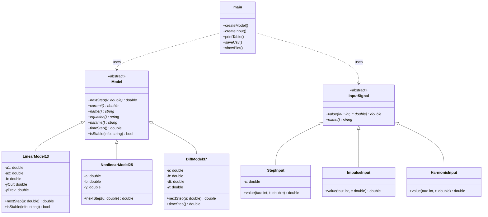

# UML-диаграмма классов (вариант 3)

Диаграмма отражает ООП-структуру программы: абстрактные базовые классы `Model` и `InputSignal` и их классы-наследники.

```mermaid
classDiagram
    class Model {
        <<abstract>>
        +nextStep(u: double) double*
        +current() double*
        +name() string*
        +equation() string*
        +params() string*
        +timeStep() double
        +isStable(info: string) bool
    }
    class LinearModel13 {
        -a1: double
        -a2: double
        -b: double
        -yCur: double
        -yPrev: double
        +nextStep(u: double) double
        +isStable(info: string) bool
    }
    class NonlinearModel25 {
        -a: double
        -b: double
        -y: double
        +nextStep(u: double) double
    }
    class DiffModel37 {
        -a: double
        -b: double
        -dt: double
        -y: double
        +nextStep(u: double) double
        +timeStep() double
    }
    class InputSignal {
        <<abstract>>
        +value(tau: int, t: double) double*
        +name() string*
    }
    class StepInput {
        -c: double
        +value(tau: int, t: double) double
    }
    class ImpulseInput {
        +value(tau: int, t: double) double
    }
    class HarmonicInput {
        +value(tau: int, t: double) double
    }
    class main {
        +createModel()
        +createInput()
        +printTable()
        +saveCsv()
        +showPlot()
    }

    Model <|-- LinearModel13
    Model <|-- NonlinearModel25
    Model <|-- DiffModel37
    InputSignal <|-- StepInput
    InputSignal <|-- ImpulseInput
    InputSignal <|-- HarmonicInput
    main ..> Model : uses
    main ..> InputSignal : uses
```
