<p align="center">Министерство образования Республики Беларусь</p>
<p align="center">Учреждение образования</p>
<p align="center">«Брестский государственный технический университет»</p>
<p align="center">Кафедра ИИТ</p>
<br><br><br><br><br><br><br>
<p align="center">Лабораторная работа №1</p>
<p align="center">По дисциплине «Общая теория интеллектуальных систем»</p>
<p align="center">Тема: «Моделирование управляемого объекта»</p>
<br><br><br><br><br>
<p align="right">Выполнил:</p>
<p align="right">Студент 2 курса</p>
<p align="right">Группы ИИ-29</p>
<p align="right">Игнатюк Д.А.</p>
<p align="right">Проверил:</p>
<p align="right">Дворанинович Д.А.</p>
<br><br><br><br><br>
<p align="center">Брест 2026</p>

---

## 1. Цель работы

## 1. Цель работы

Изучить методы математического моделирования управляемых объектов. Реализовать на языке C++ программу, моделирующую поведение трёх типов систем:

- **линейной дискретной модели** (Model 1.4 — Discrete Integrator with Loss),
- **нелинейной дискретной модели** (Model 2.9 — Square Root Modulated Action),
- **непрерывного дифференциального уравнения** (Model 3.1 — Pure Linear Decay),

с возможностью задания количества шагов симуляции, типа входного воздействия и анализа устойчивости системы.

## 2. Постановка задачи

Согласно варианту 22, реализуются следующие модели:

| Блок | Модель | Название |
|:---:|:---:|---|
| 1 | **Model 1.4** | Discrete Integrator with Loss |
| 2 | **Model 2.9** | Square Root Modulated Action |
| 3 | **Model 3.1** | Pure Linear Decay |

### Требования к программе

1. Реализация на языке **C++** с использованием принципов **ООП**.
2. Наличие **абстрактного базового класса** `Model` с виртуальным методом расчёта следующего шага.
3. Три типа входных воздействий:
   - **ступенчатое** `u_τ = const`,
   - **импульсное** `u_0 = 1, u_{τ>0} = 0`,
   - **гармоническое** `u_τ = sin(τ)`.
4. Возможность настройки количества шагов симуляции `n`.
5. Вывод результатов в табличном виде (в консоль и в CSV-файл).
6. Визуализация полученных результатов.
7. Сборка через **CMake** с запуском через **`.bat`-файл**.
8. **(Advanced)** Анализ устойчивости линейной дискретной модели через корни характеристического уравнения на Z-плоскости с выводом предупреждения при неустойчивости.

---

## 3. UML-диаграмма классов

На рисунке ниже представлена UML-диаграмма классов разработанной программы. Архитектура построена на двух иерархиях наследования:

- **`Model`** — абстрактный базовый класс всех математических моделей. Определяет общий интерфейс: метод `next(u)` для расчёта следующего шага симуляции, `reset()` для сброса состояния, а также методы анализа устойчивости `isStable()` и `stabilityWarning()`.
- **`InputSignal`** — абстрактный базовый класс генераторов входного воздействия с методами `value(tau)` и `name()`.

Конкретные реализации моделей (`Model1_4`, `Model2_9`, `Model3_1`) и сигналов (`StepInput`, `ImpulseInput`, `HarmonicInput`) наследуют соответствующие абстрактные классы и переопределяют виртуальные методы.

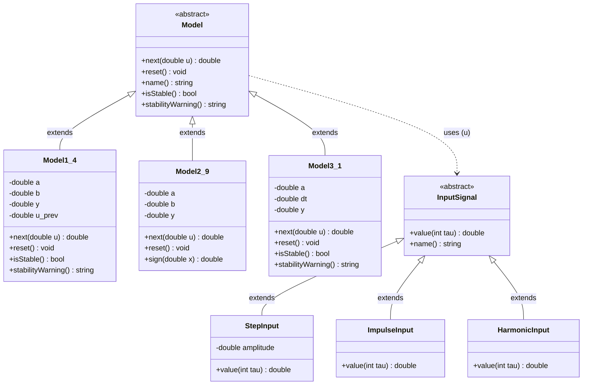

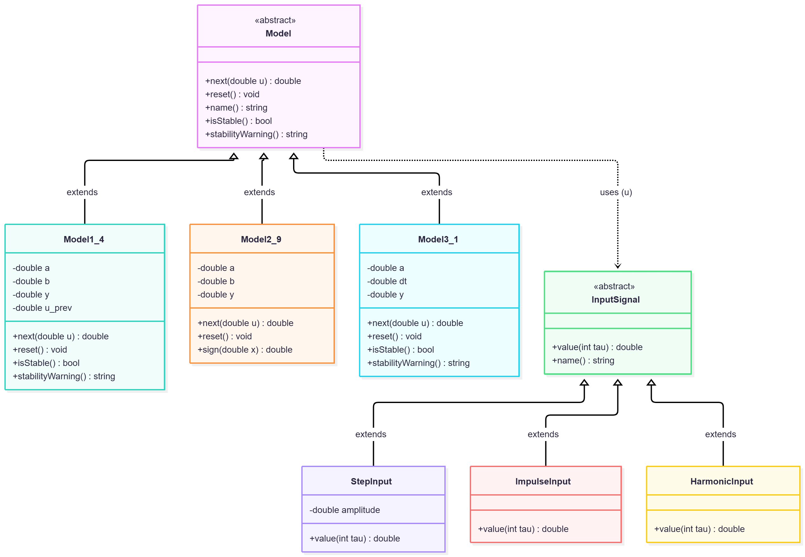

*Рис. 1. UML-диаграмма классов программы*

---

## 4. Математическое описание моделей

> **Примечание.** Формулы в отчёте записаны в формате LaTeX. Для корректного отображения рекомендуется просматривать отчёт на GitHub (поддерживается рендеринг математики) или через любой Markdown-редактор с поддержкой MathJax (например, VS Code с расширением Markdown+Math).

### 4.1. Model 1.4 — Discrete Integrator with Loss

**Формула:**

$$y_{\tau+1} = a \cdot y_\tau + b \cdot (u_\tau - u_{\tau-1})$$

**Физический смысл:**

Модель описывает дискретный интегратор с потерями. Первое слагаемое $a \cdot y_\tau$ отражает «утечку» накопленного состояния (при $a < 1$ система теряет часть своего значения на каждом шаге), второе слагаемое $b \cdot (u_\tau - u_{\tau-1})$ — реакцию на **изменение** входного воздействия. Если входной сигнал постоянен, $u_\tau - u_{\tau-1} = 0$ и система на него не реагирует.

**Анализ устойчивости (Advanced):**

Запишем однородное уравнение, положив $u_\tau = 0$:

$$y_{\tau+1} = a \cdot y_\tau$$

Ищем решение в виде $y_\tau = z^\tau$, где $z$ — комплексная переменная на Z-плоскости. Подставим:

$$z^{\tau+1} = a \cdot z^\tau \implies z = a$$

Характеристическое уравнение имеет единственный корень $z = a$.

**Критерий устойчивости:** для дискретной системы все корни характеристического уравнения должны лежать **внутри единичного круга** на Z-плоскости, то есть $|z| < 1$.

$$\boxed{|a| < 1}$$

**Разбор случаев:**

| Условие | Поведение системы |
|:---:|---|
| $|a| < 1$ | Устойчивая — $y_\tau \to 0$ при отсутствии входа |
| $|a| = 1$ | Граница устойчивости — незатухающие колебания |
| $|a| > 1$ | Неустойчивая — $y_\tau$ экспоненциально расходится |

В программе это реализовано в методах `isStable()` и `stabilityWarning()` класса `Model1_4`. Перед началом симуляции при $|a| \geq 1$ выводится предупреждение в консоль.

### 4.2. Model 2.9 — Square Root Modulated Action

**Формула:**

$$y_{\tau+1} = a \cdot y_\tau + b \cdot \sqrt{|u_\tau|} \cdot \text{sign}(u_\tau)$$

**Физический смысл:**

Нелинейная модель, в которой реакция на вход пропорциональна **корню** из входного воздействия. Такая зависимость характерна для реальных систем:

- расход жидкости через отверстие пропорционален $\sqrt{\Delta p}$,
- магнитный поток в сердечнике зависит от тока нелинейно,
- теплоотдача при конвекции зависит от $\sqrt{v}$.

Функция $\sqrt{|u_\tau|} \cdot \text{sign}(u_\tau)$ сохраняет знак входного сигнала и обеспечивает «мягкую» нелинейность: **при малых $u$ система реагирует сильно, при больших — слабо**.

**Пример:**

| $u$ | $\sqrt{|u|} \cdot \text{sign}(u)$ |
|:---:|:---:|
| $1$ | $1$ |
| $4$ | $2$ |
| $9$ | $3$ |
| $16$ | $4$ |
| $100$ | $10$ |

**Анализ устойчивости:** нелинейная модель — линейный анализ (через характеристическое уравнение) неприменим. В программе метод `isStable()` для этой модели всегда возвращает `true`.

### 4.3. Model 3.1 — Pure Linear Decay

**Формула:**

$$\frac{dy}{dt} = -a \cdot y$$

**Физический смысл:**

Классическое уравнение экспоненциального затухания. Скорость убывания пропорциональна текущему значению $y$. Примеры: остывание тела, радиоактивный распад, разряд конденсатора.

**Точное (аналитическое) решение:**

$$y(t) = y_0 \cdot e^{-a \cdot t}$$

Однако в работе используется **численное решение методом Эйлера**, так как этот метод применим и к уравнениям, не имеющим аналитического решения.

**Метод Эйлера:**

$$\frac{dy}{dt} \approx \frac{y_{\tau+1} - y_\tau}{\Delta t} \implies y_{\tau+1} = y_\tau + \Delta t \cdot (-a \cdot y_\tau)$$

**Анализ устойчивости численной схемы:**

Перепишем шаг Эйлера в виде $y_{\tau+1} = y_\tau \cdot (1 - a \cdot \Delta t)$. Корень характеристического уравнения $z = 1 - a \cdot \Delta t$. Условие устойчивости:

$$\boxed{0 < a \cdot \Delta t < 2}$$

При нарушении этого условия численная схема расходится, хотя точное решение затухает. В программе это проверяется в методе `isStable()` класса `Model3_1`.

**Пример при $a = 1$, $\Delta t = 0.1$:**

- $z = 1 - 1 \cdot 0.1 = 0.9$, $|z| < 1$ — устойчиво.
- $y_\tau = 0.9^\tau$ — экспоненциальное затухание.

---

## 5. Описание реализации

### 5.1. Архитектура ООП

Программа построена на двух независимых иерархиях наследования:

**Иерархия моделей:**

- **`Model`** — абстрактный базовый класс. Определяет общий интерфейс:
  - `virtual double next(double u)` — один шаг симуляции (подаём вход `u`, получаем выход `y`);
  - `virtual void reset()` — сброс состояния модели к начальному;
  - `virtual std::string name() const` — имя модели (для вывода);
  - `virtual bool isStable() const` — проверка устойчивости (по умолчанию `true`);
  - `virtual std::string stabilityWarning() const` — текст предупреждения о неустойчивости.

- **`Model1_4`, `Model2_9`, `Model3_1`** — конкретные реализации, наследники `Model`. Каждая переопределяет `next()`, `reset()`, `name()` и, при необходимости, `isStable()` и `stabilityWarning()`.

**Иерархия входных сигналов:**

- **`InputSignal`** — абстрактный базовый класс генератора входного воздействия:
  - `virtual double value(int tau) const` — значение сигнала на шаге `τ`;
  - `virtual std::string name() const` — имя сигнала.

- **`StepInput`, `ImpulseInput`, `HarmonicInput`** — конкретные реализации трёх типов воздействий.

**Полиморфизм:** в `main()` работа идёт через указатели `std::unique_ptr<Model>` и `std::unique_ptr<InputSignal>` — конкретный тип выбирается во время выполнения в зависимости от ввода пользователя. Это позволяет добавлять новые модели и сигналы без изменения основной логики программы.

### 5.2. Структура файлов

| Файл | Назначение |
|---|---|
| `src/Model.h` | Абстрактный базовый класс `Model` |
| `src/Model1_4.h` | Model 1.4 — Discrete Integrator with Loss + анализ устойчивости |
| `src/Model2_9.h` | Model 2.9 — Square Root Modulated Action |
| `src/Model3_1.h` | Model 3.1 — Pure Linear Decay (метод Эйлера) + анализ устойчивости |
| `src/InputSignals.h` | Генераторы трёх типов входных сигналов |
| `src/main.cpp` | Точка входа: меню, ввод параметров, симуляция, вывод результатов |
| `src/CMakeLists.txt` | Файл сборки модуля `src` |
| `CMakeLists.txt` | Локальный `CMakeLists.txt` уровня `task_01` |
| `build.bat` | Скрипт автоматической сборки проекта через CMake |
| `plot_results.py` | Python-скрипт визуализации результатов (читает `result.csv`) |
| `doc/readme.md` | Данный отчёт |

### 5.3. Формат вывода результатов

Результаты симуляции выводятся **двумя способами** одновременно:

**1. В консоль** — табличный вид:

```
   tau        u_tau        y_tau
---------------------------------
     1      1.00000      1.00000
     2      1.00000      0.90000
     3      1.00000      0.81000
    ...
```

Формат: три колонки, выровненные по правому краю с фиксированной шириной (`std::setw`). Точность — 5 знаков после запятой (`std::setprecision(5)`).

**2. В файл `result.csv`** — формат CSV с заголовком:

```csv
tau,u_tau,y_tau
1,1.0,1.0
2,1.0,0.9
3,1.0,0.81
...
```

CSV-файл создаётся в директории, из которой была запущена программа. Его можно открыть в Excel, LibreOffice Calc или обработать скриптом для построения графиков.

### 5.4. Сборка через CMake и `.bat`

Сборка проекта автоматизирована через скрипт **`build.bat`**:

```bat
@echo off
setlocal
cd /d "%~dp0"

where cmake >nul 2>nul
if errorlevel 1 (
    echo [ERROR] CMake not found in PATH.
    pause
    exit /b 1
)

if not exist "build" mkdir build
cd build

cmake ..
cmake --build . --config Release

pause
endlocal
```

**Как работает:**

1. Скрипт переходит в директорию, где лежит сам (независимо от того, откуда запущен).
2. Проверяет наличие `cmake` в `PATH`.
3. Создаёт папку `build/` (если её нет) и переходит в неё — это **out-of-source сборка**: артефакты сборки не смешиваются с исходниками.
4. Запускает `cmake ..` — генерирует файлы проекта.
5. Запускает `cmake --build . --config Release` — компилирует и линкует exe.

**Результат:** собранный `ii02909_task_01.exe` в директории `build/src/Release/`.

### 5.5. Визуализация

Для визуализации результатов используется **Python + Matplotlib**. Скрипт `plot_results.py`:

1. Читает CSV-файл с результатами симуляции (`result.csv`).
2. Строит график зависимости выходной переменной `y_τ` от номера шага `τ`.
3. Дополнительно показывает входной сигнал `u_τ` пунктирной линией.
4. Сохраняет график в PNG-файл.

**Пример использования:**

```bash
python plot_results.py result.csv doc/screenshots/07_plot_model_1_4.png "Model 1.4 — Step, a=0.9"
```

Все графики сохранены в директории `doc/screenshots/`.

---

## 6. Результаты симуляции

Для каждой модели проведена симуляция с тремя типами входных воздействий. Ниже приведены таблицы результатов и графики, полученные скриптом `plot_results.py`.

### 6.1. Model 1.4 — устойчивая система ($a = 0.9$)

**Параметры симуляции:**
- Коэффициент $a = 0.9$, $b = 1.0$
- Входной сигнал: ступенчатый ($u_\tau = 1$)
- Количество шагов: $n = 20$

**Проверка устойчивости:** $|a| = 0.9 < 1$ — система устойчива. Предупреждение не выводится.

**Таблица результатов (фрагмент):**

| $\tau$ | $u_\tau$ | $y_\tau$ |
|:---:|:---:|:---:|
| 1 | 1.00000 | 1.00000 |
| 2 | 1.00000 | 0.90000 |
| 3 | 1.00000 | 0.81000 |
| 4 | 1.00000 | 0.72900 |
| 5 | 1.00000 | 0.65610 |
| … | … | … |
| 20 | 1.00000 | 0.13509 |

Полные данные — в файле `result.csv`.

**График зависимости $y_\tau$ от $\tau$:**

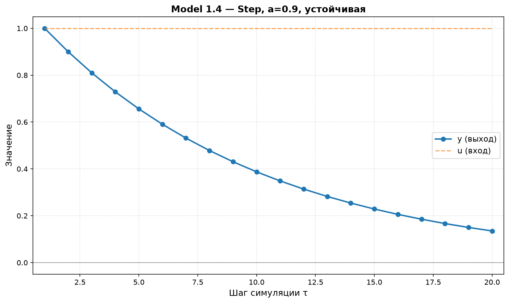

*Рис. 2. Model 1.4 (a = 0.9) — экспоненциальное затухание при ступенчатом входе*

**Скриншот консольного вывода:**

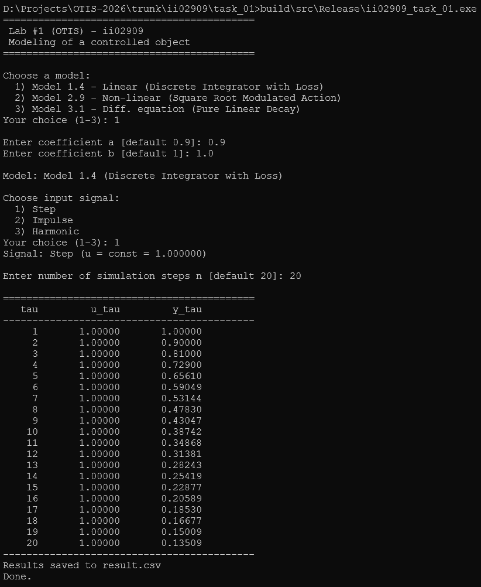

*Рис. 3. Вывод результатов в консоль для Model 1.4*

**Анализ:** система устойчива, $y_\tau$ экспоненциально убывает с коэффициентом $0.9$ на каждом шаге: $y_\tau = 0.9^{\tau-1}$. Это согласуется с теоретическим анализом.

### 6.2. Model 1.4 — неустойчивая система ($a = 1.2$) [Advanced]

**Параметры симуляции:**
- Коэффициент $a = 1.2$, $b = 1.0$
- Входной сигнал: ступенчатый
- Количество шагов: $n = 10$

**Проверка устойчивости:** $|a| = 1.2 > 1$ — система **неустойчива**. Программа выводит предупреждение перед началом симуляции:

```
!!! WARNING !!!
[WARN] Model 1.4: |a| = 1.2 >= 1, system is UNSTABLE, y will diverge!
Continue simulation? (y/n):
```

После подтверждения пользователем симуляция выполняется, но $y_\tau$ экспоненциально растёт.

**Таблица результатов:**

| $\tau$ | $u_\tau$ | $y_\tau$ |
|:---:|:---:|:---:|
| 1 | 1.00000 | 1.00000 |
| 2 | 1.00000 | 1.20000 |
| 3 | 1.00000 | 1.44000 |
| 4 | 1.00000 | 1.72800 |
| 5 | 1.00000 | 2.07360 |
| 6 | 1.00000 | 2.48832 |
| … | … | … |
| 10 | 1.00000 | 5.15978 |

**Скриншот консольного вывода с предупреждением:**

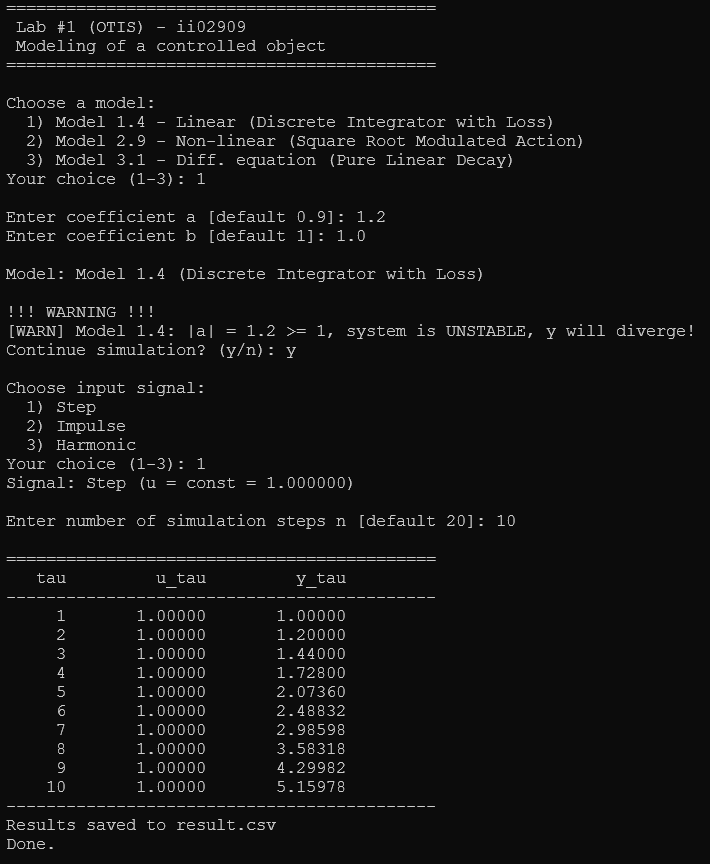

*Рис. 4. Предупреждение о неустойчивости и расходящийся процесс*

**График расходящегося процесса:**

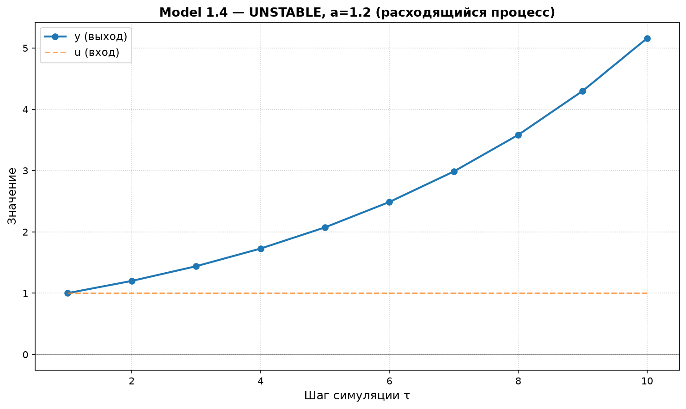

*Рис. 5. Экспоненциальный рост $y_\tau$ при $|a| > 1$*

**Анализ:** при $|a| > 1$ корень характеристического уравнения $z = a$ лежит **вне единичного круга** — система неустойчива. Значения $y_\tau$ растут как $a^{\tau-1}$: $y_\tau = 1.2^{\tau-1}$. Advanced-задание выполнено: программа корректно определяет неустойчивость и предупреждает пользователя.

### 6.3. Model 2.9 — импульсное воздействие

**Параметры симуляции:**
- Коэффициент $a = 0.9$, $b = 1.0$
- Входной сигнал: импульсный ($u_1 = 1$, $u_{\tau > 1} = 0$)
- Количество шагов: $n = 10$

**Таблица результатов:**

| $\tau$ | $u_\tau$ | $y_\tau$ |
|:---:|:---:|:---:|
| 1 | 1.00000 | 1.00000 |
| 2 | 0.00000 | 0.90000 |
| 3 | 0.00000 | 0.81000 |
| 4 | 0.00000 | 0.72900 |
| 5 | 0.00000 | 0.65610 |
| … | … | … |
| 10 | 0.00000 | 0.38742 |

**График:**

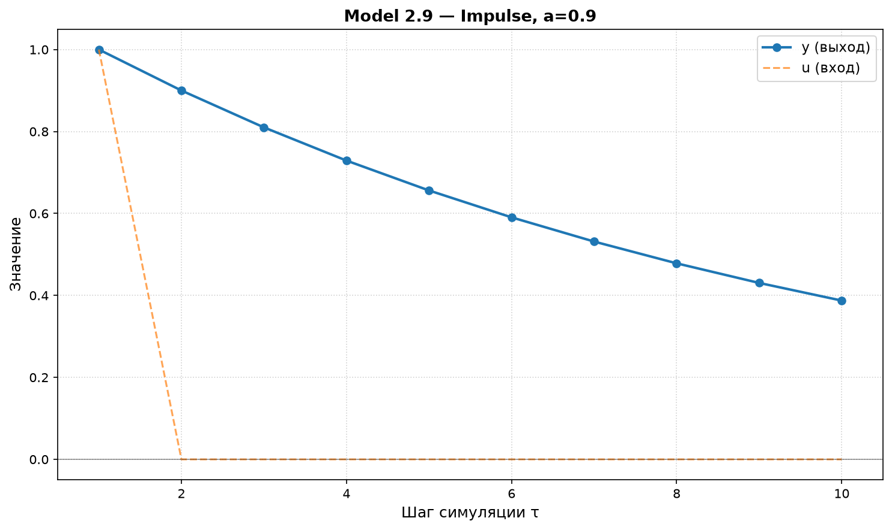

*Рис. 6. Model 2.9 — реакция на импульсное воздействие*

**Скриншот консольного вывода:**

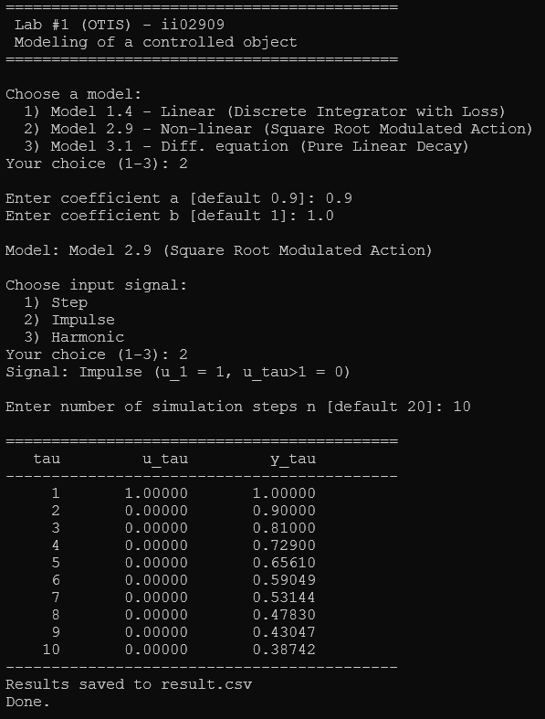

*Рис. 7. Консольный вывод для Model 2.9 с импульсным сигналом*

**Анализ:** импульс на шаге $\tau = 1$ даёт начальное значение $y_1 = 1.0$ (за счёт $\sqrt{|1|} \cdot \text{sign}(1) = 1$). Далее вход равен нулю, и система «доигрывает» — $y_\tau$ затухает с коэффициентом $a = 0.9$. Это типичный отклик на импульсное воздействие.

### 6.4. Model 3.1 — Pure Linear Decay

**Параметры симуляции:**
- Коэффициент $a = 1.0$, шаг интегрирования $\Delta t = 0.1$
- Входной сигнал: любой (не влияет на модель)
- Количество шагов: $n = 20$

**Таблица результатов:**

| $\tau$ | $y_\tau$ |
|:---:|:---:|
| 1 | 0.90000 |
| 2 | 0.81000 |
| 3 | 0.72900 |
| 4 | 0.65610 |
| 5 | 0.59049 |
| … | … |
| 20 | 0.12158 |

**Проверка устойчивости численной схемы:** $z = 1 - a \cdot \Delta t = 0.9$, $|z| < 1$ — устойчиво.

**График:**

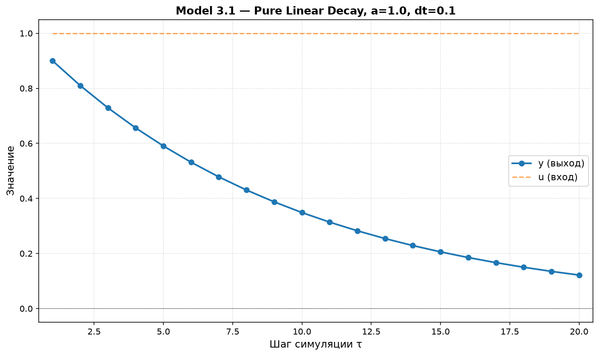

*Рис. 8. Model 3.1 — численное решение уравнения затухания*

**Скриншот консольного вывода:**

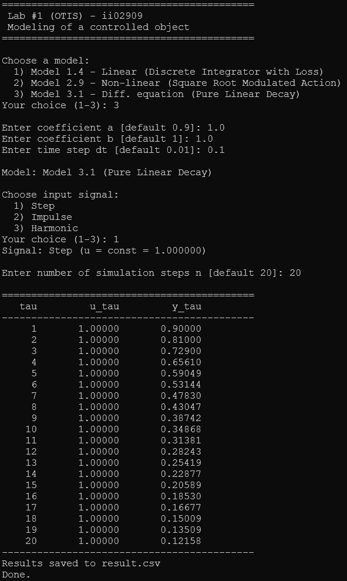

*Рис. 9. Консольный вывод для Model 3.1*

**Анализ:** численное решение методом Эйлера совпадает с аналитическим $y(t) = e^{-at}$ в первом приближении. При $a \cdot \Delta t = 0.1$ погрешность метода невелика, и кривая визуально совпадает с экспонентой.

### 6.5. Сборка проекта

**Скриншот успешной сборки через `build.bat`:**

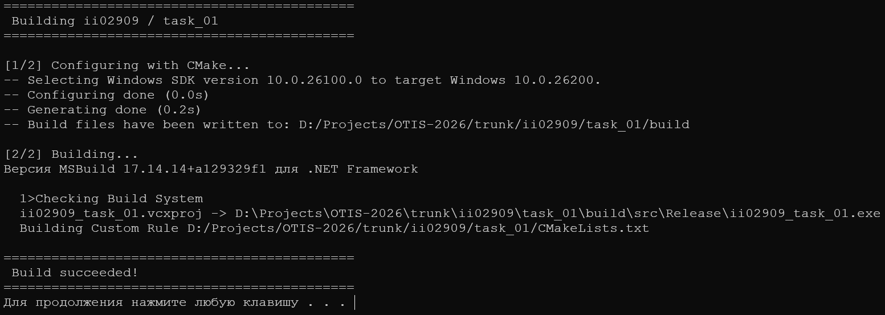

*Рис. 10. Успешная сборка проекта через скрипт build.bat*

---

## 7. Выводы

В ходе выполнения лабораторной работы были получены следующие результаты:

**1. Реализована программа на C++** с использованием принципов объектно-ориентированного программирования. Архитектура построена на абстрактном базовом классе `Model` с виртуальным методом `next()` и трёх наследниках — конкретных математических моделях.

**2. Реализованы три модели** в соответствии с вариантом 22:

- **Model 1.4** (линейная дискретная) — Discrete Integrator with Loss;
- **Model 2.9** (нелинейная дискретная) — Square Root Modulated Action;
- **Model 3.1** (дифференциальное уравнение) — Pure Linear Decay, решённое методом Эйлера.

**3. Реализованы три типа входных воздействий** (ступенчатое, импульсное, гармоническое) через отдельную иерархию классов `InputSignal`.

**4. Выполнен анализ устойчивости** (Advanced-задание):

- Для **Model 1.4** получено характеристическое уравнение $z = a$ с условием устойчивости $|a| < 1$. В программу встроена проверка: при $|a| \geq 1$ выводится предупреждение перед началом симуляции.
- Для **Model 3.1** проанализирована устойчивость численной схемы Эйлера: $|1 - a \cdot \Delta t| < 1$. При нарушении условия выводится предупреждение.
- Для **Model 2.9** (нелинейной) линейный анализ устойчивости неприменим, поэтому метод `isStable()` всегда возвращает `true`.

**5. Проведена симуляция всех моделей** при различных входных воздействиях. Результаты:

- Model 1.4 при $a = 0.9$ демонстрирует экспоненциальное затухание ($y_\tau = 0.9^{\tau-1}$).
- Model 1.4 при $a = 1.2$ — расходится ($y_\tau = 1.2^{\tau-1}$), что подтверждает теорию о неустойчивости при $|a| > 1$.
- Model 2.9 даёт «мягкий» отклик на импульс: скачок на первом шаге, затем затухание с коэффициентом $a$.
- Model 3.1 численно воспроизводит аналитическое решение $y(t) = e^{-at}$ с хорошей точностью при малом шаге $\Delta t$.

**6. Результаты визуализированы** с помощью Python + Matplotlib — построены графики $y_\tau$ от $\tau$ для каждой модели.

**7. Сборка автоматизирована** через CMake и скрипт `build.bat`, что соответствует требованиям задания.

**Итог:** цель работы достигнута — программа корректно моделирует управляемые объекты, определяет их устойчивость и визуализирует переходные процессы.

---

## 8. Приложения

### 8.1. Ссылки на исходный код

Все файлы проекта расположены в каталоге `trunk/ii02909/task_01/`:

| Файл | Ссылка |
|---|---|
| `Model.h` | [src/Model.h](../src/Model.h) |
| `Model1_4.h` | [src/Model1_4.h](../src/Model1_4.h) |
| `Model2_9.h` | [src/Model2_9.h](../src/Model2_9.h) |
| `Model3_1.h` | [src/Model3_1.h](../src/Model3_1.h) |
| `InputSignals.h` | [src/InputSignals.h](../src/InputSignals.h) |
| `main.cpp` | [src/main.cpp](../src/main.cpp) |
| `CMakeLists.txt` (src) | [src/CMakeLists.txt](../src/CMakeLists.txt) |
| `CMakeLists.txt` (task_01) | [CMakeLists.txt](../CMakeLists.txt) |
| `build.bat` | [build.bat](../build.bat) |
| `plot_results.py` | [plot_results.py](../plot_results.py) |

### 8.2. Пример выходных данных

Файл `result.csv` с результатами последнего прогона симуляции — во вложении к отчёту (пример вывода Model 1.4 при $a = 0.9$, $n = 20$).

```csv
tau,u_tau,y_tau
1,1,1
2,1,0.9
3,1,0.81
4,1,0.729
5,1,0.6561
...
20,1,0.135085
```

### 8.3. Графики

Все построенные графики находятся в каталоге `doc/screenshots/`:

- `07_plot_model_1_4.png` — Model 1.4, устойчивая
- `08_plot_model_2_9.png` — Model 2.9, импульс
- `09_plot_model_3_1.png` — Model 3.1, экспонента
- `10_plot_unstable.png` — Model 1.4, неустойчивая (Advanced)