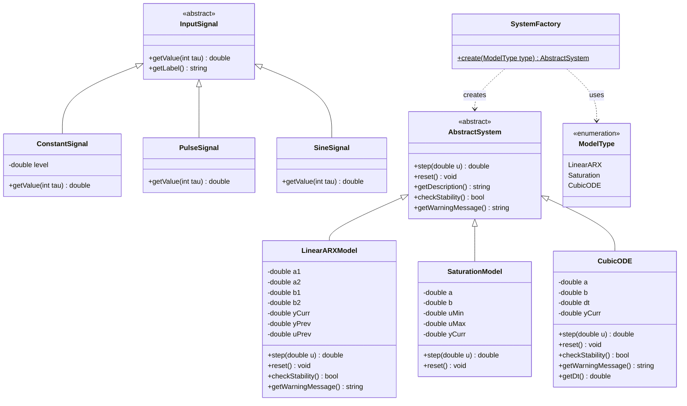
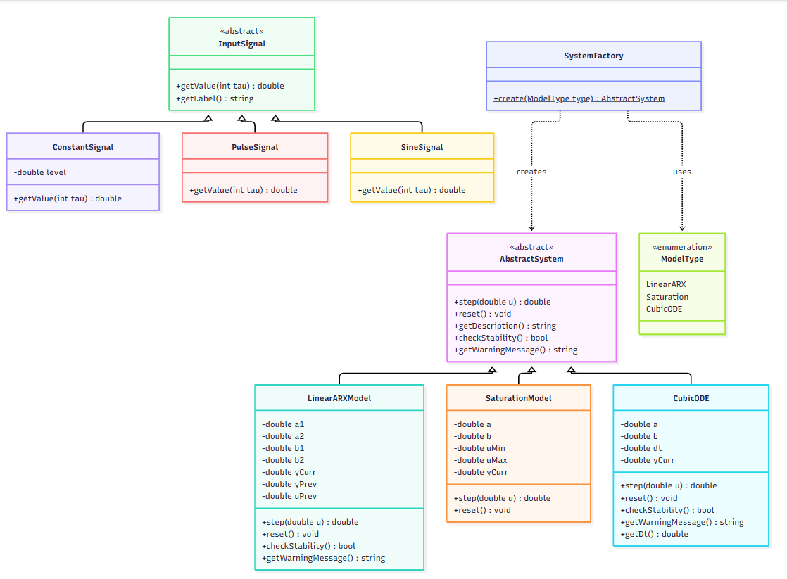
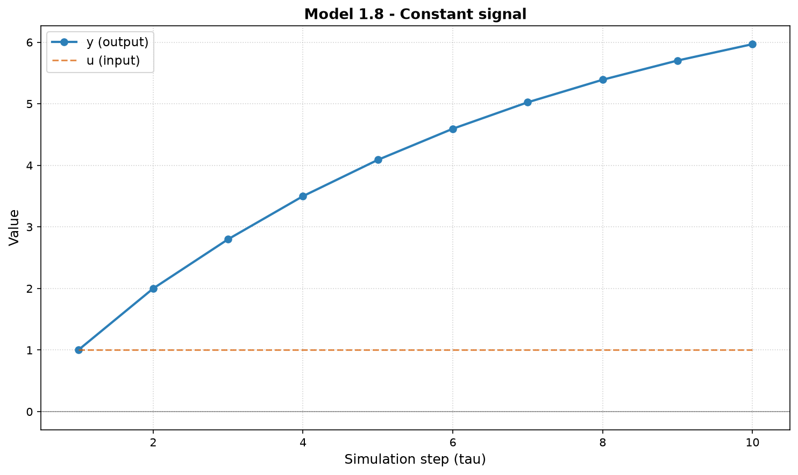
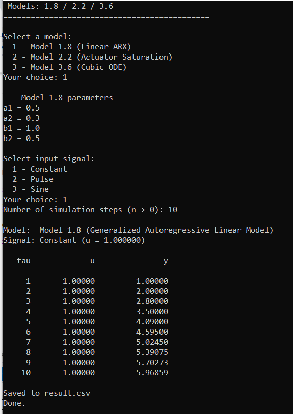
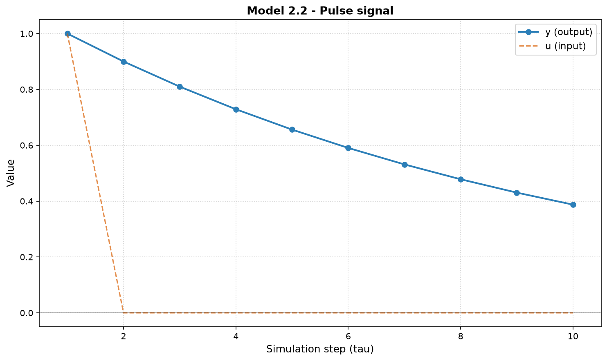
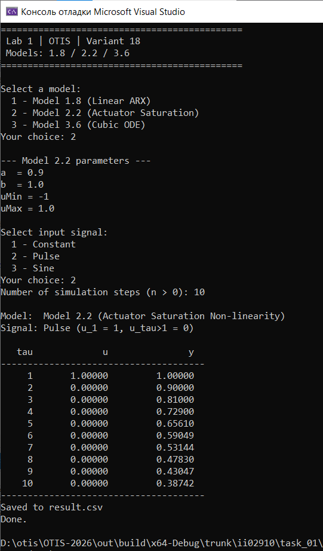
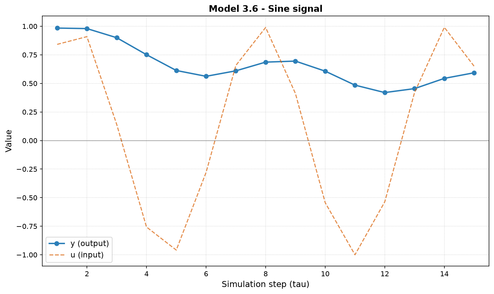
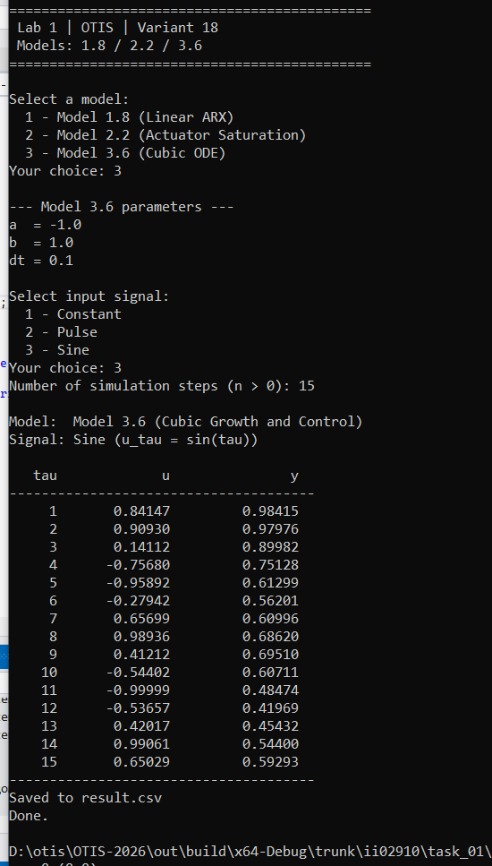
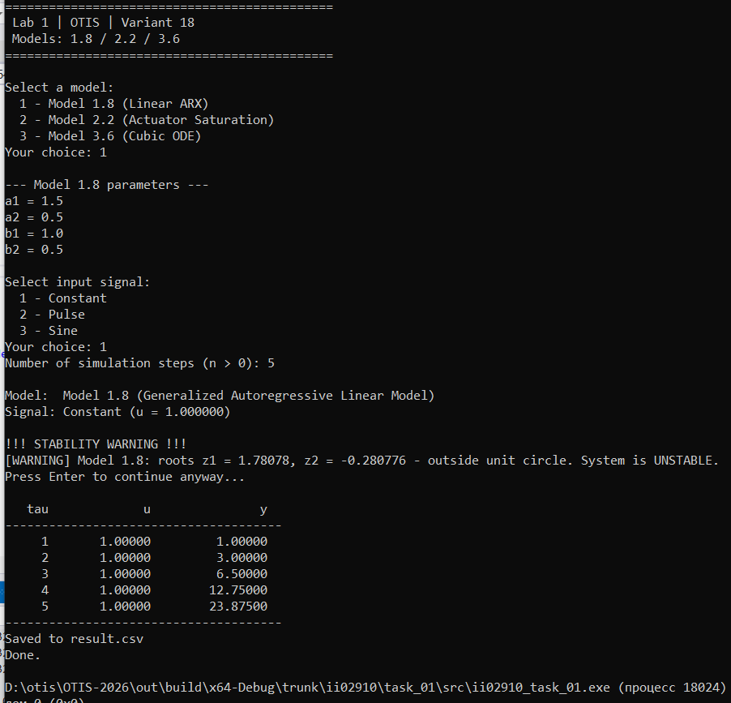
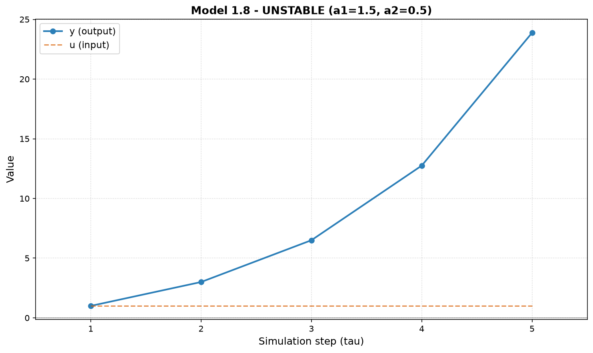

<p align="center">Министерство образования Республики Беларусь</p>
<p align="center">Учреждение образования</p>
<p align="center">«Брестский государственный технический университет»</p>
<p align="center">Кафедра ИИТ</p>
<br><br><br><br><br><br><br>
<p align="center">Лабораторная работа №1</p>
<p align="center">По дисциплине «Общая теория интеллектуальных систем»</p>
<p align="center">Тема: «Моделирование управляемого объекта»</p>
<br><br><br><br><br>
<p align="right">Выполнил:</p>
<p align="right">Студент 2 курса</p>
<p align="right">Группы ИИ-29</p>
<p align="right">Канцер М.А.</p>
<p align="right">Проверил:</p>
<p align="right">Дворанинович Д.А.</p>
<br><br><br><br><br>
<p align="center">Брест 2026</p>

---

## 1. Цель работы

Изучить методы математического моделирования управляемых объектов. Реализовать на языке C++ программу, моделирующую поведение трёх типов систем:

- **линейной дискретной модели** (Model 1.8 — Generalized Autoregressive Linear Model),
- **нелинейной дискретной модели** (Model 2.2 — Actuator Saturation Non-linearity),
- **непрерывного дифференциального уравнения** (Model 3.6 — Cubic Growth and Control),

с возможностью задания количества шагов симуляции, типа входного воздействия и анализа устойчивости системы.

## 2. Постановка задачи

Согласно варианту 18, реализуются следующие модели:

| Блок | Модель | Название |
|:---:|:---:|---|
| 1 | **Model 1.8** | Generalized Autoregressive Linear Model |
| 2 | **Model 2.2** | Actuator Saturation Non-linearity |
| 3 | **Model 3.6** | Cubic Growth and Control |

### Требования к программе

1. Реализация на языке **C++** с использованием принципов **ООП**.
2. Наличие **абстрактного базового класса** с виртуальным методом расчёта следующего шага.
3. Три типа входных воздействий:
   - **ступенчатое** `u_τ = const`,
   - **импульсное** `u_1 = 1, u_{τ>1} = 0`,
   - **гармоническое** `u_τ = sin(τ)`.
4. Возможность настройки количества шагов симуляции `n`.
5. Вывод результатов в табличном виде (в консоль и в CSV-файл).
6. Визуализация полученных результатов.
7. Сборка через **CMake** с запуском через **`.bat`-файл**.
8. **(Advanced)** Анализ устойчивости линейной дискретной модели через корни характеристического уравнения на Z-плоскости с выводом предупреждения при неустойчивости.

## 3. UML-диаграмма классов

На рисунке ниже представлена UML-диаграмма классов разработанной программы. Архитектура построена на двух независимых иерархиях наследования:

- **`AbstractSystem`** — абстрактный базовый класс всех моделей. Определяет общий интерфейс: метод `step(u)` для расчёта следующего шага симуляции, `reset()` для сброса состояния, `getDescription()` для получения текстового описания модели, а также методы анализа устойчивости `checkStability()` и `getWarningMessage()`.
- **`InputSignal`** — абстрактный базовый класс генераторов входного воздействия с методами `getValue(tau)` и `getLabel()`.

Конкретные реализации моделей (`LinearARXModel`, `SaturationModel`, `CubicODE`) и сигналов (`ConstantSignal`, `PulseSignal`, `SineSignal`) наследуют соответствующие абстрактные классы и переопределяют виртуальные методы. Создание объектов моделей инкапсулировано в классе `SystemFactory` с использованием перечисления `ModelType`.





*Рис. 1. UML-диаграмма классов программы*

---

## 4. Математическое описание моделей

### 4.1. Model 1.8 — Generalized Autoregressive Linear Model

**Формула:**

$$y_{\tau+1} = a_1 \cdot y_\tau + a_2 \cdot y_{\tau-1} + b_1 \cdot u_\tau + b_2 \cdot u_{\tau-1}$$

**Физический смысл:**

Обобщённая авторегрессионная модель (ARX — AutoRegressive with eXogenous input). Выход системы `y` на следующем шаге зависит от:

- **двух предыдущих значений** `y_τ` и `y_{τ-1}` с коэффициентами `a₁` и `a₂` — это «память» системы, её инерционность;
- **двух значений входного воздействия** `u_τ` и `u_{τ-1}` с коэффициентами `b₁` и `b₂` — влияние внешнего управления на текущий и прошлый моменты.

Такая структура характерна для **идентификации динамических систем**: зная вход и выход, подбирают коэффициенты `a_i`, `b_i`, которые наилучшим образом описывают поведение реального объекта.

**Анализ устойчивости (Advanced):**

Рассмотрим однородное уравнение, положив `u = 0`:

$$y_{\tau+1} = a_1 \cdot y_\tau + a_2 \cdot y_{\tau-1}$$

Подставим решение в виде `y_τ = z^τ`, где `z` — комплексная переменная на Z-плоскости:

$$z^{\tau+1} = a_1 \cdot z^\tau + a_2 \cdot z^{\tau-1}$$

Разделим на `z^{τ-1}`:

$$z^2 = a_1 \cdot z + a_2 \quad\Rightarrow\quad z^2 - a_1 \cdot z - a_2 = 0$$

Получили **характеристическое уравнение** второго порядка. Его корни:

$$z_{1,2} = \frac{a_1 \pm \sqrt{a_1^2 + 4a_2}}{2}$$

**Критерий устойчивости:** для дискретной системы все корни характеристического уравнения должны лежать **внутри единичного круга** на Z-плоскости, то есть:

$$\boxed{|z_1| < 1 \quad \text{и} \quad |z_2| < 1}$$

Если хотя бы один корень по модулю больше единицы — система **неустойчива**, выход `y` экспоненциально расходится.

В программе это реализовано в методах `checkStability()` и `getWarningMessage()` класса `LinearARXModel`. Перед началом симуляции при неустойчивости выводится предупреждение в консоль.

### 4.2. Model 2.2 — Actuator Saturation Non-linearity

**Формула:**

$$y_{\tau+1} = a \cdot y_\tau + b \cdot \text{sat}(u_\tau)$$

где функция `sat(u)` определяется как:

$$\text{sat}(u) = \begin{cases} U_{\max}, & u > U_{\max} \\ u, & U_{\min} \le u \le U_{\max} \\ U_{\min}, & u < U_{\min} \end{cases}$$

**Физический смысл:**

Линейная модель с **нелинейным ограничением на входе**. Функция `sat(u)` моделирует **насыщение исполнительного устройства**: реальные приводы (двигатели, клапаны, нагреватели) имеют физические пределы. Например, напряжение на нагревателе не может быть больше 220 В, а открытие клапана — больше 100%.

Если пользователь подаёт вход `u` в допустимом диапазоне `[U_min, U_max]` — ограничение не влияет. Если выходит за пределы — значение **обрезается** до границы.

**Анализ устойчивости:**

Нелинейная модель — линейный анализ через характеристическое уравнение **неприменим**. Для нелинейных систем используются другие методы (метод Ляпунова, линеаризация в рабочей точке). В программе метод `checkStability()` для этой модели всегда возвращает `true`.

### 4.3. Model 3.6 — Cubic Growth and Control

**Формула:**

$$\frac{dy}{dt} = a \cdot y^3 + b \cdot u$$

**Физический смысл:**

Дифференциальное уравнение с **кубической нелинейностью**. Скорость изменения `y` пропорциональна кубу текущего значения `y` (с коэффициентом `a`) плюс управляющее воздействие `u` (с коэффициентом `b`).

Такие уравнения встречаются в задачах:
- **химической кинетики** (автокаталитические реакции),
- **физики плазмы** (нелинейные неустойчивости),
- **лазерной физики** (нелинейное усиление),
- **теплофизики** (термические неустойчивости, когда рост температуры ускоряет сам себя).

**Численное решение методом Эйлера:**

$$\frac{dy}{dt} \approx \frac{y_{\tau+1} - y_\tau}{\Delta t} \quad\Rightarrow\quad y_{\tau+1} = y_\tau + \Delta t \cdot (a \cdot y_\tau^3 + b \cdot u_\tau)$$

**Анализ устойчивости численной схемы:**

Для проверки устойчивости метода Эйлера линеаризуем уравнение в рабочей точке `y*`:

$$f(y) = a \cdot y^3 + b \cdot u \quad\Rightarrow\quad f'(y) = 3 \cdot a \cdot y^2$$

Дискретное уравнение в окрестности `y*` принимает вид `y_{τ+1} = y_τ · (1 + Δt · f'(y*))`. Корень характеристического уравнения:

$$z = 1 + \Delta t \cdot 3 \cdot a \cdot (y^*)^2$$

**Условие устойчивости:**

$$\boxed{|1 + 3 \cdot a \cdot (y^*)^2 \cdot \Delta t| < 1}$$

При нарушении условия численная схема **расходится**, хотя точное решение могло бы затухать. В программе проверка выполняется в начальной точке `y* = 1`; при нарушении выводится предупреждение.

---

## 5. Описание реализации

### 5.1. Архитектура ООП

Программа построена на двух независимых иерархиях наследования:

**Иерархия моделей:**

- **`AbstractSystem`** — абстрактный базовый класс. Определяет общий интерфейс:
  - `virtual double step(double u)` — один шаг симуляции;
  - `virtual void reset()` — сброс состояния к начальному;
  - `virtual std::string getDescription() const` — текстовое описание модели;
  - `virtual bool checkStability() const` — проверка устойчивости (по умолчанию `true`);
  - `virtual std::string getWarningMessage() const` — текст предупреждения о неустойчивости (по умолчанию — пусто).

- **`LinearARXModel`, `SaturationModel`, `CubicODE`** — конкретные реализации, наследники `AbstractSystem`. Каждая переопределяет `step()`, `reset()`, `getDescription()`, а при необходимости — `checkStability()` и `getWarningMessage()`.

**Иерархия входных сигналов:**

- **`InputSignal`** — абстрактный базовый класс генератора входного воздействия:
  - `virtual double getValue(int tau) const` — значение сигнала на шаге `τ`;
  - `virtual std::string getLabel() const` — название сигнала.

- **`ConstantSignal`, `PulseSignal`, `SineSignal`** — конкретные реализации трёх типов воздействий.

**Фабрика:**

- **`SystemFactory`** — статический класс-фабрика с методом `create(ModelType type)`, который создаёт нужный объект-модель по типу. Параметры модели запрашиваются у пользователя внутри фабрики. Тип модели задаётся перечислением `enum class ModelType`.

**Полиморфизм:** в `main()` работа идёт через указатели `std::unique_ptr<AbstractSystem>` и `std::unique_ptr<InputSignal>`. Конкретный тип выбирается во время выполнения, что позволяет добавлять новые модели и сигналы без изменения основной логики программы.

### 5.2. Структура файлов

| Файл | Назначение |
|---|---|
| `src/AbstractSystem.h` | Абстрактный базовый класс `AbstractSystem` |
| `src/LinearARXModel.h` / `.cpp` | Model 1.8 — линейная ARX-модель + анализ устойчивости |
| `src/SaturationModel.h` / `.cpp` | Model 2.2 — модель с насыщением |
| `src/CubicODE.h` / `.cpp` | Model 3.6 — кубическое ДУ, метод Эйлера + анализ устойчивости |
| `src/InputGenerator.h` / `.cpp` | Генераторы трёх типов входных сигналов |
| `src/SystemFactory.h` / `.cpp` | Фабрика систем + запрос параметров у пользователя |
| `src/main.cpp` | Точка входа: меню, ввод, симуляция, вывод |
| `src/CMakeLists.txt` | Файл сборки модуля `src` |
| `CMakeLists.txt` | Локальный `CMakeLists.txt` уровня `task_01` |
| `build.bat` | Скрипт автоматической сборки проекта |
| `plot_results.py` | Python-скрипт визуализации результатов |
| `doc/readme.md` | Данный отчёт |

### 5.3. Формат вывода результатов

Результаты симуляции выводятся **двумя способами** одновременно:

**1. В консоль** — табличный вид:

```
   tau             u               y
--------------------------------------
     1       1.00000       1.00000
     2       1.00000       2.00000
     3       1.00000       2.80000
    ...
```

Формат: три колонки с фиксированной шириной поля (`std::setw`), точность — 5 знаков после запятой (`std::setprecision(5)`).

**2. В файл `result.csv`** — формат CSV с заголовком:

```csv
tau,u_tau,y_tau
1,1,1
2,1,2
3,1,2.8
...
```

CSV-файл создаётся в директории, откуда была запущена программа.

### 5.4. Сборка через CMake и `.bat`

Сборка проекта автоматизирована через скрипт **`build.bat`**:

```bat
@echo off
setlocal
cd /d "%~dp0"

set CMAKE_BIN=C:\Program Files\Microsoft Visual Studio\2022\Community\Common7\IDE\CommonExtensions\Microsoft\CMake\CMake\bin\cmake.exe

if not exist "%CMAKE_BIN%" (
    echo [ERROR] CMake not found at %CMAKE_BIN%
    pause
    exit /b 1
)

if not exist "build" mkdir build
cd build

"%CMAKE_BIN%" .. -DCMAKE_BUILD_TYPE=Release
"%CMAKE_BIN%" --build . --config Release

pause
endlocal
```

**Как работает:**

1. Скрипт переходит в директорию, где лежит сам (независимо от места запуска).
2. Проверяет наличие `cmake.exe` по указанному пути.
3. Создаёт папку `build/` (если нет) и переходит в неё — это **out-of-source сборка** (артефакты не смешиваются с исходниками).
4. Запускает `cmake ..` — конфигурация проекта.
5. Запускает `cmake --build . --config Release` — компиляция и линковка.

**Результат:** собранный `ii02910_task_01.exe` в `build/src/Release/`.

### 5.5. Визуализация

Для визуализации используется **Python + Matplotlib**. Скрипт `plot_results.py`:

1. Читает `result.csv` с результатами симуляции.
2. Строит график зависимости выходной переменной `y_τ` от шага `τ`.
3. Дополнительно отображает входной сигнал `u_τ` пунктирной линией.
4. Сохраняет график в PNG.

**Пример использования:**

```bash
python plot_results.py result.csv doc/screenshots/01_plot_model_1_8.png "Model 1.8 - Constant signal"
```

Все графики сохранены в директории `doc/screenshots/`.

---

## 6. Результаты симуляции

Для каждой модели проведена симуляция с тремя типами входных воздействий. Ниже приведены таблицы результатов и графики, полученные скриптом `plot_results.py`.

### 6.1. Model 1.8 — устойчивая система

**Параметры симуляции:**
- Коэффициенты: $a_1 = 0.5$, $a_2 = 0.3$, $b_1 = 1.0$, $b_2 = 0.5$
- Входной сигнал: постоянный ($u_\tau = 1$)
- Количество шагов: $n = 10$

**Проверка устойчивости:** корни характеристического уравнения $z^2 - 0.5z - 0.3 = 0$ равны $z_1 \approx 0.84$, $z_2 \approx -0.34$. Оба корня по модулю меньше 1 — система устойчива.

**Таблица результатов (фрагмент):**

| $\tau$ | $u_\tau$ | $y_\tau$ |
|:---:|:---:|:---:|
| 1 | 1.00000 | 1.00000 |
| 2 | 1.00000 | 2.00000 |
| 3 | 1.00000 | 2.80000 |
| 4 | 1.00000 | 3.50000 |
| 5 | 1.00000 | 4.09000 |
| … | … | … |
| 10 | 1.00000 | 5.96859 |

Полные данные — в файле `result.csv`.

**График зависимости $y_\tau$ от $\tau$:**



*Рис. 2. Model 1.8 ($a_1=0.5$, $a_2=0.3$) — рост при постоянном входе*

**Скриншот консольного вывода:**



*Рис. 3. Вывод результатов в консоль для Model 1.8*

**Анализ:** система устойчива, значения `y` плавно растут при постоянном входе, поскольку коэффициенты `a₁`, `a₂`, `b₁`, `b₂` положительные. Скорость роста замедляется — система выходит на асимптоту.

### 6.2. Model 2.2 — импульсное воздействие

**Параметры симуляции:**
- Коэффициенты: $a = 0.9$, $b = 1.0$, $U_{\min} = -1.0$, $U_{\max} = 1.0$
- Входной сигнал: импульсный ($u_1 = 1$, $u_{\tau>1} = 0$)
- Количество шагов: $n = 10$

**Таблица результатов (фрагмент):**

| $\tau$ | $u_\tau$ | $y_\tau$ |
|:---:|:---:|:---:|
| 1 | 1.00000 | 1.00000 |
| 2 | 0.00000 | 0.90000 |
| 3 | 0.00000 | 0.81000 |
| 4 | 0.00000 | 0.72900 |
| 5 | 0.00000 | 0.65610 |
| … | … | … |
| 10 | 0.00000 | 0.38742 |

**График:**



*Рис. 4. Model 2.2 — реакция на импульсное воздействие*

**Скриншот консольного вывода:**



*Рис. 5. Вывод результатов в консоль для Model 2.2*

**Анализ:** импульс на первом шаге даёт скачок `y₁ = 1.0`. Далее вход равен нулю, и система затухает с коэффициентом $a = 0.9$: $y_\tau = 0.9^{\tau-1}$.

### 6.3. Model 3.6 — гармоническое воздействие

**Параметры симуляции:**
- Коэффициенты: $a = -1.0$, $b = 1.0$, шаг интегрирования $\Delta t = 0.1$
- Входной сигнал: гармонический ($u_\tau = \sin(\tau)$)
- Количество шагов: $n = 15$

**Проверка устойчивости численной схемы:** $z = 1 + 3 \cdot (-1.0) \cdot 1^2 \cdot 0.1 = 0.7$, $|z| < 1$ — устойчиво.

**Таблица результатов (фрагмент):**

| $\tau$ | $u_\tau$ | $y_\tau$ |
|:---:|:---:|:---:|
| 1 | 0.84147 | 0.98415 |
| 2 | 0.90930 | 0.97976 |
| 3 | 0.14112 | 0.89982 |
| 4 | −0.75680 | 0.75128 |
| 5 | −0.95892 | 0.61299 |
| … | … | … |
| 15 | 0.65029 | 0.59293 |

**График:**



*Рис. 6. Model 3.6 — реакция на гармоническое воздействие*

**Скриншот консольного вывода:**



*Рис. 7. Вывод результатов в консоль для Model 3.6*

**Анализ:** выход `y` колеблется вслед за синусоидальным входом, но с меньшей амплитудой и небольшим запаздыванием. Отрицательный коэффициент `a` стабилизирует систему, не давая ей «разогнаться».

### 6.4. Model 1.8 — неустойчивая система (Advanced)

**Параметры симуляции:**
- Коэффициенты: $a_1 = 1.5$, $a_2 = 0.5$, $b_1 = 1.0$, $b_2 = 0.5$
- Входной сигнал: постоянный
- Количество шагов: $n = 5$

**Проверка устойчивости:** корни характеристического уравнения $z^2 - 1.5z - 0.5 = 0$ равны $z_1 \approx 1.78$, $z_2 \approx -0.28$. Корень $z_1$ по модулю больше 1 — система **неустойчива**.

Перед началом симуляции программа выводит предупреждение:

```
!!! STABILITY WARNING !!!
[WARNING] Model 1.8: roots z1 = 1.78078, z2 = -0.280776 - outside unit circle. System is UNSTABLE.
Press Enter to continue anyway...
```

**Таблица результатов:**

| $\tau$ | $u_\tau$ | $y_\tau$ |
|:---:|:---:|:---:|
| 1 | 1.00000 | 1.00000 |
| 2 | 1.00000 | 3.00000 |
| 3 | 1.00000 | 6.50000 |
| 4 | 1.00000 | 12.75000 |
| 5 | 1.00000 | 23.87500 |

**Скриншот консольного вывода с предупреждением:**



*Рис. 8. Предупреждение о неустойчивости и расходящийся процесс*

**График расходящегося процесса:**



*Рис. 9. Экспоненциальный рост $y_\tau$ при $|z_1| > 1$*

**Анализ:** при $|z_1| > 1$ система неустойчива, значения `y` растут экспоненциально. Advanced-задание выполнено: программа корректно определяет неустойчивость через корни характеристического уравнения и предупреждает пользователя.

---

## 7. Выводы

В ходе выполнения лабораторной работы были получены следующие результаты:

**1. Реализована программа на C++** с использованием принципов объектно-ориентированного программирования. Архитектура построена на абстрактном базовом классе `AbstractSystem` с виртуальным методом `step()` и трёх наследниках — конкретных математических моделях.

**2. Реализованы три модели** в соответствии с вариантом 18:

- **Model 1.8** — Generalized Autoregressive Linear Model;
- **Model 2.2** — Actuator Saturation Non-linearity;
- **Model 3.6** — Cubic Growth and Control (решено методом Эйлера).

**3. Реализованы три типа входных воздействий** (постоянное, импульсное, гармоническое) через отдельную иерархию классов `InputSignal`.

**4. Создание объектов инкапсулировано в фабрике** `SystemFactory`, которая по типу модели создаёт нужный объект и запрашивает у пользователя необходимые параметры. Это позволяет добавлять новые модели без изменения основной логики программы.

**5. Выполнен анализ устойчивости** (Advanced-задание):

- Для **Model 1.8** выведено характеристическое уравнение $z^2 - a_1 z - a_2 = 0$ с корнями $z_{1,2} = (a_1 \pm \sqrt{a_1^2 + 4a_2})/2$. Условие устойчивости: $|z_1| < 1$ и $|z_2| < 1$. В программе реализована проверка: при неустойчивости выводится предупреждение перед началом симуляции.
- Для **Model 3.6** проанализирована устойчивость численной схемы Эйлера через линеаризацию: $|1 + 3a(y^*)^2 \Delta t| < 1$. При нарушении выводится предупреждение.
- Для **Model 2.2** линейный анализ неприменим (нелинейная модель), поэтому `checkStability()` всегда возвращает `true`.

**6. Проведена симуляция всех моделей** при различных входных воздействиях. Результаты:

- Model 1.8 при устойчивых коэффициентах — плавный рост `y` при постоянном входе.
- Model 1.8 при неустойчивых коэффициентах ($a_1 = 1.5$, $a_2 = 0.5$) — экспоненциальный расходящийся процесс, что подтверждает теоретический анализ.
- Model 2.2 даёт «мягкий» отклик на импульс: скачок на первом шаге, затем затухание с коэффициентом `a`.
- Model 3.6 численно воспроизводит колебания `y` вслед за синусоидальным входом `u` с меньшей амплитудой.

**7. Результаты визуализированы** с помощью Python + Matplotlib — построены графики `y(τ)` и `u(τ)` для каждой модели.

**8. Сборка автоматизирована** через CMake и скрипт `build.bat`.

**Итог:** цель работы достигнута — программа корректно моделирует управляемые объекты, определяет их устойчивость и визуализирует переходные процессы.

---

## 8. Приложения

### 8.1. Ссылки на исходный код

Все файлы проекта расположены в каталоге `trunk/ii02910/task_01/`:

| Файл | Ссылка |
|---|---|
| `AbstractSystem.h` | [src/AbstractSystem.h](../src/AbstractSystem.h) |
| `LinearARXModel.h` | [src/LinearARXModel.h](../src/LinearARXModel.h) |
| `LinearARXModel.cpp` | [src/LinearARXModel.cpp](../src/LinearARXModel.cpp) |
| `SaturationModel.h` | [src/SaturationModel.h](../src/SaturationModel.h) |
| `SaturationModel.cpp` | [src/SaturationModel.cpp](../src/SaturationModel.cpp) |
| `CubicODE.h` | [src/CubicODE.h](../src/CubicODE.h) |
| `CubicODE.cpp` | [src/CubicODE.cpp](../src/CubicODE.cpp) |
| `InputGenerator.h` | [src/InputGenerator.h](../src/InputGenerator.h) |
| `InputGenerator.cpp` | [src/InputGenerator.cpp](../src/InputGenerator.cpp) |
| `SystemFactory.h` | [src/SystemFactory.h](../src/SystemFactory.h) |
| `SystemFactory.cpp` | [src/SystemFactory.cpp](../src/SystemFactory.cpp) |
| `main.cpp` | [src/main.cpp](../src/main.cpp) |
| `CMakeLists.txt` (src) | [src/CMakeLists.txt](../src/CMakeLists.txt) |
| `CMakeLists.txt` (task_01) | [CMakeLists.txt](../CMakeLists.txt) |
| `build.bat` | [build.bat](../build.bat) |
| `plot_results.py` | [plot_results.py](../plot_results.py) |

### 8.2. Пример выходных данных

Файл `result.csv` с результатами последнего прогона симуляции (Model 1.8 при $a_1 = 0.5$, $a_2 = 0.3$, $n = 10$):

```csv
tau,u_tau,y_tau
1,1,1
2,1,2
3,1,2.8
4,1,3.5
5,1,4.09
6,1,4.595
7,1,5.0245
8,1,5.39075
9,1,5.70273
10,1,5.96859
```

### 8.3. Графики

Все построенные графики находятся в каталоге `doc/screenshots/`:

- `01_plot_model_1_8.png` — Model 1.8 (Constant)
- `02_plot_model_2_2.png` — Model 2.2 (Pulse)
- `03_plot_model_3_6.png` — Model 3.6 (Sine)
- `04_plot_model_1_8_unstable.png` — Model 1.8 (неустойчивая, Advanced)
---