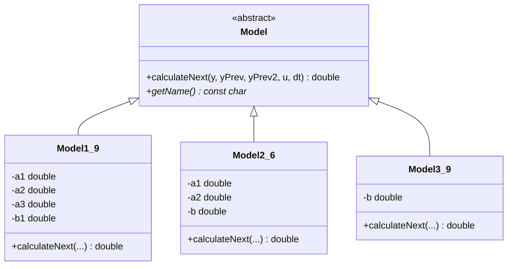
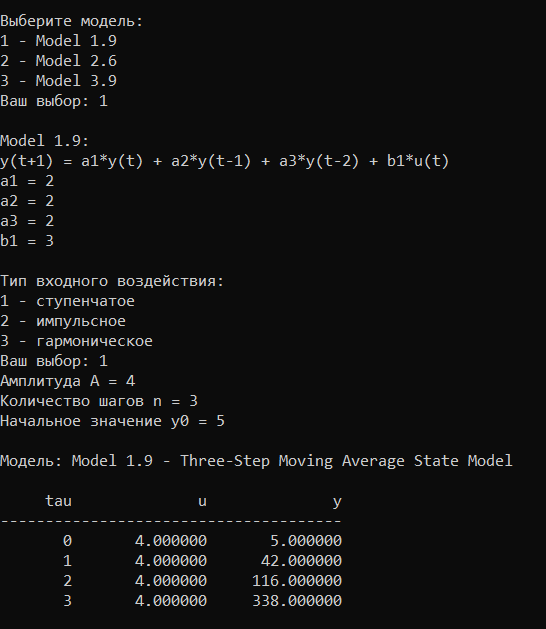
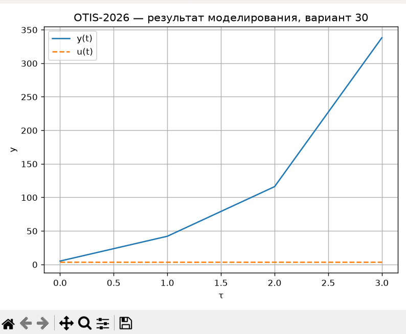
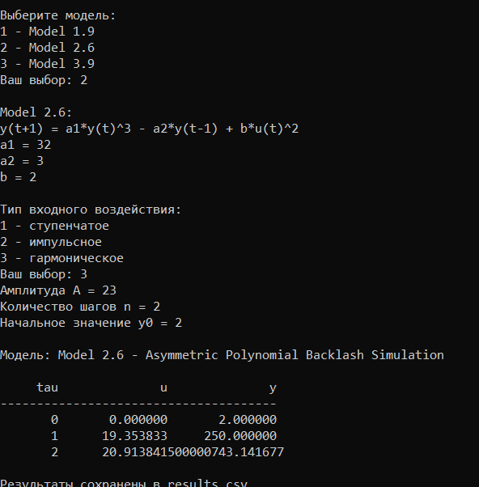
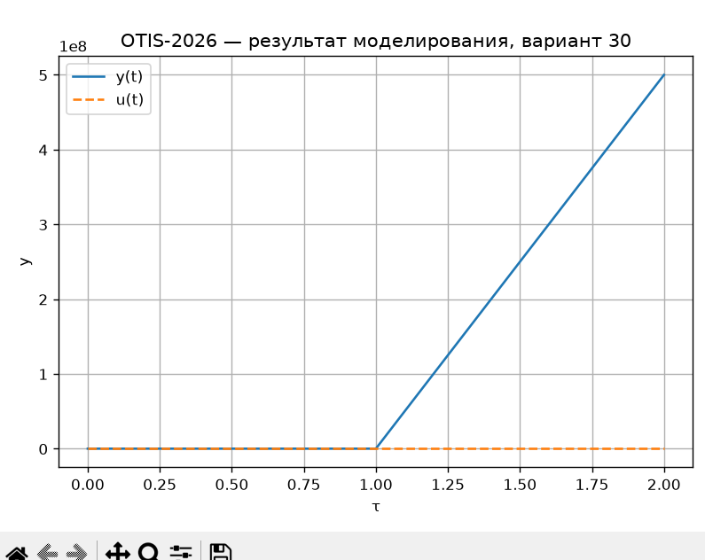
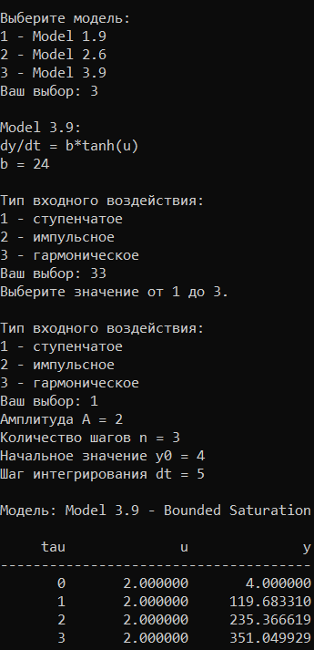
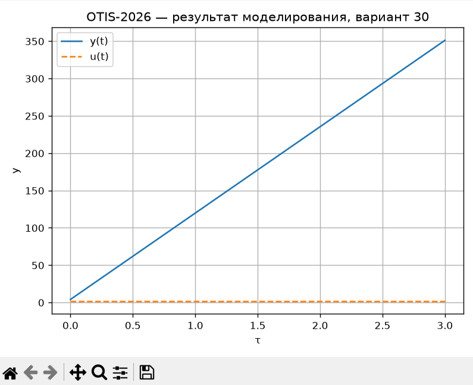

<p align="center">Министерство образования Республики Беларусь</p>
<p align="center">Учреждение образования</p>
<p align="center">«Брестский Государственный технический университет»</p>
<p align="center">Кафедра ИИТ</p>

<br><br><br><br>

<p align="center">Лабораторная работа №1</p>
<p align="center">По дисциплине «Общая теория интеллектуальных систем»</p>
<p align="center">Тема: «Моделирования температуры объекта»</p>

<br><br><br>

<p align="right">Выполнил:</p>
<p align="right">Студент 2 курса</p>
<p align="right">Группы ИИ-29</p>
<p align="right">Кондратчик Н.И.</p>
<p align="right">Проверил:</p>
<p align="right">Дворанинович Д. А.</p>

<br><br><br>

<p align="center">Брест 2026</p>

---

# Вариант

- Линейная модель: **Model 1.9**
- Нелинейная модель: **Model 2.6**
- Дифференциальное уравнение: **Model 3.9**

# Реализованные модели

## Model 1.9

Трёхшаговая линейная модель:

`y(t+1) = a1*y(t) + a2*y(t-1) + a3*y(t-2) + b1*u(t)`

## Model 2.6

Нелинейная модель:

`y(t+1) = a1*y(t)^3 - a2*y(t-1) + b*u(t)^2`

## Model 3.9

Дифференциальное уравнение:

`dy/dt = b*tanh(u)`

Для Model 3.9 используется метод Эйлера:

`y(t+1) = y(t) + dt*b*tanh(u(t))`

# Входные воздействия

1. Ступенчатое: `u(t) = A`
2. Импульсное: `u(0) = A`, `u(t > 0) = 0`
3. Гармоническое: `u(t) = A*sin(t)`

# ООП

Создан абстрактный базовый класс `Model` с виртуальным методом `calculateNext()`.

От него наследуются:

- `Model1_9`
- `Model2_6`
- `Model3_9`

Для Model 1.9 дополнительно учитываются два предыдущих значения выходной величины.

# Результат

Программа:

- позволяет выбрать модель;
- принимает коэффициенты;
- позволяет выбрать входное воздействие;
- позволяет задать количество шагов `n`;
- позволяет задать начальное значение `y0`;
- для дифференциальной модели позволяет задать `dt`;
- выводит результаты в табличном виде;
- сохраняет результаты в `results.csv`;
- автоматически запускает `plot.py`;
- строит график результата с помощью Python/Matplotlib.

# Сборка

На Windows используется `build.bat`:

```bat
@echo off
setlocal

if not exist "%~dp0CMakeLists.txt" (
    echo ERROR CMakeLists not found in this folder
    pause
    exit /b 1
)

cd /d "%~dp0"

echo STARTING BUILD PROCESS

echo STAGE 1 Configuration
cmake -S . -B build -G "MinGW Makefiles"

echo STAGE 2 Compilation
cmake --build build --config Release

echo SUCCESS Build completed successfully
pause
```

После сборки исполняемый файл находится здесь:

`build/src/otis_task_01.exe`

# Запуск

Программа запускается без аргументов:

```text
otis_task_01.exe
```

После запуска пользователь выбирает модель, задаёт коэффициенты, вид входного воздействия, амплитуду, число шагов и начальное значение.

# Пример работы

После запуска появляется меню:

```text
============================================
 OTIS-2026 | Лабораторная работа №1
 Вариант 30
============================================

Выберите модель:
1 - Model 1.9
2 - Model 2.6
3 - Model 3.9
Ваш выбор:
```

После выбора модели вводятся соответствующие коэффициенты.

Затем выбирается воздействие:

```text
1 - ступенчатое
2 - импульсное
3 - гармоническое
```

Полученные данные выводятся в консоль и сохраняются в `results.csv`.

После этого автоматически запускается `plot.py`.

# UML


# Пример работы 1.9


# Пример работы 2.6


# Пример работы 3.9



# Вывод

В ходе лабораторной работы была разработана объектно-ориентированная программа моделирования динамических систем для варианта 30.

Были реализованы линейная модель 1.9, нелинейная модель 2.6 и дифференциальное уравнение 3.9. Программа поддерживает ступенчатое, импульсное и гармоническое входные воздействия, позволяет задавать количество шагов моделирования и необходимые коэффициенты.

Результаты выводятся в табличном виде, сохраняются в CSV-файл и визуализируются с помощью Python и Matplotlib. Сборка проекта выполняется с помощью CMake и `build.bat`.
