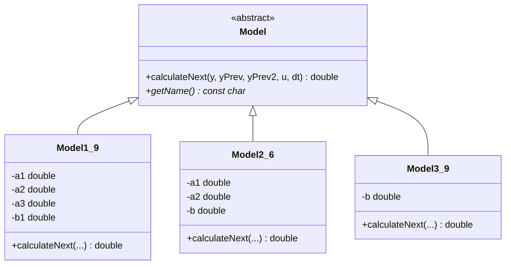

# UML диаграмма

```mermaid
classDiagram
    class Model {
        <<abstract>>
        +calculateNext(y, yPrev, yPrev2, u, dt) double
        +getName() const char*
    }

    class Model1_9 {
        -a1 double
        -a2 double
        -a3 double
        -b1 double
        +calculateNext(...) double
    }

    class Model2_6 {
        -a1 double
        -a2 double
        -b double
        +calculateNext(...) double
    }

    class Model3_9 {
        -b double
        +calculateNext(...) double
    }

    Model <|-- Model1_9
    Model <|-- Model2_6
    Model <|-- Model3_9
```
