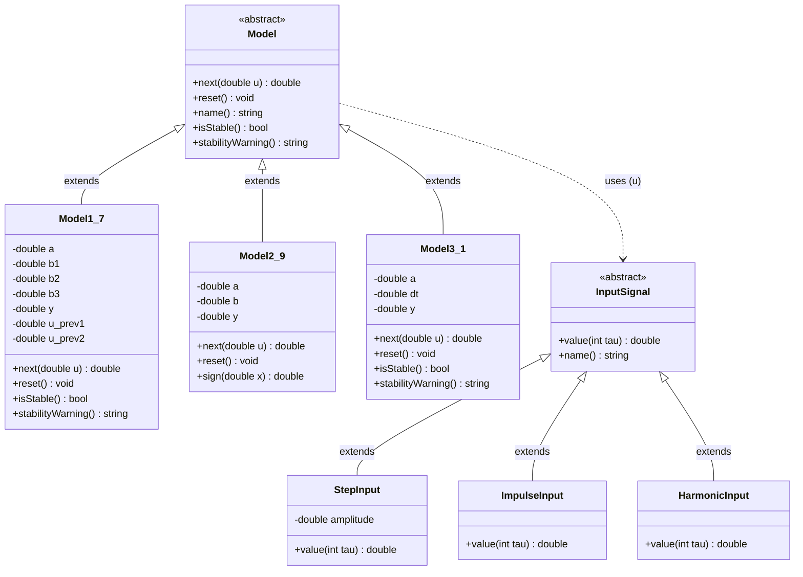
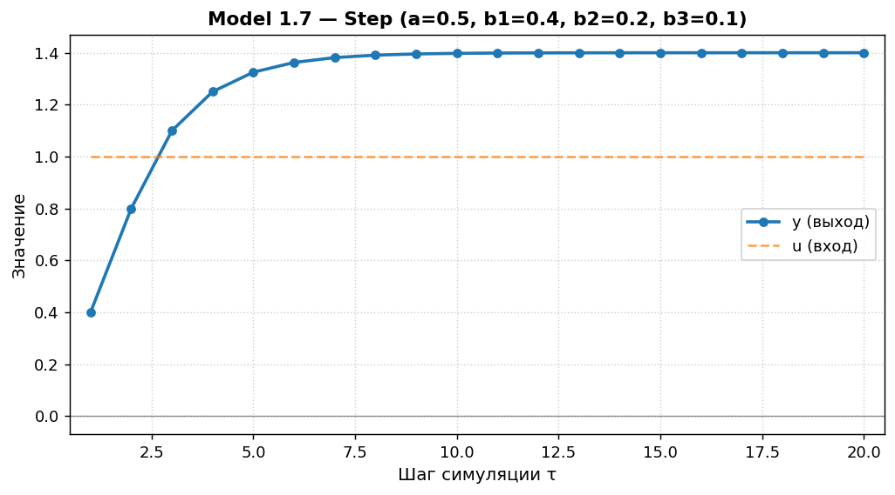
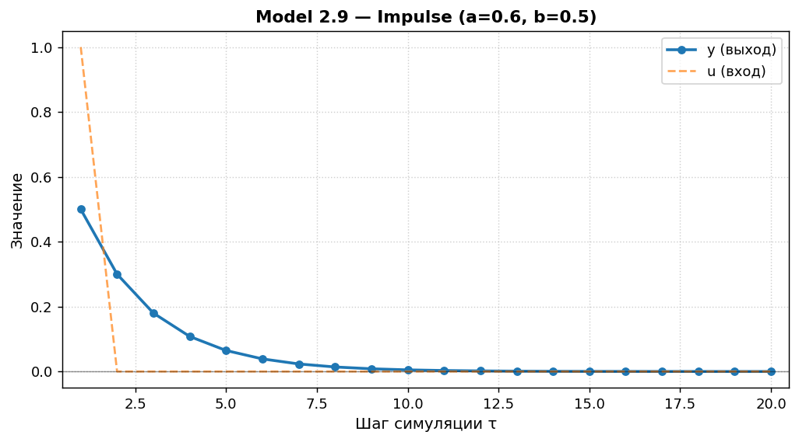
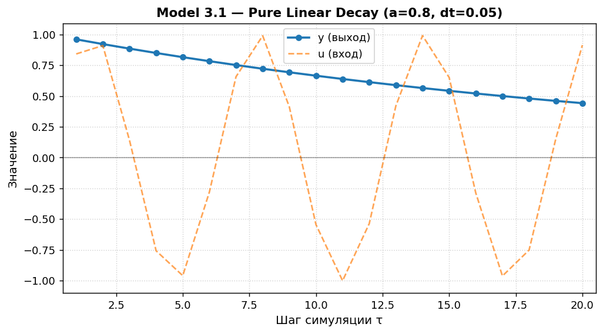

Министерство образования Республики Беларусь

Учреждение образования

«Брестский государственный технический университет»

Кафедра ИИТ

       

Лабораторная работа №1

По дисциплине «Общая теория интеллектуальных систем»

Тема: «Моделирование управляемого объекта»

     

Выполнил:

Студент 2 курса

Группы ИИ-29

Углик С.С.

Проверил:

Дворанинович Д.А.

     

Брест 2026

---

## 1. Цель работы

Изучить методы математического моделирования управляемых объектов. Реализовать на языке C++ программу, моделирующую поведение трёх типов систем:

- **линейной дискретной модели** (Model 1.7 — System with Multi-Step Control History),
- **нелинейной дискретной модели** (Model 2.9 — Square Root Modulated Action),
- **непрерывного дифференциального уравнения** (Model 3.1 — Pure Linear Decay),

с возможностью настройки количества шагов симуляции, типа входного воздействия и анализа устойчивости системы.

## 2. Постановка задачи

Согласно варианту 7, реализуются следующие модели:

| Блок | Модель | Название |
|:---:|:---:|---|
| 1 | **Model 1.7** | System with Multi-Step Control History |
| 2 | **Model 2.9** | Square Root Modulated Action |
| 3 | **Model 3.1** | Pure Linear Decay |

### Требования к программе

1. Реализация на языке **C++** с использованием принципов **ООП**.
2. Наличие **абстрактного базового класса** `Model` с виртуальным методом расчёта следующего шага.
3. Три типа входных воздействий:
   - **ступенчатое** $u_\tau = \text{const}$,
   - **импульсное** $u_1 = 1, u_{\tau>1} = 0$,
   - **гармоническое** $u_\tau = \sin(\tau)$.
4. Возможность настройки количества шагов симуляции $n$.
5. Вывод результатов в табличном виде (в консоль и в CSV-файл).
6. Визуализация полученных результатов.
7. Сборка через **CMake** с запуском через **`.bat`-файл**.
8. **(Advanced)** Анализ устойчивости линейной дискретной модели через корни характеристического уравнения на Z-плоскости с выводом предупреждения при неустойчивости.

---

## 3. UML-диаграмма классов

Архитектура программы построена на двух иерархиях наследования:
- **`Model`** — абстрактный базовый класс с виртуальными методами `next(u)`, `reset()`, `name()`, `isStable()` и `stabilityWarning()`.
- **`InputSignal`** — абстрактный базовый класс генераторов входных воздействий (`StepInput`, `ImpulseInput`, `HarmonicInput`).

---

## 4. Математическое описание моделей

### 4.1. Model 1.7 — System with Multi-Step Control History

**Формула:**
$$y_{\tau+1} = a \cdot y_\tau + b_1 \cdot u_\tau + b_2 \cdot u_{\tau-1} + b_3 \cdot u_{\tau-2}$$

**Физический смысл:**
Модель динамического звена с распределённым запаздыванием управления. Текущий выход зависит от состояния системы и трёх последних тактов управляющего сигнала.

**Анализ устойчивости (Advanced):**
Однородная часть уравнения при $u_\tau = 0$:
$$y_{\tau+1} - a \cdot y_\tau = 0$$

Подстановка $y_\tau = z^\tau$ дает характеристическое уравнение $z - a = 0 \implies z = a$. Для устойчивости дискретной системы корень должен лежать строго внутри единичного круга на Z-плоскости:
$$\boxed{\vert{}a\vert{} < 1}$$

В программе проверка реализована в методе `isStable()` класса `Model1_7`. При $|a| \ge 1$ выводится предупреждение о неустойчивости.

### 4.2. Model 2.9 — Square Root Modulated Action

**Формула:**
$$y_{\tau+1} = a \cdot y_\tau + b \cdot \sqrt{|u_\tau|} \cdot \text{sign}(u_\tau)$$

**Физический смысл:**
Нелинейная система с модуляцией по квадратному корню. Обеспечивает высокую чувствительность к малым управляющим воздействиям и насыщение при больших значениях сигнала.

### 4.3. Model 3.1 — Pure Linear Decay

**Формула:**
$$\frac{dy}{dt} = -a \cdot y$$

**Метод Эйлера:**
$$y_{\tau+1} = y_\tau + \Delta t \cdot (-a \cdot y_\tau) = y_\tau (1 - a \cdot \Delta t)$$

**Условие устойчивости схемы:**
$$\boxed{|1 - a \cdot \Delta t| < 1 \iff 0 < a \cdot \Delta t < 2}$$

---

## 5. Результаты симуляции

### 5.1. Model 1.7 (Линейная модель)

### 5.2. Model 2.9 (Нелинейная модель)

### 5.3. Model 3.1 (Дифференциальное уравнение)

---

## 6. Выводы

В ходе работы спроектирована архитектура на языке C++ с применением полиморфизма и абстрактных базовых классов (`Model`, `InputSignal`). Настроена кроссплатформенная сборка через CMake. Проведен численный эксперимент и визуализированы переходные процессы для моделей Варианта 7. Реализован модуль анализа устойчивости на Z-плоскости (Advanced).

---

## 7. Приложения

### 7.1. Ссылки на исходный код
Все файлы расположены в каталоге `trunk/ii02914/task_01/`:
* `Model.h` — [src/Model.h](../src/Model.h)
* `Model1_7.h` — [src/Model1_7.h](../src/Model1_7.h)
* `Model2_9.h` — [src/Model2_9.h](../src/Model2_9.h)
* `Model3_1.h` — [src/Model3_1.h](../src/Model3_1.h)
* `InputSignals.h` — [src/InputSignals.h](../src/InputSignals.h)
* `main.cpp` — [src/main.cpp](../src/main.cpp)
* `CMakeLists.txt` (src) — [src/CMakeLists.txt](../src/CMakeLists.txt)
* `CMakeLists.txt` (task_01) — [CMakeLists.txt](../CMakeLists.txt)
* `build.bat` — [build.bat](../build.bat)
* `plot_results.py` — [plot_results.py](../plot_results.py)