<p align="center">Министерство образования Республики Беларусь</p>
<p align="center">Учреждение образования</p>
<p align="center">«Брестский государственный технический университет»</p>
<p align="center">Кафедра ИИТ</p>
<br><br><br><br><br><br><br>
<p align="center">Лабораторная работа №1</p>
<p align="center">По дисциплине «Общая теория интеллектуальных систем»</p>
<p align="center">Тема: «Моделирование управляемого объекта»</p>
<br><br><br><br><br>
<p align="right">Выполнил:</p>
<p align="right">Студент 2 курса</p>
<p align="right">Группы ИИ-29</p>
<p align="right">Пархоц В.В.</p>
<p align="right">Проверил:</p>
<p align="right">Дворанинович Д.А.</p>
<br><br><br><br><br>
<p align="center">Брест 2026</p>

---

## 1. Цель работы

Изучить методы математического моделирования управляемых объектов. Реализовать на языке C++ программу, моделирующую поведение трёх типов систем:

- **линейной дискретной модели** (Model 1.5 — System with State Delay),
- **нелинейной дискретной модели** (Model 2.2 — Actuator Saturation Non-linearity),
- **непрерывного дифференциального уравнения** (Model 3.8 — Combined Linear-Quadratic Decay),

с возможностью задания количества шагов симуляции, типа входного воздействия и анализа устойчивости системы.

## 2. Постановка задачи

Согласно варианту 28, реализуются следующие модели:

| Блок | Модель | Название |
|:---:|:---:|---|
| 1 | **Model 1.5** | System with State Delay |
| 2 | **Model 2.2** | Actuator Saturation Non-linearity |
| 3 | **Model 3.8** | Combined Linear-Quadratic Decay |

### Требования к программе

1. Реализация на языке **C++** с использованием принципов **ООП**.
2. Наличие **абстрактного базового класса** `DynamicModel` с виртуальным методом расчёта следующего шага.
3. Три типа входных воздействий:
   - **ступенчатое** `u_τ = const`,
   - **импульсное** `u_1 = 1, u_{τ>1} = 0`,
   - **гармоническое** `u_τ = sin(τ)`.
4. Возможность настройки количества шагов симуляции `n`.
5. Вывод результатов в табличном виде (в консоль и в CSV-файл).
6. Визуализация полученных результатов.
7. Сборка через **CMake** с запуском через **`.bat`-файл**.
8. **(Advanced)** Анализ устойчивости линейной дискретной модели через корни характеристического уравнения на Z-плоскости с выводом предупреждения при неустойчивости.

---

## 3. UML-диаграмма классов

На рисунке ниже представлена UML-диаграмма классов разработанной программы. Архитектура построена на двух независимых иерархиях наследования:

- **`DynamicModel`** — абстрактный базовый класс всех математических моделей. Определяет общий интерфейс: метод `advance(u)` для расчёта следующего шага симуляции, `reset()` для сброса состояния, `describe()` для текстового описания, а также методы анализа устойчивости `verifyStability()` и `getWarningMessage()`.
- **`SignalGenerator`** — абстрактный базовый класс генераторов входного воздействия с методами `value(tau)` и `getName()`.

Конкретные реализации моделей (`StateDelayModel`, `SaturationModel`, `QuadraticDecayODE`) и сигналов (`StepSignal`, `BurstSignal`, `HarmonicSignal`) наследуют соответствующие абстрактные классы и переопределяют виртуальные методы. Создание моделей инкапсулировано в фабрике `ModelCreator`.

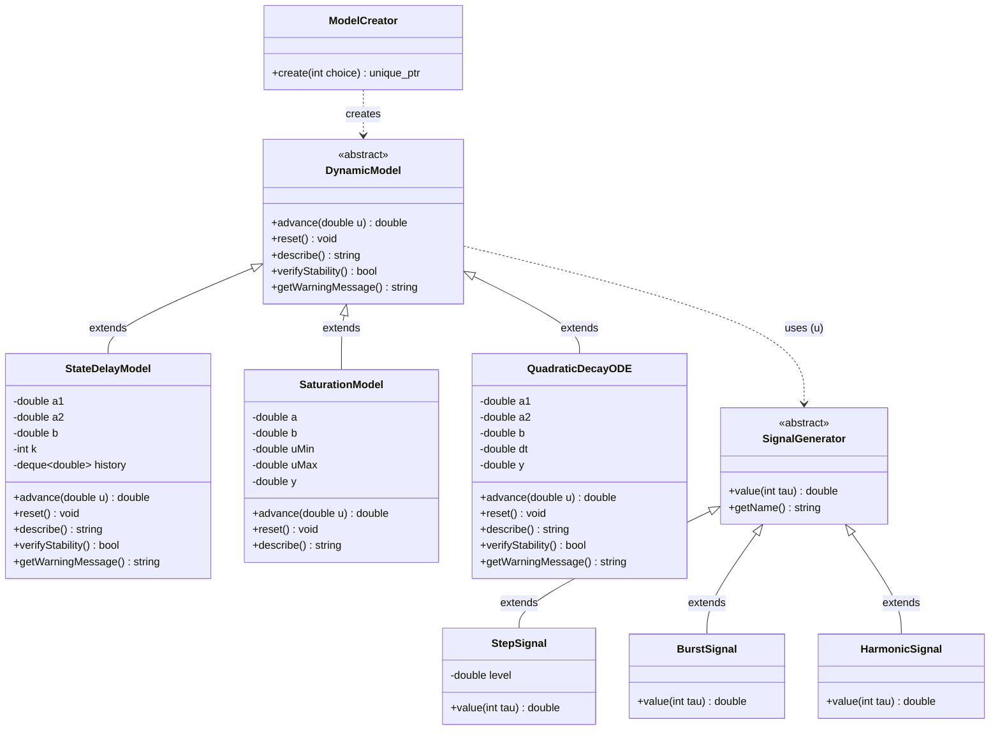

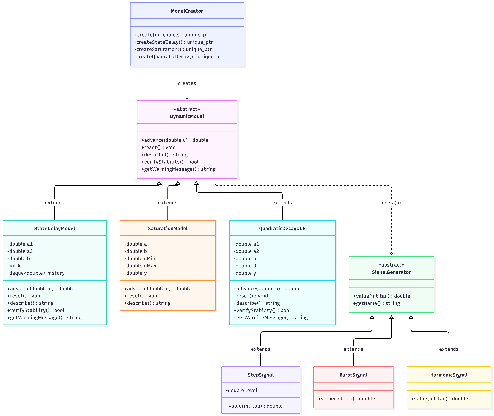

*Рис. 1. UML-диаграмма классов программы*

---

## 4. Математическое описание моделей

### 4.1. Model 1.5 — System with State Delay

**Формула:**

$$y_{\tau+1} = a_1 \cdot y_\tau + a_2 \cdot y_{\tau-k} + b \cdot u_\tau$$

где $k \geq 1$ — шаг задержки.

**Физический смысл:**

Модель описывает систему с **задержкой по состоянию**. Первое слагаемое $a_1 \cdot y_\tau$ отвечает за текущее состояние, второе $a_2 \cdot y_{\tau-k}$ — за состояние **$k$ шагов назад**, третье $b \cdot u_\tau$ — за реакцию на вход. Задержка характерна для реальных систем: распространение воды в трубе, теплопередача через стену, транспортные потоки.

**Анализ устойчивости (Advanced):**

Характеристическое уравнение для однородной части (при $u_\tau = 0$):

$$z^{k+1} = a_1 \cdot z^k + a_2$$

**Практический критерий устойчивости** (через критерий Джури):

$$\boxed{|a_1| + |a_2| < 1}$$

Если условие выполнено — система устойчива. Если нарушено — возможна неустойчивость (требуется точный анализ корней).

В программе реализовано в методах `verifyStability()` и `getWarningMessage()` класса `StateDelayModel`.

### 4.2. Model 2.2 — Actuator Saturation Non-linearity

**Формула:**

$$y_{\tau+1} = a \cdot y_\tau + b \cdot \text{sat}(u_\tau)$$

$$\text{sat}(u) = \begin{cases} U_{\max}, & u > U_{\max} \\ u, & U_{\min} \le u \le U_{\max} \\ U_{\min}, & u < U_{\min} \end{cases}$$

**Физический смысл:**

Модель отражает **физические ограничения** исполнительных механизмов. Реальный двигатель имеет максимальный момент, клапан — максимальную степень открытия, усилитель — максимальное напряжение. Функция `sat(u)` **ограничивает** управляющее воздействие сверху (`U_max`) и снизу (`U_min`).

**Пример:** при `U_max = 1.0` и `u = 5.0` на вход модели фактически подаётся `sat(5.0) = 1.0`.

**Анализ устойчивости:** нелинейная модель — линейный анализ (характеристическое уравнение) неприменим.

### 4.3. Model 3.8 — Combined Linear-Quadratic Decay

**Формула:**

$$\frac{dy}{dt} = -a_1 \cdot y - a_2 \cdot y^2 + b \cdot u$$

**Физический смысл:**

Комбинированное затухание — сочетание **линейного** и **квадратичного** механизмов. Линейный член $-a_1 y$ описывает обычное экспоненциальное затухание, квадратичный $-a_2 y^2$ — усиливает эффект при больших $y$. Встречается в задачах теплообмена, химической кинетики, популяционной динамики.

**Численное решение методом Эйлера:**

$$y_{\tau+1} = y_\tau + \Delta t \cdot \left(-a_1 \cdot y_\tau - a_2 \cdot y_\tau^2 + b \cdot u_\tau\right)$$

**Устойчивость численной схемы:**

$$|1 + \Delta t \cdot (-a_1 - 2 a_2 \cdot y_0)| < 1$$

где $y_0$ — начальное значение. В отличие от линейных моделей, коэффициент зависит от текущего значения $y$.

---

## 5. Описание реализации

### 5.1. Архитектура ООП

Программа построена на двух независимых иерархиях наследования:

**Иерархия моделей:**

- **`DynamicModel`** — абстрактный базовый класс. Определяет общий интерфейс:
  - `virtual double advance(double u)` — один шаг симуляции;
  - `virtual void reset()` — сброс состояния модели к начальному;
  - `virtual std::string describe() const` — имя модели;
  - `virtual bool verifyStability() const` — проверка устойчивости;
  - `virtual std::string getWarningMessage() const` — предупреждение о неустойчивости.

- **`StateDelayModel`, `SaturationModel`, `QuadraticDecayODE`** — конкретные реализации, наследники `DynamicModel`.

**Иерархия входных сигналов:**

- **`SignalGenerator`** — абстрактный базовый класс генератора входного воздействия:
  - `virtual double value(int tau) const` — значение сигнала на шаге τ;
  - `virtual std::string getName() const` — имя сигнала.

- **`StepSignal`, `BurstSignal`, `HarmonicSignal`** — три реализации сигналов.

**Фабрика `ModelCreator`:** инкапсулирует создание моделей и ввод их параметров. Возвращает `std::unique_ptr<DynamicModel>`.

**Полиморфизм:** в `main()` работа идёт через указатели `std::unique_ptr<DynamicModel>` и `std::unique_ptr<SignalGenerator>` — конкретный тип выбирается во время выполнения.

### 5.2. Структура файлов

| Файл | Назначение |
|---|---|
| `src/DynamicModel.h` | Абстрактный базовый класс `DynamicModel` |
| `src/StateDelayModel.h` | Model 1.5 — System with State Delay |
| `src/SaturationModel.h` | Model 2.2 — Actuator Saturation Non-linearity |
| `src/QuadraticDecayODE.h` | Model 3.8 — Combined Linear-Quadratic Decay |
| `src/SignalGenerator.h` | Три типа входных сигналов |
| `src/ModelCreator.h` | Фабрика для создания моделей |
| `src/main.cpp` | Точка входа |
| `src/CMakeLists.txt` | Файл сборки |
| `build.bat` | Скрипт автоматической сборки через CMake |
| `plot_results.py` | Python-скрипт визуализации результатов |
| `doc/readme.md` | Данный отчёт |

### 5.3. Формат вывода результатов

Результаты симуляции выводятся **двумя способами** одновременно:

**1. В консоль** — табличный вид:

```
   tau        u_tau        y_tau
--------------------------------------------
     1      1.00000      1.00000
     2      1.00000      1.40000
     3      1.00000      1.56000
    ...
```

**2. В файл `result.csv`** — формат CSV с заголовком:

```csv
tau,u_tau,y_tau
1,1,1
2,1,1.4
3,1,1.56
...
```

CSV-файл создаётся в директории запуска программы. Его можно открыть в Excel или обработать скриптом `plot_results.py` для построения графиков.

### 5.4. Сборка через CMake и `.bat`

Сборка автоматизирована через скрипт **`build.bat`**. Скрипт:
1. Переходит в директорию, где лежит сам файл (`cd /d "%~dp0"`).
2. Проверяет наличие `cmake` в `PATH`.
3. Создаёт папку `build/` (out-of-source сборка).
4. Запускает `cmake ..\src` — конфигурация.
5. Запускает `cmake --build . --config Release` — сборка.

**Результат:** `build/Release/ii02918_task_01.exe`.

### 5.5. Визуализация

Для визуализации используется **Python + Matplotlib**. Скрипт `plot_results.py`:
1. Читает `result.csv`.
2. Строит график зависимости `y_τ` от номера шага `τ`.
3. Дополнительно показывает вход `u_τ` пунктирной линией.
4. Сохраняет график в PNG.

**Пример использования:**

```bash
python plot_results.py result.csv doc/screenshots/06_plot_model_1_5.png "Model 1.5 - Step, a1=0.4, a2=0.3, k=2"
```

---

## 6. Результаты симуляции

Для каждой модели проведена симуляция с различными входными воздействиями. Ниже приведены таблицы результатов, графики и скриншоты работы программы.

### 6.1. Model 1.5 — Step (ступенчатое воздействие)

**Параметры:** $a_1 = 0.4$, $a_2 = 0.3$, $b = 1.0$, $k = 2$, сигнал Step, $n = 10$.

**Проверка устойчивости:** $|a_1| + |a_2| = 0.7 < 1$ — система устойчива.

**Таблица результатов:**

| $\tau$ | $u_\tau$ | $y_\tau$ |
|:---:|:---:|:---:|
| 1 | 1.00000 | 1.00000 |
| 2 | 1.00000 | 1.40000 |
| 3 | 1.00000 | 1.56000 |
| 4 | 1.00000 | 1.92400 |
| 5 | 1.00000 | 2.18960 |
| … | … | … |
| 10 | 1.00000 | 2.86173 |

**График:**

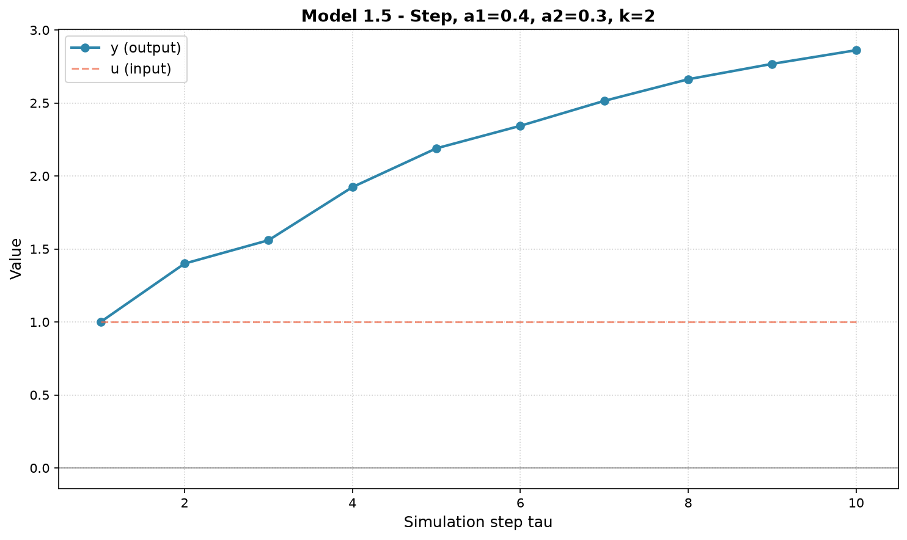

*Рис. 2. Model 1.5 — сходимость к установившемуся значению*

**Скриншот консоли:**

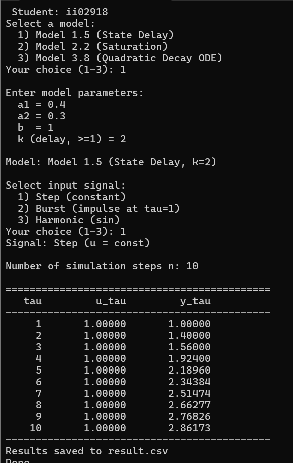

*Рис. 3. Вывод результатов для Model 1.5 (Step)*

**Анализ:** система устойчива, $y_\tau$ сходится к установившемуся значению $y_{уст} = \frac{b}{1 - a_1 - a_2} = \frac{1}{0.3} \approx 3.33$.

### 6.2. Model 1.5 — Burst (импульсное воздействие)

**Параметры:** $a_1 = 0.4$, $a_2 = 0.3$, $b = 1.0$, $k = 2$, сигнал Burst, $n = 10$.

**Таблица результатов:**

| $\tau$ | $u_\tau$ | $y_\tau$ |
|:---:|:---:|:---:|
| 1 | 1.00000 | 1.00000 |
| 2 | 0.00000 | 0.40000 |
| 3 | 0.00000 | 0.16000 |
| 4 | 0.00000 | 0.36400 |
| 5 | 0.00000 | 0.26560 |
| … | … | … |
| 10 | 0.00000 | 0.09346 |

**График:**

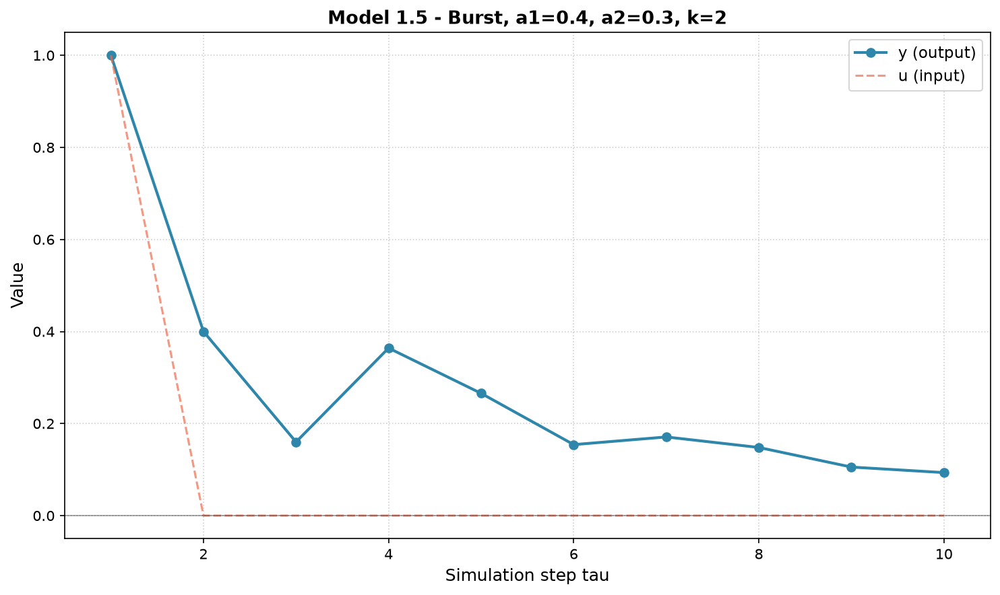

*Рис. 4. Model 1.5 — затухание после импульса*

**Скриншот консоли:**

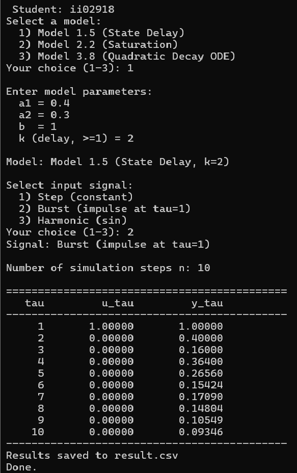

*Рис. 5. Вывод результатов для Model 1.5 (Burst)*

**Анализ:** импульс на шаге $\tau = 1$ даёт начальное значение $y_1 = 1.0$. Далее вход равен нулю, система затухает. Из-за задержки $k = 2$ наблюдается колебательный характер: на шаге $\tau = 4$ — отскок.

### 6.3. Model 2.2 — Saturation (нелинейная)

**Параметры:** $a = 0.5$, $b = 1.0$, $U_{\min} = -1$, $U_{\max} = 1$, сигнал Step, $n = 10$.

**Таблица результатов:**

| $\tau$ | $u_\tau$ | $y_\tau$ |
|:---:|:---:|:---:|
| 1 | 1.00000 | 1.00000 |
| 2 | 1.00000 | 1.50000 |
| 3 | 1.00000 | 1.75000 |
| 4 | 1.00000 | 1.87500 |
| 5 | 1.00000 | 1.93750 |
| … | … | … |
| 10 | 1.00000 | 1.99805 |

**График:**

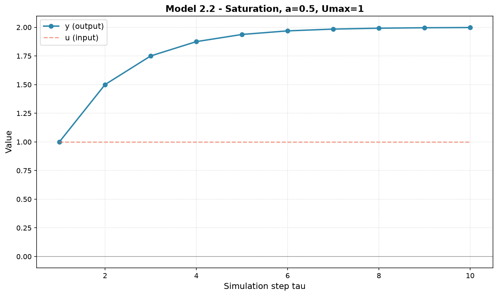

*Рис. 6. Model 2.2 — сходимость к 2.0*

**Скриншот консоли:**

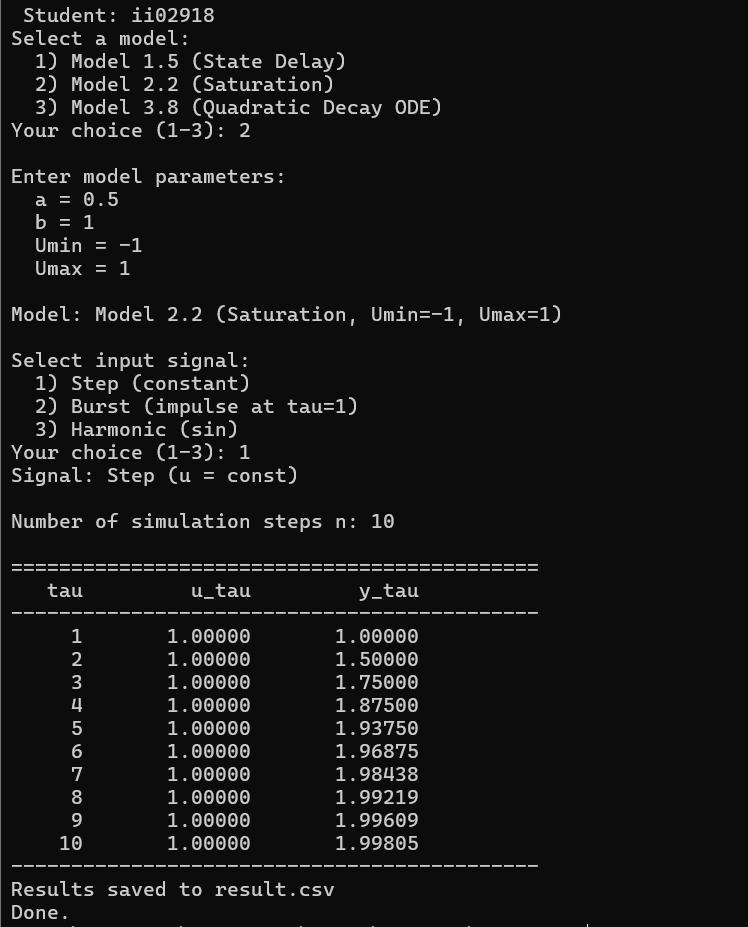

*Рис. 7. Вывод результатов для Model 2.2*

**Анализ:** при $u = 1$ (в границах насыщения) система сходится к $y_{уст} = \frac{b \cdot u}{1 - a} = \frac{1}{0.5} = 2.0$. Функция `sat()` не влияет, так как `u` внутри диапазона.

### 6.4. Model 3.8 — Quadratic Decay (дифференциальное уравнение)

**Параметры:** $a_1 = 0.5$, $a_2 = 0.1$, $b = 1.0$, $\Delta t = 0.1$, сигнал Step, $n = 20$.

**Таблица результатов:**

| $\tau$ | $y_\tau$ |
|:---:|:---:|
| 1 | 1.04000 |
| 2 | 1.07718 |
| 3 | 1.11172 |
| 4 | 1.14378 |
| 5 | 1.17351 |
| … | … |
| 20 | 1.42616 |

**График:**

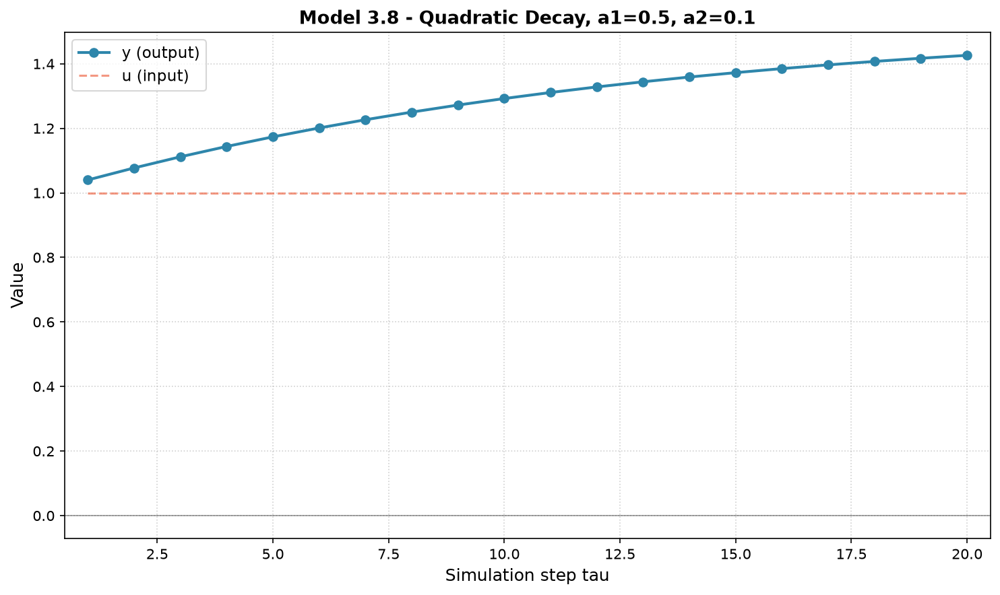

*Рис. 8. Model 3.8 — медленный рост к стационарному значению*

**Скриншот консоли:**

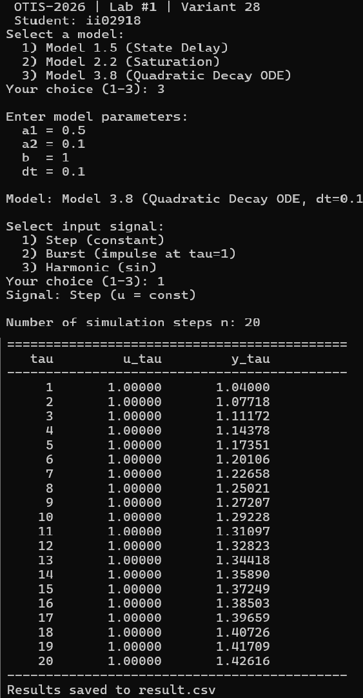

*Рис. 9. Вывод результатов для Model 3.8*

**Анализ:** система устойчива ($|1 + \Delta t \cdot (-a_1 - 2 a_2 y_0)| = 0.93 < 1$). $y$ медленно растёт к значению, определяемому условием $\frac{dy}{dt} = 0$: $-a_1 y - a_2 y^2 + b = 0 \implies y \approx 1.53$.

### 6.5. Model 1.5 — Неустойчивая система (Advanced)

**Параметры:** $a_1 = 0.6$, $a_2 = 0.5$, $b = 1.0$, $k = 1$, сигнал Step, $n = 10$.

**Проверка устойчивости:** $|a_1| + |a_2| = 1.1 \geq 1$ — система **неустойчива**. Программа выводит предупреждение:

```
!!! WARNING !!!
[WARNING] Model 1.5: |a1|+|a2| = 1.1 >= 1. Possible instability.
Continue simulation? (y/n):
```

**Таблица результатов:**

| $\tau$ | $y_\tau$ |
|:---:|:---:|
| 1 | 1.00000 |
| 2 | 1.60000 |
| 3 | 2.46000 |
| 4 | 3.27600 |
| 5 | 4.19560 |
| … | … |
| 10 | 9.72867 |

**Скриншот консоли с предупреждением:**

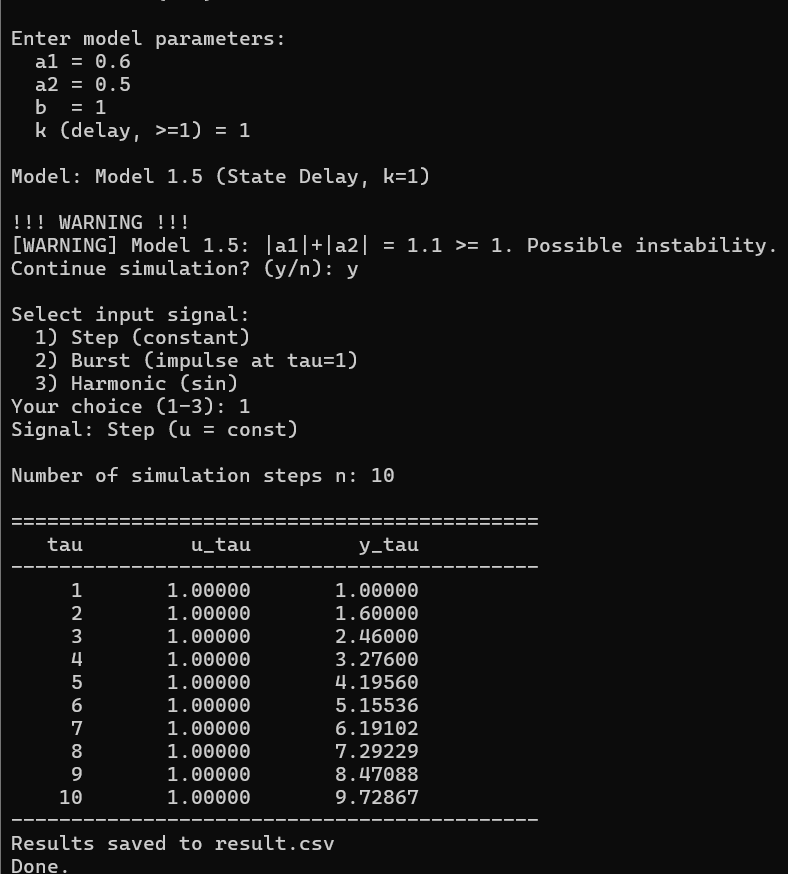

*Рис. 10. Предупреждение о неустойчивости и расходящийся процесс*

**График расходящегося процесса:**

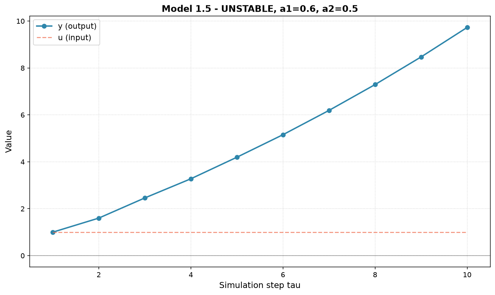

*Рис. 11. Экспоненциальный рост при неустойчивости*

**Анализ:** при $|a_1| + |a_2| \geq 1$ система расходится. Значения $y$ экспоненциально растут. Advanced-задание выполнено: программа корректно определяет неустойчивость и предупреждает пользователя.

### 6.6. Сборка проекта

**Скриншот успешной сборки:**

(если есть скриншот сборки — можно вставить)

---

## 7. Выводы

В ходе выполнения лабораторной работы были получены следующие результаты:

**1. Реализована программа на C++** с использованием принципов объектно-ориентированного программирования. Архитектура построена на абстрактном базовом классе `DynamicModel` с виртуальным методом `advance()` и трёх наследниках — конкретных математических моделях.

**2. Реализованы три модели** в соответствии с вариантом 28:

- **Model 1.5** (линейная дискретная) — System with State Delay;
- **Model 2.2** (нелинейная дискретная) — Actuator Saturation Non-linearity;
- **Model 3.8** (дифференциальное уравнение) — Combined Linear-Quadratic Decay, решённое методом Эйлера.

**3. Реализованы три типа входных воздействий** (ступенчатое, импульсное, гармоническое) через отдельную иерархию классов `SignalGenerator`.

**4. Выполнен анализ устойчивости (Advanced-задание):**

- Для **Model 1.5** получен практический критерий устойчивости $|a_1| + |a_2| < 1$. В программу встроена проверка: при нарушении условия выводится предупреждение перед началом симуляции.
- Для **Model 3.8** проанализирована устойчивость численной схемы Эйлера: $|1 + \Delta t \cdot (-a_1 - 2 a_2 y_0)| < 1$. При нарушении — предупреждение.
- Для **Model 2.2** (нелинейной) линейный анализ устойчивости неприменим.

**5. Проведена симуляция всех моделей** при различных входных воздействиях. Результаты:

- Model 1.5 при $|a_1| + |a_2| < 1$ сходится к установившемуся значению.
- Model 1.5 при $|a_1| + |a_2| \geq 1$ расходится — подтверждение теории.
- Model 2.2 демонстрирует эффект насыщения при превышении $U_{\max}$.
- Model 3.8 численно воспроизводит динамику с квадратичным затуханием.

**6. Результаты визуализированы** с помощью Python + Matplotlib — построены графики $y_\tau$ от $\tau$ для каждой модели.

**7. Сборка автоматизирована** через CMake и скрипт `build.bat`.

**Итог:** цель работы достигнута — программа корректно моделирует управляемые объекты, определяет их устойчивость и визуализирует переходные процессы.

---

## 8. Приложения

### 8.1. Ссылки на исходный код

Все файлы проекта расположены в каталоге `trunk/ii02918/task_01/`:

| Файл | Ссылка |
|---|---|
| `DynamicModel.h` | [src/DynamicModel.h](../src/DynamicModel.h) |
| `StateDelayModel.h` | [src/StateDelayModel.h](../src/StateDelayModel.h) |
| `SaturationModel.h` | [src/SaturationModel.h](../src/SaturationModel.h) |
| `QuadraticDecayODE.h` | [src/QuadraticDecayODE.h](../src/QuadraticDecayODE.h) |
| `SignalGenerator.h` | [src/SignalGenerator.h](../src/SignalGenerator.h) |
| `ModelCreator.h` | [src/ModelCreator.h](../src/ModelCreator.h) |
| `main.cpp` | [src/main.cpp](../src/main.cpp) |
| `CMakeLists.txt` | [src/CMakeLists.txt](../src/CMakeLists.txt) |
| `build.bat` | [build.bat](../build.bat) |
| `plot_results.py` | [plot_results.py](../plot_results.py) |

### 8.2. Пример выходных данных

Файл `doc/example_output.csv` содержит пример вывода симуляции Model 2.2.

### 8.3. Графики

Все построенные графики находятся в каталоге `doc/screenshots/`:

- `06_plot_model_1_5.png` — Model 1.5, Step
- `07_plot_model_1_5_burst.png` — Model 1.5, Burst
- `08_plot_model_2_2_step.png` — Model 2.2, Saturation
- `09_plot_model_3_8_step.png` — Model 3.8, Quadratic Decay
- `10_plot_model_1_5_unstable.png` — Model 1.5, неустойчивая (Advanced)