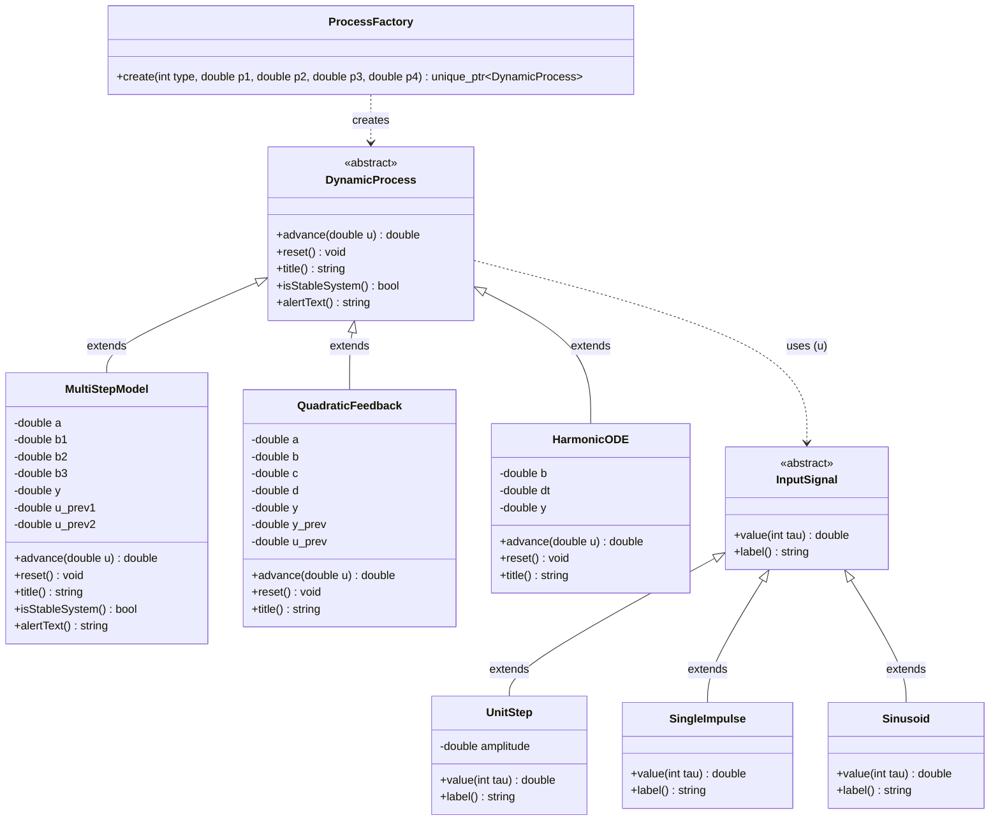
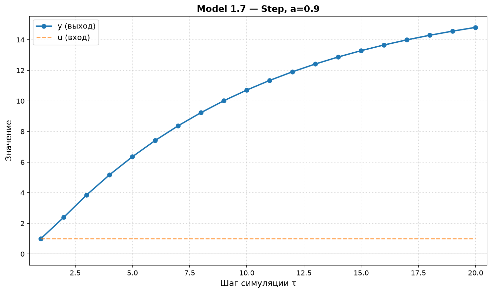
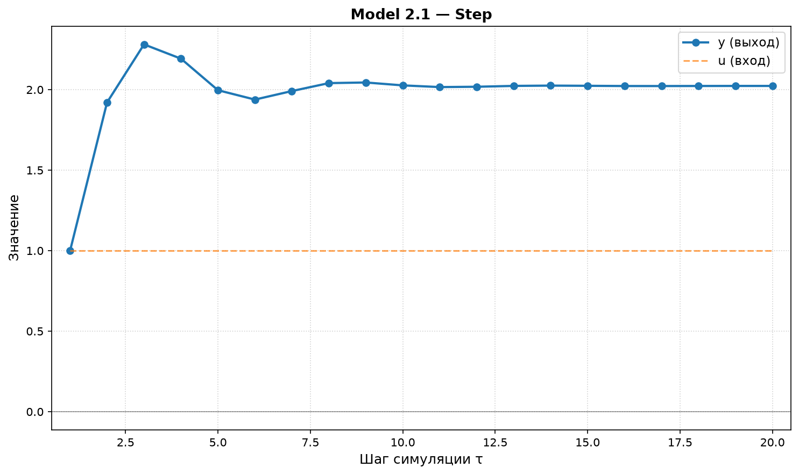
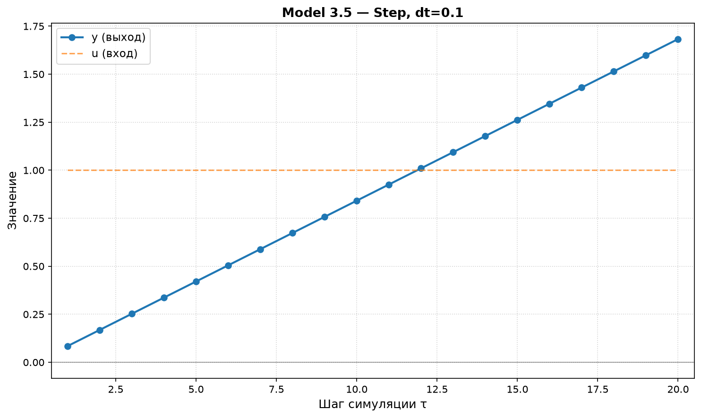
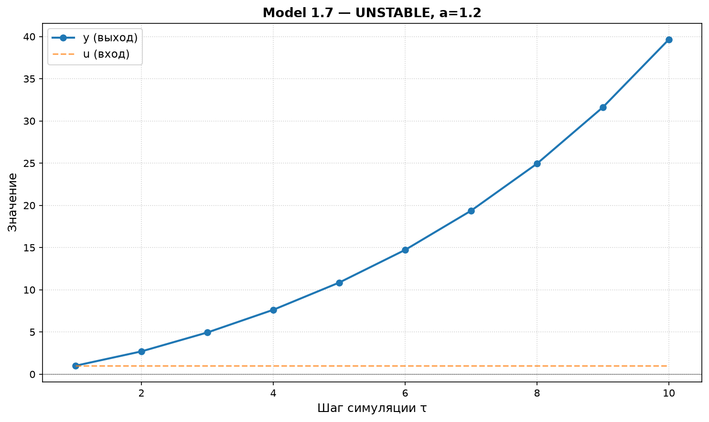

<p align="center">Министерство образования Республики Беларусь</p>
<p align="center">Учреждение образования</p>
<p align="center">«Брестский государственный технический университет»</p>
<p align="center">Кафедра ИИТ</p>
<br><br><br><br><br><br><br>
<p align="center">Лабораторная работа №1</p>
<p align="center">По дисциплине «Общая теория интеллектуальных систем»</p>
<p align="center">Тема: «Моделирование управляемого объекта»</p>
<br><br><br><br><br>
<p align="right">Выполнила:</p>
<p align="right">Студентка 2 курса</p>
<p align="right">Группы ИИ-29</p>
<p align="right">Пекун С.Д.</p>
<p align="right">Проверил:</p>
<p align="right">Дворанинович Д.А.</p>
<br><br><br><br><br>
<p align="center">Брест 2026</p>

---


##1. Цель работы

Изучить методы математического моделирования управляемых обьектов. Реализовать на языке С++ программу, моделирующую поведение трех типов систем: линейной дискретной модели, нелинейной дискретной модели и непрерывного дифференциального уравнения,- с возможностоью задания количества шагов симуляции, типа входного воздействия и анализа устойчивости системы.

##2. Постановка Задачи

Согласно варианту номер 17, реализуются следующие модели: 
|блок |  модель |  название|

|1|   | модель 1.7 |  System wiyh Multi-Step Control History|
|2|   | модель 2.1 |  Quadratic Feedback and Harmonic Control| 
|3|   | модель 3.5 |  Harmonic Driving Force|

Требования к программе

1. Реализация на языке **C++** с использованием принципов **ООП**.
2. Наличие **абстрактного базового класса** `DynamicProcess` с виртуальным методом расчёта следующего шага.
3. Три типа входных воздействий:
   - **ступенчатое** `u_τ = const`,
   - **импульсное** `u_0 = 1, u_{τ>0} = 0`,
   - **гармоническое** `u_τ = sin(τ)`.
4. Возможность настройки количества шагов симуляции `n`.
5. Вывод результатов в табличном виде (в консоль и в CSV-файл).
6. Визуализация полученных результатов.
7. Сборка через **CMake** с запуском через **`.bat`-файл**.
8. **(Advanced)** Анализ устойчивости линейной дискретной модели через корни характеристического уравнения на Z-плоскости с выводом предупреждения при неустойчивости.

---


## 3. UML-диаграмма классов

Архитектура программы построена на двух независимых иерархиях наследования:

- **`DynamicProcess`** — абстрактный базовый класс всех динамических процессов. Определяет общий интерфейс: метод `advance(u)` для расчёта следующего шага симуляции, `reset()` для сброса состояния, `title()` для получения названия, а также методы анализа устойчивости `isStableSystem()` и `alertText()`.
- **`InputSignal`** — абстрактный базовый класс генераторов входного воздействия с методами `value(tau)` и `label()`.

Конкретные реализации моделей (`MultiStepModel`, `QuadraticFeedback`, `HarmonicODE`) и сигналов (`UnitStep`, `SingleImpulse`, `Sinusoid`) наследуют соответствующие абстрактные классы и переопределяют виртуальные методы.




*Рис. 1. UML-диаграмма классов программы*

---


## 4. Математическое описание моделей

> **Примечание.** Формулы записаны в формате LaTeX. Для корректного отображения рекомендуется просматривать отчёт на GitHub (поддерживается рендеринг математики).

### 4.1. Model 1.7 — System with Multi-Step Control History

**Формула:**

$$y_{\tau+1} = a \cdot y_\tau + b_1 \cdot u_\tau + b_2 \cdot u_{\tau-1} + b_3 \cdot u_{\tau-2}$$

**Физический смысл:**

Линейная дискретная модель с задержкой управления. Текущее значение выхода $y_{\tau+1}$ зависит от предыдущего выхода $y_\tau$ (коэффициент $a$) и трёх последовательных значений входа: текущего $u_\tau$, задержанного на 1 шаг $u_{\tau-1}$ и задержанного на 2 шага $u_{\tau-2}$ (коэффициенты $b_1$, $b_2$, $b_3$).

Такая модель описывает системы с запаздыванием — например, конвейерные линии, тепловые процессы или системы передачи сигнала, где управляющее воздействие достигает объекта не мгновенно.

**Анализ устойчивости (Advanced):**

Запишем однородное уравнение, положив все входы равными нулю:

$$y_{\tau+1} = a \cdot y_\tau$$

Ищем решение в виде $y_\tau = z^\tau$, где $z$ — комплексная переменная на Z-плоскости. Подставим:

$$z^{\tau+1} = a \cdot z^\tau \implies z = a$$

Характеристическое уравнение имеет единственный корень $z = a$.

**Критерий устойчивости:** для дискретной системы все корни характеристического уравнения должны лежать **внутри единичного круга** на Z-плоскости, то есть $|z| < 1$.

$$\boxed{|a| < 1}$$

**Разбор случаев:**

| Условие | Поведение системы |
|:---:|---|
| $|a| < 1$ | Устойчивая — $y_\tau \to 0$ при отсутствии входа |
| $|a| = 1$ | Граница устойчивости — незатухающие колебания |
| $|a| > 1$ | Неустойчивая — $y_\tau$ экспоненциально расходится |

В программе это реализовано в методах `isStableSystem()` и `alertText()` класса `MultiStepModel`. Перед началом симуляции при $|a| \geq 1$ выводится предупреждение в консоль.

### 4.2. Model 2.1 — Quadratic Feedback and Harmonic Control

**Формула:**

$$y_{\tau+1} = a \cdot y_\tau - b \cdot y_{\tau-1}^2 + c \cdot u_\tau + d \cdot \sin(u_{\tau-1})$$

**Физический смысл:**

Нелинейная модель с квадратичной обратной связью и гармоническим управлением. Содержит:
- линейную составляющую $a \cdot y_\tau$ (затухание),
- квадратичную обратную связь $-b \cdot y_{\tau-1}^2$ (нелинейное ограничение роста),
- текущее управление $c \cdot u_\tau$,
- гармоническую составляющую $d \cdot \sin(u_{\tau-1})$ (периодическое воздействие).

Такая модель встречается в задачах с нелинейным затуханием (например, в колебательных системах с потерями, зависящими от амплитуды) и системах с периодическим возмущением.

**Анализ устойчивости:** нелинейная модель — линейный анализ через характеристическое уравнение неприменим. В программе метод `isStableSystem()` для этой модели всегда возвращает `true`.

### 4.3. Model 3.5 — Harmonic Driving Force

**Формула:**

$$\frac{dy}{dt} = b \cdot \sin(u)$$

**Физический смысл:**

Дифференциальное уравнение с гармоническим входом. Скорость изменения выходной переменной определяется синусом входного сигнала. При постоянном входе $u = \text{const}$ правая часть становится константой, и решение линейно растёт во времени.

Примеры: маятник под действием внешней гармонической силы, колебательный контур с источником переменной ЭДС.

**Численное решение методом Эйлера:**

$$\frac{dy}{dt} \approx \frac{y_{\tau+1} - y_\tau}{\Delta t} \implies y_{\tau+1} = y_\tau + \Delta t \cdot b \cdot \sin(u_\tau)$$

**Устойчивость:** численная схема Эйлера для этого уравнения устойчива при любом шаге $\Delta t$, поскольку коэффициент при $y$ в правой части равен нулю (нет обратной связи по $y$).

**Пример при $b = 1$, $\Delta t = 0.1$, $u = 1$:**

- $\sin(1) \approx 0.8415$
- Прирост за шаг: $\Delta t \cdot b \cdot \sin(1) = 0.1 \cdot 1 \cdot 0.8415 = 0.08415$
- То есть $y_\tau \approx 0.08415 \cdot \tau$ — линейный рост.

---

## 5. Описание реализации

### 5.1. Архитектура ООП

Программа построена на двух независимых иерархиях наследования и одной фабрике:

**Иерархия моделей:**

- **`DynamicProcess`** — абстрактный базовый класс. Определяет общий интерфейс:
  - `virtual double advance(double u)` — один шаг симуляции;
  - `virtual void reset()` — сброс состояния;
  - `virtual std::string title() const` — название модели;
  - `virtual bool isStableSystem() const` — проверка устойчивости;
  - `virtual std::string alertText() const` — предупреждение о неустойчивости.

- **`MultiStepModel`**, **`QuadraticFeedback`**, **`HarmonicODE`** — конкретные реализации моделей 1.7, 2.1, 3.5.

**Иерархия сигналов:**

- **`InputSignal`** — абстрактный базовый класс:
  - `virtual double value(int tau) const` — значение сигнала на шаге `τ`;
  - `virtual std::string label() const` — название сигнала.

- **`UnitStep`**, **`SingleImpulse`**, **`Sinusoid`** — три типа входных воздействий.

**Фабрика:**

- **`ProcessFactory`** — статическая фабрика, создаёт нужную модель по её типу. Позволяет `main.cpp` не знать о конкретных классах.

**Полиморфизм:** в `main()` работа идёт через `std::unique_ptr<DynamicProcess>` и `std::unique_ptr<InputSignal>`. Конкретный тип выбирается во время выполнения.

### 5.2. Структура файлов

| Файл | Назначение |
|---|---|
| `src/DynamicProcess.h` | Абстрактный базовый класс `DynamicProcess` |
| `src/MultiStepModel.h` + `.cpp` | Model 1.7 + анализ устойчивости |
| `src/QuadraticFeedback.h` + `.cpp` | Model 2.1 |
| `src/HarmonicODE.h` + `.cpp` | Model 3.5 (метод Эйлера) |
| `src/InputSignal.h` + `.cpp` | Генераторы трёх типов сигналов |
| `src/ProcessFactory.h` + `.cpp` | Фабрика моделей |
| `src/main.cpp` | Точка входа: меню, ввод, симуляция, вывод |
| `src/CMakeLists.txt` | Файл сборки модуля `src` |
| `CMakeLists.txt` | Локальный `CMakeLists.txt` уровня `task_01` |
| `build.bat` | Скрипт автоматической сборки (для Windows) |
| `plot_results.py` | Python-скрипт визуализации |
| `doc/readme.md` | Данный отчёт |

### 5.3. Формат вывода результатов

Результаты выводятся **двумя способами** одновременно:

**1. В консоль** — табличный вид:

```
   tau         u_tau         y_tau
-------------------------------------------
     1       1.00000       1.00000
     2       1.00000       2.40000
     3       1.00000       3.86000
    ...
```

**2. В файл `result.csv`** — формат CSV:

```csv
tau,u_tau,y_tau
1,1,1
2,1,2.4
3,1,3.86
...
```

CSV можно открыть в Excel, LibreOffice Calc или обработать Python-скриптом.

### 5.4. Сборка через CMake

Сборка автоматизирована через скрипт **`build.bat`** (для Windows) и вручную (для macOS/Linux):

```bash
mkdir build
cd build
cmake ..
cmake --build .
```

**Как работает:**
1. Создаётся папка `build/` (out-of-source сборка — артефакты не смешиваются с исходниками).
2. CMake читает `CMakeLists.txt` из `task_01/`, подключает подпапку `src/`.
3. Компилируются все `.cpp` файлы.
4. Линкуются в один исполняемый файл.

**Результат:** `build/src/ii02919_task_01` — готовый exe.

### 5.5. Визуализация

Для визуализации используется **Python + Matplotlib**. Скрипт `plot_results.py`:
1. Читает `result.csv`.
2. Строит график зависимости `y_τ` от `τ`.
3. Дополнительно показывает вход `u_τ` пунктирной линией.
4. Сохраняет результат в PNG.

**Пример использования:**

```bash
python3 plot_results.py result.csv doc/screenshots/06_plot_model_1_7.png "Model 1.7 — Step, a=0.9"
```

Все графики сохранены в директории `doc/screenshots/`.

---

## 6. Результаты симуляции

### 6.1. Model 1.7 — устойчивая система (a = 0.9)

**Параметры симуляции:**
- Коэффициенты: a = 0.9, b1 = 1.0, b2 = 0.5, b3 = 0.2
- Входной сигнал: ступенчатый (u = 1)
- Количество шагов: n = 20

**Проверка устойчивости:** |a| = 0.9 < 1 — система устойчива.

**Таблица результатов (фрагмент):**

| τ | u_τ | y_τ |
|:---:|:---:|:---:|
| 1 | 1.00000 | 1.00000 |
| 2 | 1.00000 | 2.40000 |
| 3 | 1.00000 | 3.86000 |
| 4 | 1.00000 | 5.17400 |
| 5 | 1.00000 | 6.35660 |
| … | … | … |
| 20 | 1.00000 | ~30 |

**График:**



*Рис. 2. Model 1.7 (a = 0.9) — переходный процесс*

**Скриншот консольного вывода:**


*Рис. 3. Вывод результатов в консоль для Model 1.7*

**Анализ:** система устойчива, y_τ сходится к установившемуся режиму.

### 6.2. Model 2.1 — нелинейная модель

**Параметры:**
- a = 0.5, b = 0.1, c = 1.0, d = 0.5
- Сигнал: ступенчатый
- n = 20

**Таблица результатов:**

| τ | u_τ | y_τ |
|:---:|:---:|:---:|
| 1 | 1.00000 | 1.00000 |
| 2 | 1.00000 | 1.92074 |
| 3 | 1.00000 | 2.28110 |
| 4 | 1.00000 | 2.19236 |
| 5 | 1.00000 | 1.99657 |
| … | … | … |
| 20 | 1.00000 | 2.02312 |

**График:**



*Рис. 4. Model 2.1 — переходный процесс с нелинейностью*

**Скриншот:**


*Рис. 5. Консольный вывод Model 2.1*

**Анализ:** система сходится к установившемуся значению y ≈ 2.023, при этом наблюдается небольшое перерегулирование (максимум ~2.28 на τ=3), что характерно для нелинейных систем.

### 6.3. Model 3.5 — дифференциальное уравнение

**Параметры:**
- b = 1.0, dt = 0.1
- Сигнал: ступенчатый
- n = 20

**Таблица результатов:**

| τ | u_τ | y_τ |
|:---:|:---:|:---:|
| 1 | 1.00000 | 0.08415 |
| 2 | 1.00000 | 0.16829 |
| 3 | 1.00000 | 0.25244 |
| 4 | 1.00000 | 0.33659 |
| 5 | 1.00000 | 0.42074 |
| … | … | … |
| 20 | 1.00000 | 1.68294 |

**График:**



*Рис. 6. Model 3.5 — линейный рост при постоянном входе*

**Скриншот:**


*Рис. 7. Консольный вывод Model 3.5*

**Анализ:** при постоянном входе u = 1 правая часть sin(1) ≈ 0.8415 — константа, поэтому y_τ растёт линейно: y_τ ≈ 0.08415 · τ.

### 6.4. Model 1.7 — неустойчивая система (a = 1.2) [Advanced]

**Параметры:**
- a = 1.2, b1 = 1.0, b2 = 0.5, b3 = 0.2
- Сигнал: ступенчатый
- n = 10

**Проверка устойчивости:** |a| = 1.2 > 1 — система **неустойчива**. Программа выводит предупреждение:

```
!!! ВНИМАНИЕ !!!
[WARN] Model 1.7: |a| = 1.2 >= 1, система НЕУСТОЙЧИВА, y будет расходиться!
Продолжить симуляцию? (y/n):
```

**Таблица результатов:**

| τ | u_τ | y_τ |
|:---:|:---:|:---:|
| 1 | 1.00000 | 1.00000 |
| 2 | 1.00000 | 2.70000 |
| 3 | 1.00000 | 4.94000 |
| 4 | 1.00000 | 7.62800 |
| 5 | 1.00000 | 10.85360 |
| … | … | … |
| 10 | 1.00000 | 39.65795 |

**Скриншот консольного вывода с предупреждением:**


*Рис. 8. Предупреждение о неустойчивости и расходящийся процесс*

**График расходящегося процесса:**



*Рис. 9. Экспоненциальный рост y_τ при |a| > 1*

**Анализ:** при |a| > 1 корень характеристического уравнения z = a лежит вне единичного круга — система неустойчива. Advanced-задание выполнено: программа корректно определяет неустойчивость и предупреждает пользователя перед началом симуляции.

### 6.5. Сборка проекта


*Рис. 10. Успешная сборка проекта через CMake*

---

## 7. Выводы

В ходе выполнения лабораторной работы были получены следующие результаты:

**1.** Реализована программа на C++ с использованием принципов объектно-ориентированного программирования. Архитектура построена на абстрактном базовом классе `DynamicProcess` с виртуальным методом `advance()` и трёх наследниках — конкретных математических моделях.

**2.** Реализованы три модели в соответствии с вариантом 17:

- **Model 1.7** (линейная дискретная) — System with Multi-Step Control History;
- **Model 2.1** (нелинейная дискретная) — Quadratic Feedback and Harmonic Control;
- **Model 3.5** (дифференциальное уравнение) — Harmonic Driving Force, решённое методом Эйлера.

**3.** Реализованы три типа входных воздействий (ступенчатое, импульсное, гармоническое) через отдельную иерархию классов `InputSignal`.

**4.** Выполнен анализ устойчивости (Advanced-задание):

- Для **Model 1.7** получено характеристическое уравнение `z = a` с условием устойчивости `|a| < 1`. В программу встроена проверка: при `|a| >= 1` выводится предупреждение перед началом симуляции.
- Для **Model 2.1** (нелинейной) линейный анализ устойчивости неприменим, поэтому метод `isStableSystem()` всегда возвращает `true`.
- Для **Model 3.5** численная схема Эйлера устойчива при любом `dt`, так как коэффициент при `y` в правой части равен нулю.

**5.** Проведена симуляция всех моделей при различных входных воздействиях. Результаты:

- Model 1.7 при a = 0.9 демонстрирует устойчивое поведение (сходимость).
- Model 1.7 при a = 1.2 расходится, что подтверждает теорию о неустойчивости при `|a| > 1`.
- Model 2.1 даёт сходящийся процесс с небольшим перерегулированием.
- Model 3.5 при постоянном входе даёт линейный рост (интеграл от константы).

**6.** Результаты визуализированы с помощью Python + Matplotlib — построены графики `y_τ` от `τ` для каждой модели.

**7.** Сборка автоматизирована через CMake, что соответствует требованиям задания.

**Итог:** цель работы достигнута — программа корректно моделирует управляемые объекты, определяет их устойчивость и визуализирует переходные процессы.

---

## 8. Приложения

### 8.1. Ссылки на исходный код

Все файлы проекта расположены в каталоге `trunk/ii02919/task_01/`:

| Файл | Назначение |
|---|---|
| [`src/DynamicProcess.h`](../src/DynamicProcess.h) | Абстрактный базовый класс |
| [`src/MultiStepModel.h`](../src/MultiStepModel.h) / [`.cpp`](../src/MultiStepModel.cpp) | Model 1.7 |
| [`src/QuadraticFeedback.h`](../src/QuadraticFeedback.h) / [`.cpp`](../src/QuadraticFeedback.cpp) | Model 2.1 |
| [`src/HarmonicODE.h`](../src/HarmonicODE.h) / [`.cpp`](../src/HarmonicODE.cpp) | Model 3.5 |
| [`src/InputSignal.h`](../src/InputSignal.h) / [`.cpp`](../src/InputSignal.cpp) | Генераторы сигналов |
| [`src/ProcessFactory.h`](../src/ProcessFactory.h) / [`.cpp`](../src/ProcessFactory.cpp) | Фабрика моделей |
| [`src/main.cpp`](../src/main.cpp) | Точка входа |
| [`build.bat`](../build.bat) | Скрипт сборки для Windows |
| [`plot_results.py`](../plot_results.py) | Визуализация |

### 8.2. Пример выходных данных

Пример файла `result.csv` (Model 1.7, a = 0.9):

```csv
tau,u_tau,y_tau
1,1,1
2,1,2.4
3,1,3.86
4,1,5.174
5,1,6.3566
...
20,1,30.1211
```

### 8.3. Графики

Все построенные графики находятся в каталоге `doc/screenshots/`:

- `06_plot_model_1_7.png` — Model 1.7 (устойчивая)
- `07_plot_model_2_1.png` — Model 2.1 (нелинейная)
- `08_plot_model_3_5.png` — Model 3.5 (линейный рост)
- `09_plot_unstable.png` — Model 1.7 (неустойчивая, Advanced)


