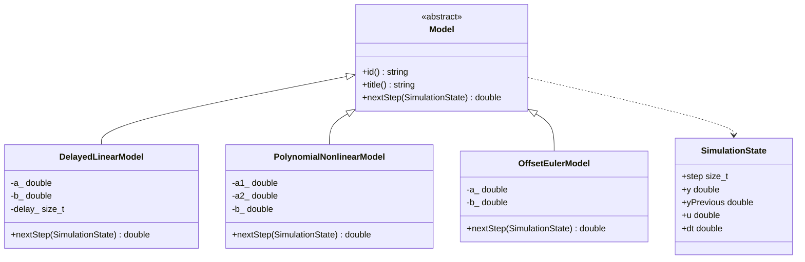

# UML-диаграмма ЛР №1, вариант 12

```mermaid
classDiagram
    class Model {
        <<abstract>>
        +id() string
        +title() string
        +nextStep(SimulationState) double
    }
    class DelayedLinearModel {
        -a_ double
        -b_ double
        -delay_ size_t
        +nextStep(SimulationState) double
    }
    class PolynomialNonlinearModel {
        -a1_ double
        -a2_ double
        -b_ double
        +nextStep(SimulationState) double
    }
    class OffsetEulerModel {
        -a_ double
        -b_ double
        +nextStep(SimulationState) double
    }
    class SimulationState {
        +step size_t
        +y double
        +yPrevious double
        +u double
        +dt double
    }
    Model <|-- DelayedLinearModel
    Model <|-- PolynomialNonlinearModel
    Model <|-- OffsetEulerModel
    Model ..> SimulationState
```
