<p align="center"> Министерство образования Республики Беларусь</p>
<p align="center"> Учреждение образования</p>
<p align="center"> «Брестский Государственный технический университет»</p>
<p align="center"> Кафедра ИИТ</p>

<br><br><br><br>

<p align="center"><b>Лабораторная работа №1</b></p>

<p align="center">по дисциплине «Общая теория интеллектуальных систем»</p>

<p align="center"><b>Тема: «Моделирование температуры объекта»</b></p>

<br><br><br>

<p align="right">Выполнил:</p>
<p align="right">студент 2 курса</p>
<p align="right">группы ИИ-30</p>
<p align="right">Ефименко К. А.</p>

<p align="right">Проверил:</p>
<p align="right">Дворанинович Д. А.</p>

<br><br><br><br>

<p align="center">Брест 2026</p>

---

# 1. Цель работы

Освоить методы математического моделирования управляемых объектов и принципы объектно-ориентированного программирования на языке C++.

В ходе выполнения лабораторной работы необходимо разработать программу, которая:

* моделирует три объекта различной природы (линейную, нелинейную, дифференциальную);
* поддерживает различные типы входных воздействий;
* сохраняет результаты в CSV-файл;
* использует принципы объектно-ориентированного программирования;

---

# 2. Постановка задачи

В соответствии с таблицей вариантов для **варианта 5** необходимо реализовать следующие модели:

| Блок | Номер модели | Название                      | Тип                        |
| :--: | :----------: | :---------------------------- | :------------------------- |
|   1  |    **1.5**   | System with State Delay       | Линейная дискретная        |
|   2  |    **2.7**   | Relay with Hysteresis Element | Нелинейная дискретная      |
|   3  |    **3.9**   | Bounded Saturation Rate       | Дифференциальное уравнение |

Общие требования к программе:

1. Использовать язык программирования C++.
2. Использовать принципы объектно-ориентированного программирования.
3. Создать абстрактный базовый класс модели.
4. Реализовать конкретные модели в классах-наследниках.
5. Реализовать три типа входных воздействий:

   * ступенчатое;
   * импульсное;
   * гармоническое.
6. Предусмотреть возможность задания количества шагов моделирования `n`.
7. Выполнять проверку корректности пользовательского ввода.
8. Выводить результаты в консоль в табличном виде.
9. Сохранять результаты в CSV-файл.
10. Выполнять визуализацию результатов.
11. Использовать CMake для сборки.
12. Предусмотреть запуск сборки через `.bat`-файл.
13. Разработать UML-диаграмму классов.
14. Для линейной модели выполнить дополнительный анализ устойчивости.

---

# 3. Вариант задания

Для варианта 5 используются следующие математические модели:

### Линейная модель 1.5

**System with State Delay:**

$$ y_{\tau+1} =a_1y_{\tau} + a_2y_{\tau-k} + bu_{\tau}$$

где:

* $a_1$, $a_2$, $b$ — коэффициенты модели;
* $k$ — величина задержки состояния;
* $u_\tau$ — входной сигнал;
* $y_\tau$ — выход объекта.

---

### Нелинейная модель 2.7

**Relay with Hysteresis Element:**

$$y_{\tau+1} = ay_\tau + b\cdot relay(u_\tau,y_\tau)$$

Функция релейного элемента определяется следующим образом:

$$
relay(u,y)=
\begin{cases}
1, & u>\varepsilon
\quad\text{или}\quad
(u\geq-\varepsilon \text{ и } y>0),\\
-1, & u<-\varepsilon
\quad\text{или}\quad
(u\leq\varepsilon \text{ и } y\leq0).
\end{cases}
$$

где $\varepsilon$ — параметр зоны лимита.

---

### Дифференциальная модель 3.9

**Bounded Saturation Rate:**

$$
\frac{dy}{dt}=b\tanh(u)
$$

Для численного решения используется явная схема Эйлера:

$$
y_{\tau+1}
=
y_\tau+
\Delta t\cdot b\tanh(u_\tau)
$$

где $\Delta t$ — шаг интегрирования.

---

# 4. Структура программы

## 4.1. Объектно-ориентированная архитектура

В основе программы используется абстрактный класс `Model`, определяющий общий интерфейс математических моделей.

Пример базового класса:

```cpp
class Model
{
public:
    virtual ~Model() = default;

    virtual double nextStep(double u) = 0;
};
```

Метод `nextStep()` выполняет расчёт следующего значения выходного сигнала.

Абстрактный класс позволяет работать с различными математическими моделями через единый интерфейс.

Для варианта 5 реализуются три класса:
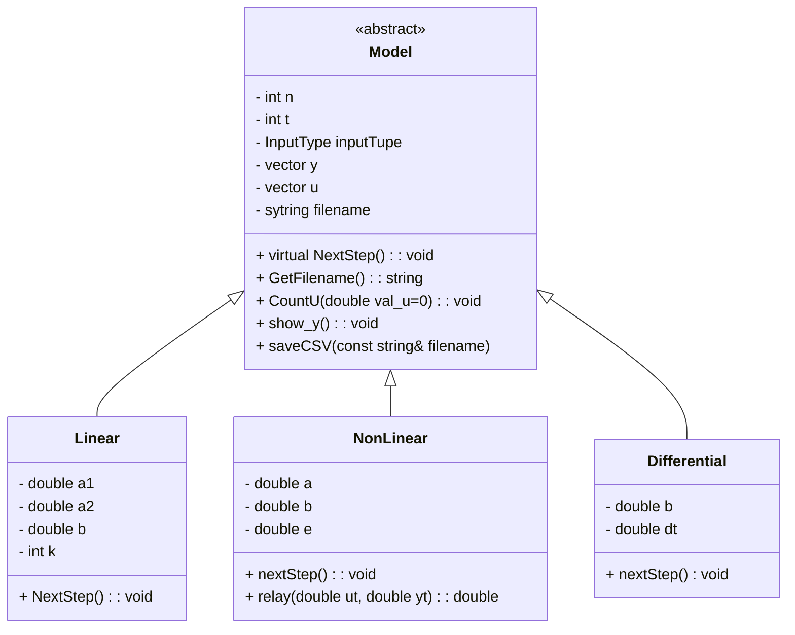

**Рис. 1 — Иерархия классов программы**

В реализации используется механизм полиморфизма. Основная программа может работать с объектом через указатель или ссылку на базовый класс `Model`, при этом вызывается реализация `nextStep()`, соответствующая конкретному классу.

---

## 4.2. Генерация входного сигнала

Для тестирования моделей используются три вида входного воздействия.

### Ступенчатое воздействие

$$
u_\tau=A
$$

Значение входного сигнала остаётся постоянным на протяжении всей симуляции.

### Импульсное воздействие

$$
u_0=1
$$

$$
u_{\tau}=0,\qquad \tau>0
$$

Сигнал имеет ненулевое значение только на первом шаге.

### Гармоническое воздействие

$$
u_\tau=A\sin(\tau)
$$

Такой сигнал позволяет исследовать реакцию объекта на периодическое воздействие.

Генерация входного сигнала реализована отдельной функцией:

```cpp
void CountU(double val_u = 0);
```

Тип входного сигнала выбирается пользователем.

---

# 5. Модели

## 5.1. Модель 1.5 — System with State Delay

Математическое уравнение модели имеет вид:

$$y_{\tau+1} = a_1y_\tau + a_2y_{\tau-k} + bu_\tau $$

Особенностью данной модели является наличие задержки состояния.

Параметр $k$ должен удовлетворять условию:

$$
k\geq1
$$

Для первых $k$ шагов необходимо предусмотреть начальные значения задержанных состояний.
Например, при нулевых начальных условиях: $$ y_{t-k}=0 $$
это позволяет начать моделирование без обращения к несуществующим элементам массива.

### Пример

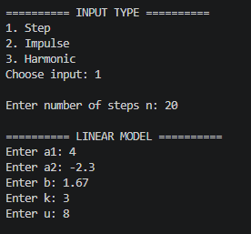
*Входные параметры*

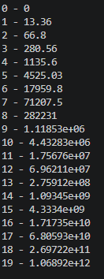
*Результат моделирования*

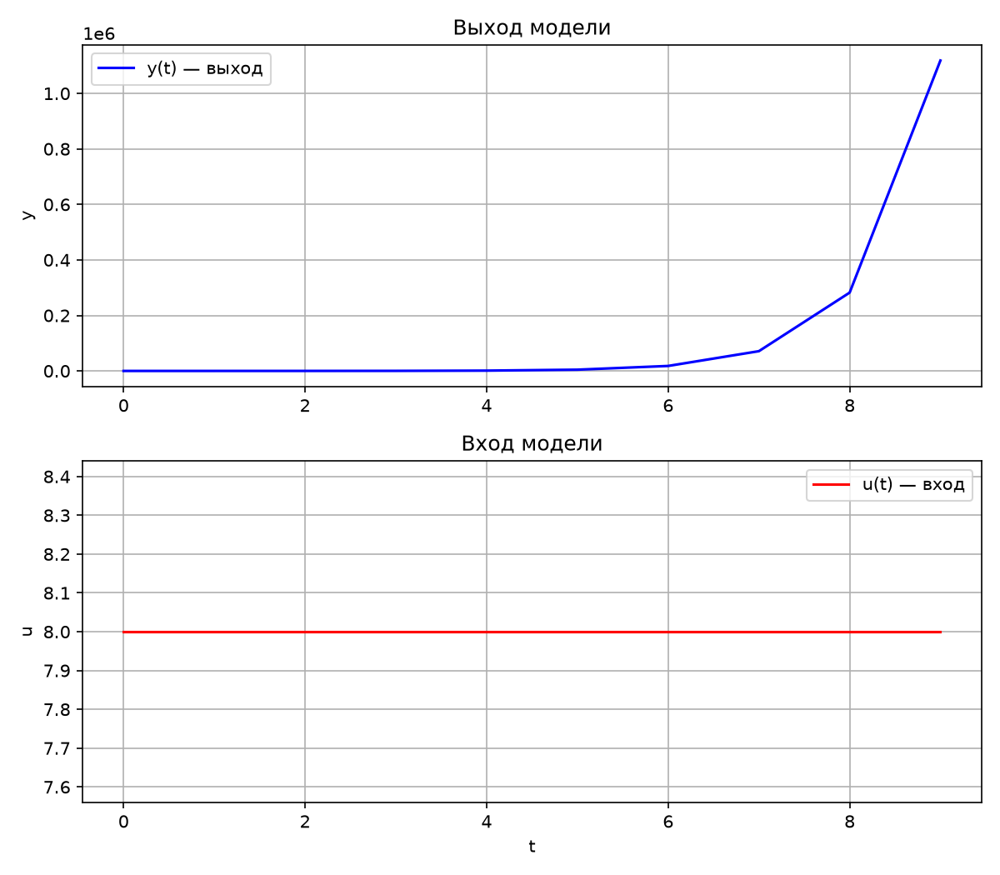
*График*

---

## 5.2. Модель 2.7 — Relay with Hysteresis Element

Уравнение модели:

$$
y_{\tau+1}
=
ay_\tau+
b\cdot relay(u_\tau,y_\tau)
$$

Релейный элемент принимает только два значения:

$$
relay(u,y)\in\{-1,1\}
$$

Для него используется зона гистерезиса $\varepsilon$.

Функция имеет вид:

$$
relay(u,y)=
\begin{cases}
1,
&
u>\varepsilon
\text{ или }
(u\geq-\varepsilon \text{ и } y>0),
\\
-1,
&
u<-\varepsilon
\text{ или }
(u\leq\varepsilon \text{ и } y\leq0).
\end{cases}
$$

Гистерезис необходим для предотвращения постоянного переключения реле при нахождении входного сигнала около нуля.

Параметр $\varepsilon$ определяет ширину области, внутри которой решение о переключении зависит от текущего состояния $y$.

В программе релейная функция может быть вынесена в отдельный приватный метод класса:

```cpp
double relay(double u, double y);
```

Благодаря этому внутренняя реализация нелинейности скрыта от остальной части программы.

Для проверки нелинейной модели задаются:

* коэффициент $a$;
* коэффициент $b$;
* параметр гистерезиса $\varepsilon$;
* тип входного воздействия;
* амплитуда;
* количество шагов $n$.

### Пример

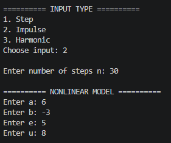
*Входные данные*

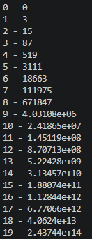
*Результат*

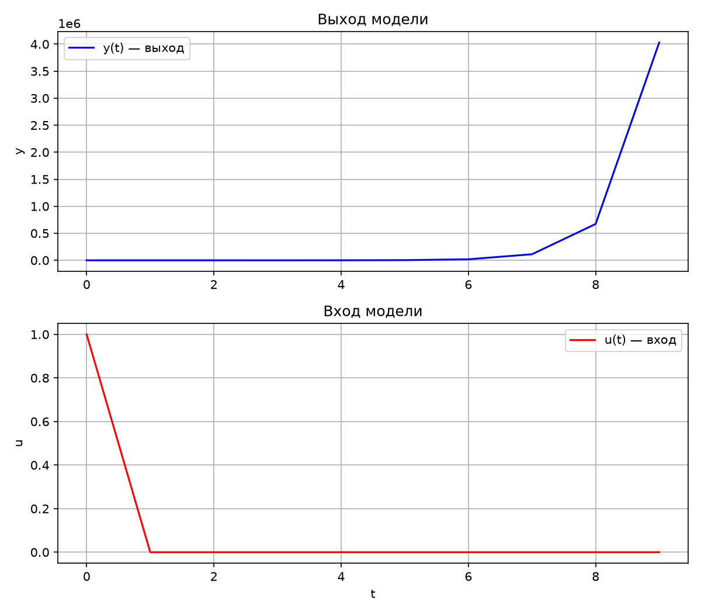
*График*

---

## 5.3. Модель 3.9 — Bounded Saturation Rate

Дифференциальное уравнение модели:

$$
\frac{dy}{dt}=b\tanh(u)
$$

Для решения используется явный метод Эйлера:

$$
y_{\tau+1}
=
y_\tau+
\Delta t\cdot b\tanh(u_\tau)
$$

где:

* $b$ — коэффициент воздействия;
* $\Delta t$ — шаг интегрирования;
* $u_\tau$ — входной сигнал;
* $y_\tau$ — текущее состояние объекта.

#Пример

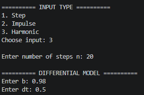
*Входные данные*

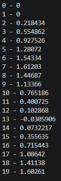
*Результат*

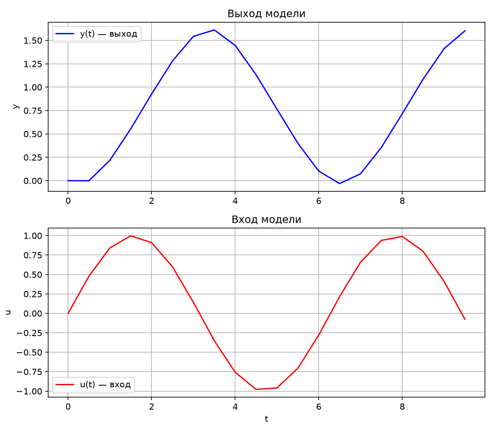
*График*

---

# 8. Сохранение результатов в CSV

Для дальнейшей обработки результаты сохраняются в CSV-файл.

Файл имеет следующий формат:

```text
t;u;y
0;...;...
1;...;...
2;...;...
3;...;...
```

Использование разделителя `;` позволяет удобно открывать полученный файл в Excel и других табличных редакторах.

Пример записи результатов:

```cpp
file << "t;u;y\n";

for (int i = 0; i < n; ++i)
{
    file << i << ";"
         << u[i] << ";"
         << y[i] << "\n";
}
```

CSV-файл одновременно используется как источник данных для построения графика.

---

# 9. Визуализация результатов

Для визуализации результатов используется Python и библиотека `matplotlib`.

Программа C++ после завершения моделирования формирует CSV-файл.

Затем Python-скрипт:

1. открывает CSV-файл;
2. считывает значения;
3. строит график;
4. сохраняет изображение результата.

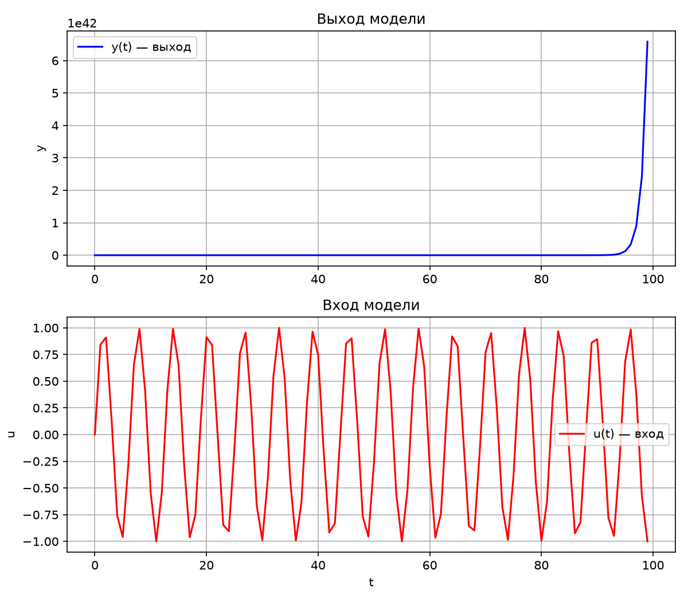

*Рис. 3 — График результатов моделирования*

---

# 10. Сборка проекта

Для автоматизации сборки используется система **CMake**.

Структура проекта имеет следующий вид:

```text
task_01/
│
├── CMakeLists.txt
├── build.bat
│
├── src/
|   ├── plot.py
│   └── main.cpp
│
└── doc/
    └── readme.md
```

### Назначение файлов

| Файл                           | Назначение                     |
| ------------------------------ | ------------------------------ |
| `main.cpp`                     | Главная программа              |
| `CMakeLists.txt`               | Конфигурация сборки            |
| `build.bat`                    | Автоматическая сборка и запуск |
| `plot.py`                      | Построение графиков            |
| `readme.md`                    | Отчёт                          |

Сборка выполняется в отдельной директории `build`.

Пример последовательности команд:

```bash
cmake -B build -S . -G "MinGW Makefiles"
cmake --build build
```

Запуск проекта выполняется через:

```text
build.bat
```

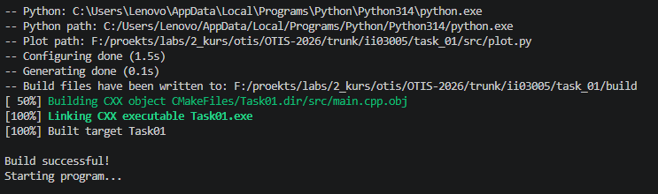

*Сборка и запуск программы с помощью `build.bat`*

---

# 11. Рецензирование

В соответствии с заданием необходимо выполнить рецензирование запросов на внесение изменений других студентов.

Task 01 Вариант 17 - Пекун Софья (ii02919) - #17


task_01 Пархоц ЛР1


---

# 12. Вывод

В ходе лабораторной работы была разработана программа для моделирования управляемых объектов с использованием языка C++ и принципов объектно-ориентированного программирования.

Были рассмотрены три математические модели: динейная, нелинейная и дифференциальная.


Также реализованы:

* три типа входного воздействия;
* настройка количества шагов моделирования;
* табличный вывод результатов;
* сохранение результатов в CSV;
* построение графиков с помощью Python и `matplotlib`;
* сборка проекта с помощью CMake;
* автоматизация сборки и запуска через `.bat`-файл;
* UML-диаграмма классов;
* анализ устойчивости линейной модели.

Таким образом, основные требования лабораторной работы выполнены.

---
