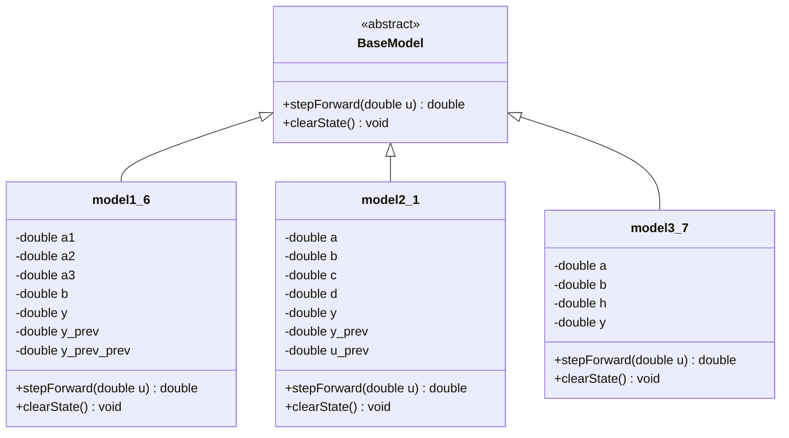
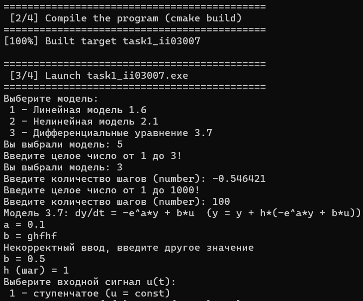
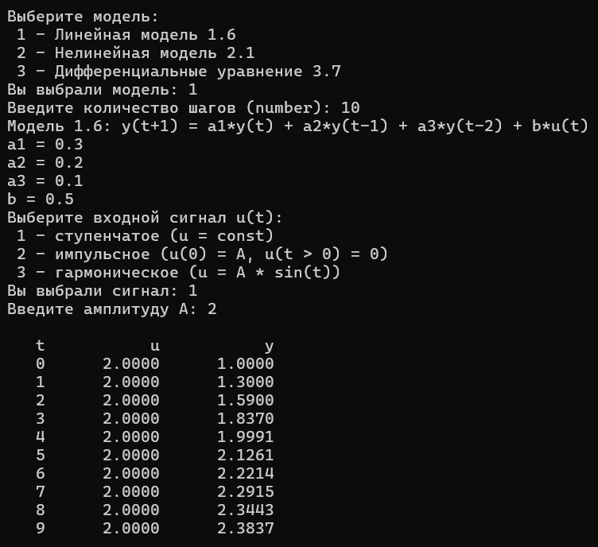
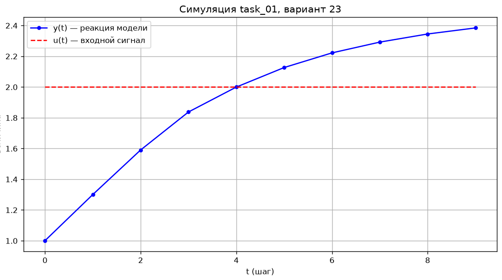
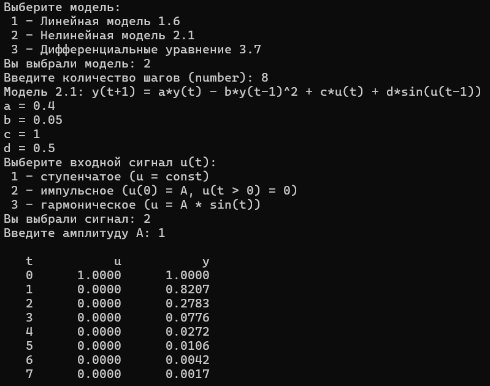
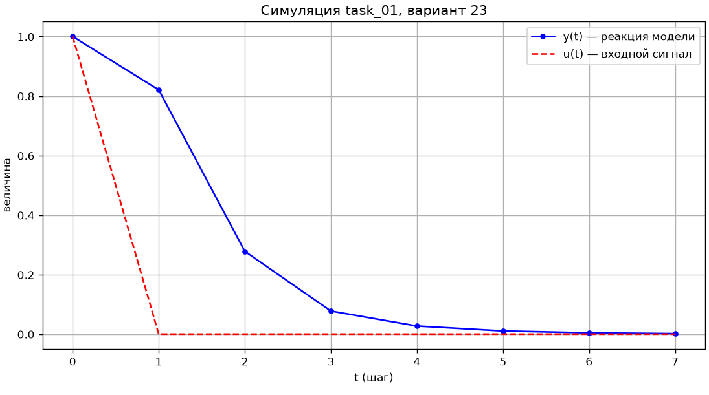
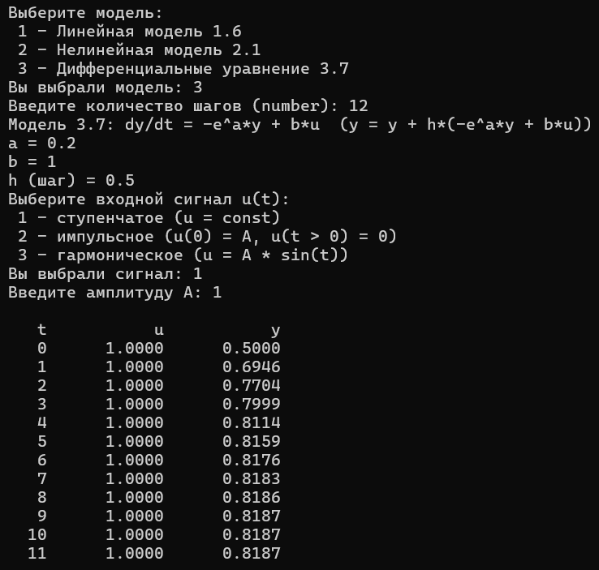
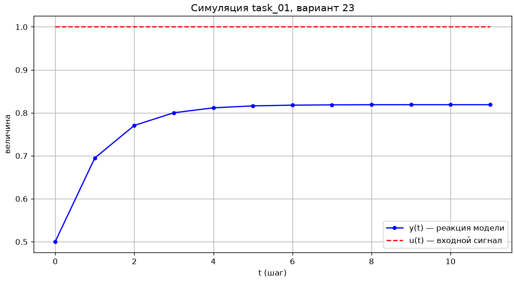

<p align="center"> Министерство образования Республики Беларусь</p>
<p align="center">Учреждение образования</p>
<p align="center">“Брестский Государственный технический университет”</p>
<p align="center">Кафедра ИИТ</p>
<br><br><br><br><br><br><br>
<p align="center">Лабораторная работа №1</p>
<p align="center">По дисциплине “Общая теория интеллектуальных систем”</p>
<p align="center">Тема: “Моделирования температуры объекта”</p>
<br><br><br><br><br>
<p align="right">Выполнил:</p>
<p align="right">Студент 2 курса</p>
<p align="right">Группы ИИ-30</p>
<p align="right">Киселевич А. В.</p>
<p align="right">Проверил:</p>
<p align="right">Дворанинович Д. А.</p>
<br><br><br><br><br>
<p align="center">Брест 2026</p>

## 1. Цель работы

Получить практические навыки построения математических моделей динамических объектов и организации кода по объектно-ориентированному принципу. Результат — программа на C++, которая умеет:

 - симулировать три модели разного типа (линейная дискретная, нелинейная дискретная, непрерывная);
 - во время работы брать с клавиатуры тип модели, коэффициенты, тип сигнала и число шагов;
 - выводить таблицу результатов на экран и сохранять её в файл;
 - автоматически строить график по сохранённым данным.

## 2. Постановка задачи

По варианту 23 в работе реализованы три модели:

| Блок | Номер модели | Тип |
|:--:|:--:|:--:|
| 1 | 1.6 | линейная  |
| 2 | 2.1 | нелинейная  |
| 3 | 3.7 | дифференциальное уравнение  |

Требования к программе:

1. C++, ООП: общий абстрактный класс для всех моделей, наследование, виртуальные методы;
2. три типа входного воздействия — ступеньчатый $u = A$, импульс $u_0 = A$, гармонический $u = A\sin t$;
3. все параметры (коэффициенты, амплитуда $A$, число шагов $n$) задаются в момент запуска; неверный ввод не роняет программу, а просит ввести значение ещё раз;
4. табличный вывод в консоль + сохранение в файл `result.csv`;
5. график переходного процесса — Python + matplotlib;
6. сборка через CMake, вся сборка и запуск — одним батником `build.bat`.

## 3. Структура программы

### 3.1. Классы

Все модели объединены одним интерфейсом — абстрактным классом `BaseModel`:

```cpp
class BaseModel{
    public:
        virtual ~BaseModel() = default;
        virtual double stepForward(double u) = 0;
        virtual void clearState() = 0;
};
```

`stepForward(u)` принимает текущий вход и возвращает новое значение выхода, `clearState()` обнуляет внутреннее состояние. Конкретные модели унаследованы от `BaseModel`:

|   Класс    | Модель | Что хранит                                                                          |
|------------|--------|-------------------------------------------------------------------------------------|
| `model1_6` |   1.6  | коэффициенты $a_1, a_2, a_3, b$; последние три выхода $y, y_{prev}, y_{prev\_prev}$ |
| `model2_1` |   2.1  | коэффициенты $a, b, c, d$; два последних выхода и последний вход                    |
| `model3_7` |   3.7  | коэффициенты $a, b$; шаг $h$; текущий выход $y$                                     |

Входной сигнал вырабатывает отдельная функция `checkSignal(t, type, A)`: параметр `type` определяет форму воздействия, `switch` возвращает нужное значение.

**Полиморфизм.** В `main()` программа держит модель за указатель базового класса:

```cpp
std::unique_ptr<BaseModel> model;
model = std::make_unique<model1_6>(a1, a2, a3, b);
```

Какой именно класс создаётся, выбирается после ответа пользователя; дальше общий цикл симуляции просто вызывает `model->stepForward(u)` и не знает, какая модель стоит за указателем. Умный указатель `unique_ptr` сам освобождает память в конце работы, поэтому в коде нет явного `delete`.

Структура наследования показана на UML-диаграмме классов:


### 3.2. Ввод параметров

Параметры вводятся с клавиатуры, поэтому каждый запрос защищён от «мусора»:

```cpp
double checkdoublevalues(const std::string& text);
int    checkintvalues(const std::string& text, int minVal, int maxVal);
```

Обе функции устроены одинаково: в цикле читают число из `std::cin`; если чтение прошло успешно (а у целого — ещё и значение в диапазоне) — возвращают его. Иначе сбрасывают флаг ошибки потока (`cin.clear()`) и выбрасывают оставшийся мусор из буфера (`cin.ignore(10000, '\n')`), после чего вопрос задаётся заново. Дополнительно для модели 3.7 проконтролировано условие $h > 0$ — шаг меньше нуля программа не принимает.



### 3.3. Состав проекта

| Файл             | За что отвечает                                    |
|------------------|----------------------------------------------------|
| `model.h`        | абстрактный класс `BaseModel`                          |
| `model1.6.h`     | модель 1.6 (линейная)                              |
| `model2.1.h`     | модель 2.1 (нелинейная)                            |                          
| `model3.7.h`     | модель 3.7 (дифференциальное уравнение)            |
| `main.cpp`       | меню, ввод, цикл симуляции, вывод в консоль и файл |
| `CMakeLists.txt` | правила сборки: C++14, цель `task1_ii03007`        |
| `build.bat`      | сборка + запуск + график одной командой            |
| `plot.py`        | строит график из `result.csv`                      |
| `doc/readme.md`  | данный отчёт                                       |

## 4. Описание моделей

### 4.1. Модель 1.6(Линейную система третьего порядка)

$$y_{t+1} = a_1\,y_t + a_2\,y_{t-1} + a_3\,y_{t-2} + b\,u_t$$

Следующий выход — взвешенная сумма трёх предыдущих значений самого выхода (авторегрессия) + текущего входного сигнала. 

Коэффициенты $a$ задают насколько прошлые значения влияют на настоящее, $b$ — чувствительность к внешнему сигналу..

Начальные условия: y(0)=y(−1)=y(−2)=0


Для постоянного входа $u = A$ установившееся значение находится из условия $y_{t+1} = y_t = y_{t-1} = \bar{y}$:

$$\bar{y} = \frac{b\,A}{1 - a_1 - a_2 - a_3}$$

### 4.2. Модель 2.1(Нелинейная система)

$$y_{t+1} = a\,y_t - b\,y_{t-1}^2 + c\,u_t + d\,\sin\big(u_{t-1}\big)$$

В отличие от предыдущей, эта модель включает нелинейные элементы. Слагаемое y_{t-1}^2​ вносит квадратичную зависимость от прошлого состояния (что часто моделирует эффекты торможения или сопротивления среды при положительном bb). Слагаемое ssin\big(u_{t-1}\big) добавляет нелинейную реакцию на предыдущее входное воздействие.

### 4.3. Модель 3.7(Непрерывная модель)

$$\frac{dy}{dt} = -e^a\,y + b\,u$$

Единственная непрерывная модель в работе. Решается явной схемой Эйлера с шагом $h$:

$$y_{t+1} = y_t + h\,\big(-e^a\,y_t + b\,u_t\big)$$

Чем меньше шаг $h$, тем точнее численное решение (слишком большой шаг даёт колебания и расхождение).

Уравнение описывает процесс изменения температуры непрерывно во времени. Множитель -e^a перед y экспоненциальный коэффициент затухания.
    При a<0: система естественным образом затухает (возвращается к нулю)
    При a>0: система естественным образом растет (нестабильна)
    Модуль e^a определяет скорость затухания/роста
    b⋅u: линейное управление

 b\,u: линейное управление
Входной сигнал u напрямую влияет на скорость изменения

 При отсутствии сигнала (u=0) система будет стремиться к нулю (остывать), то есть процесс принципиально устойчив.

Для постоянного входа $u = A$ установившееся значение находится по формуле:
$$\bar{y} = \frac{b\,A}{e^a}.$$

 ## 5. Ввод-вывод и сборка

### 5.1. Результаты

Во время симуляции данные выводятся двумя путями:

- **в консоль** — таблица из трёх колонок фиксированной ширины (`std::setw(4)`, `std::setw(12)`, `std::setw(12)`), четыре цифры после запятой (`std::fixed` + `std::setprecision(4)`);
- **в `result.csv`** — заголовок `t;u;y`, разделитель `;`, те же числа с точкой:

```
t;u;y
0;1.0000;0.5000
1;1.0000;0.6946
2;1.0000;0.7704
```

### 5.2. График

Скрипт plot.py читает result.csv через csv-модуль (разделитель ;), пропуская заголовок, собирает три списка — номера шагов, значения входа и выхода — и рисует обе кривые на одном поле: выход сплошной линией с маркерами, вход пунктиром. Результат сохраняется в simulation.png и выводится в окно. Скрипт запускается батником автоматически после завершения симуляции.

### 5.3. Сборка

Сборка осуществляется через генератор CMake. Конфигурация прописана в файле CMakeLists.txt.

Батник (build.bat): Создает директорию build, компилирует C++ код, запускает исполняемый файл и, по завершении расчетов, вызывает Python-скрипт.

Вывод данных формируется форматированная таблица в консоли, а все расчеты сохраняются в файл result.csv.

Визуализация. Скрипт plot.py считывает result.csv с помощью библиотеки matplotlib и выводит пользователю график зависимости y(t) и u(t).

При ошибке на любом шаге батник останавливается с сообщением и ожидает нажатие клавиши, поэтому причину всегда можно прочитать.


## 6. Результаты моделирования

### 6.1. Модель 1.6, ступенчатый вход

**Параметры:** $a_1 = 0.3$, $a_2 = 0.2$, $a_3 = 0.1$, $b = 0.5$; ступенька $A = 2$; $n = 10$.

|$t$ | $u_t$  | $y_t$  |
|:--:|:------:|:------:|
| 0  | 2.0000 | 1.0000 |
| 1  | 2.0000 | 1.3000 |
| 2  | 2.0000 | 1.5900 |
| 3  | 2.0000 | 1.8370 |
| 4  | 2.0000 | 1.9991 |
| 5  | 2.0000 | 2.1261 |
| 6  | 2.0000 | 2.2214 |
| 7  | 2.0000 | 2.2915 |
| 8  | 2.0000 | 2.3443 |
| 9  | 2.0000 | 2.3837 |

По формуле раздела 4.1 установившееся значение:

$$\bar{y} = \frac{0.5 \cdot 2}{1 - 0.3 - 0.2 - 0.1} = \frac{1}{0.4} = 2.5.$$

Симуляция к девятому шагу дала 2.3837 и продолжает ползти к 2.5 — расхождение объяснимо малым числом шагов.





### 6.2. Модель 2.1, импульсный вход

**Параметры:** $a = 0.4$, $b = 0.05$, $c = 1$, $d = 0.5$; импульс $A = 1$; $n = 8$.

|$t$ | $u_t$  | $y_t$  |
|:--:|:------:|:------:|
| 0  | 1.0000 | 1.0000 |
| 1  | 0.0000 | 0.8207 |
| 2  | 0.0000 | 0.2783 |
| 3  | 0.0000 | 0.0776 |
| 4  | 0.0000 | 0.0272 |
| 5  | 0.0000 | 0.0106 |
| 6  | 0.0000 | 0.0042 |
| 7  | 0.0000 | 0.0017 |

После первого шага вход обнулён, но выход ещё долго «отзывается» — это и есть собственная динамика модели. Поскольку $|a| = 0.4 < 1$, затухание гарантировано, и таблица это показывает: с шага 3 по шаг 7 значение упало с $0.0776$ до $0.0017$, то есть примерно в 45 раз.





### 6.3. Модель 3.7, ступенчатый вход

**Параметры:** $a = 0.2$, $b = 1$, $h = 0.5$; ступенька $A = 1$; $n = 12$.
 
|$t$ | $u_t$  | $y_t$  |
|:--:|:------:|:------:|
| 0  | 1.0000 | 0.5000 |
| 1  | 1.0000 | 0.6946 |
| 2  | 1.0000 | 0.7704 |
| 3  | 1.0000 | 0.7999 |
| 4  | 1.0000 | 0.8114 |
| 5  | 1.0000 | 0.8159 |
| 6  | 1.0000 | 0.8176 |
| 7  | 1.0000 | 0.8183 |
| 8  | 1.0000 | 0.8186 |
| 9  | 1.0000 | 0.8187 |
| 10 | 1.0000 | 0.8187 |
| 11 | 1.0000 | 0.8187 |

Равновесие по формуле раздела 4.3:

$$\bar{y} = \frac{1 \cdot 1}{e^{0.2}} = \frac{1}{1.2214} \approx 0.8187$$

— ровно то, к чему сходится схема Эйлера (на девятом шаге совпадение до четырёх знаков).





## 7. Вывод

В ходе лабораторной работы была успешно создана программа на C++ для симуляции трех различных динамических объектов. 

Рассмотренные математические модели корректно реагируют на различные входные воздействия (ступенька, импульс, гармоника). Уравнения реализованы в соответствии с математическими законами: линейная модель использует память прошлых состояний, нелинейная демонстрирует сложное поведение за счет квадратичных и тригонометрических функций, а дифференциальное уравнение успешно интегрируется методом Эйлера. Автоматизация процесса через CMake и .bat файлы значительно упростила тестирование и сборку проекта. 
