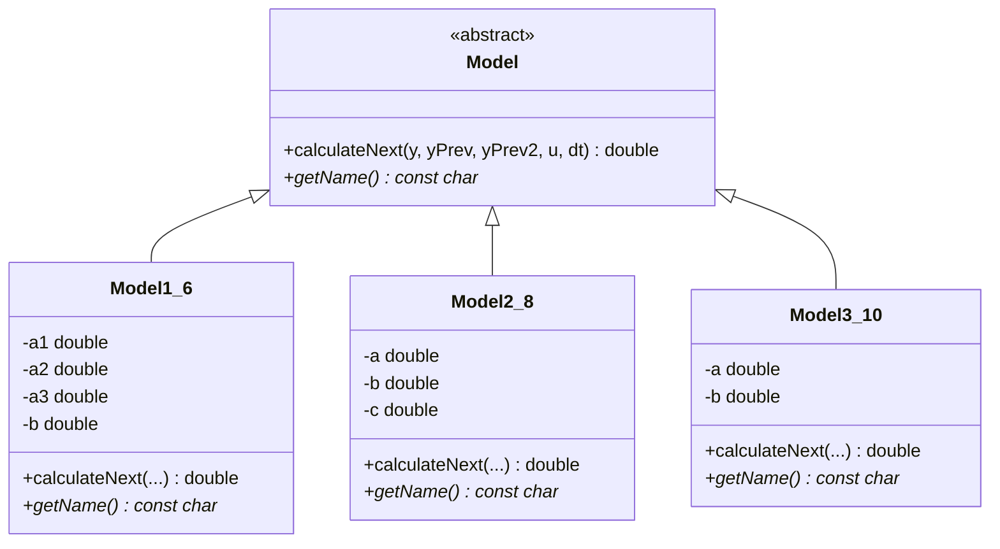
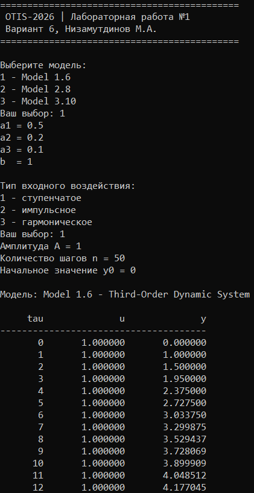
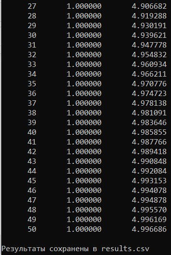
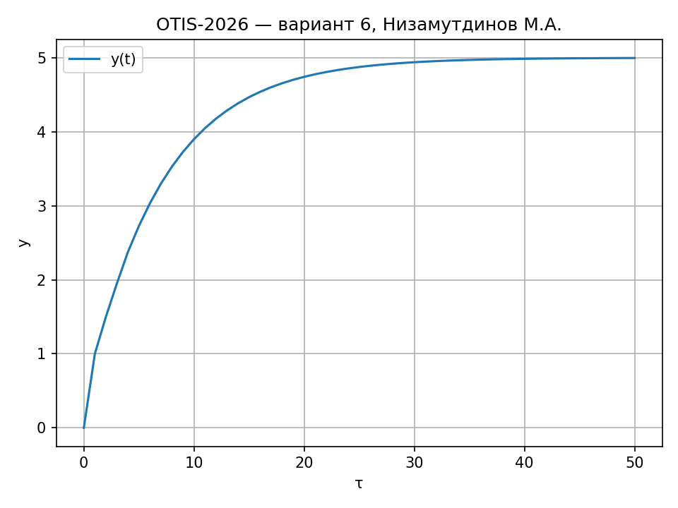
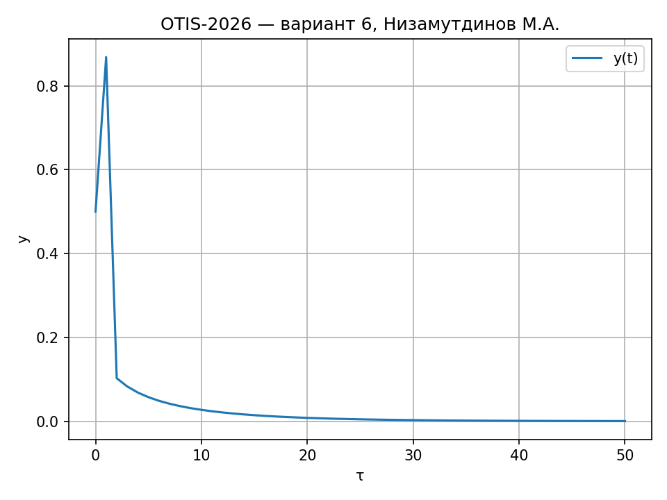
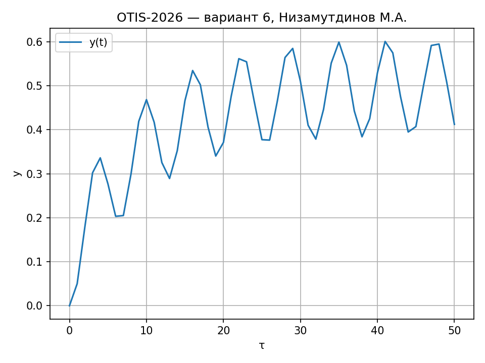

<p align="center"> Министерство образования Республики Беларусь</p>
<p align="center">Учреждение образования</p>
<p align="center">“Брестский Государственный технический университет”</p>
<p align="center">Кафедра ИИТ</p>
<br><br><br><br><br><br><br>
<p align="center">Лабораторная работа №1</p>
<p align="center">По дисциплине “Общая теория интеллектуальных систем”</p>
<p align="center">Тема: “Моделирование температуры объекта”</p>
<br><br><br><br><br>
<p align="right">Выполнил:</p>
<p align="right">Студент 2 курса</p>
<p align="right">Группы ИИ-30</p>
<p align="right">Низамутдинов М. А.</p>
<p align="right">Проверил:</p>
<p align="right">Дворанинович Д. А.</p>
<br><br><br><br><br>
<p align="center">Брест 2026</p>

---

## 1. Цель работы

Освоить приёмы математического моделирования управляемых объектов и объектно-ориентированного программирования на C++. Разработать программу, которая моделирует три объекта различной природы, позволяет задавать параметры и тип входного воздействия, выводит результаты в консоль и CSV-файл, а также строит графики переходных процессов.

---

## 2. Постановка задачи

Вариант 6. В работе реализуются три модели:

| Блок | Модель | Тип | Название |
|:--:|:--:|:--:|---|
| 1 | 1.6 | линейная дискретная | Third-Order Dynamic System |
| 2 | 2.8 | нелинейная дискретная | Chaotic Logistic Map Disturbance |
| 3 | 3.10 | дифференциальное уравнение | Basic External Constant Offset |

Требования к программе:

1. язык C++, принципы ООП — абстрактный базовый класс Model и три наследника;
2. три вида входного воздействия: ступенчатое, импульсное, гармоническое;
3. параметры (коэффициенты, амплитуда, число шагов `n`) вводятся во время работы;
4. табличный вывод в консоль и сохранение в CSV;
5. визуализация результатов (Python + Matplotlib);
6. сборка через CMake, запуск сборки через build.bat;
7. UML-диаграмма классов.

---

## 3. Математическое описание

### 3.1. Model 1.6 — Third-Order Dynamic System

y(t+1) = a1*y(t) + a2*y(t-1) + a3*y(t-2) + b*u(t)

Линейная дискретная модель третьего порядка: выход зависит от трёх предыдущих значений y и текущего входа u.

### 3.2. Model 2.8 — Chaotic Logistic Map Disturbance

y(t+1) = a*y(t)*(1 - y(t)) + b*u(t) + c*sin(y(t-1)*u(t))

Нелинейная модель на основе логистической карты с синусоидальным возмущением.

### 3.3. Model 3.10 — Basic External Constant Offset

dy/dt = -a*y + b + u

Непрерывное уравнение, решается методом Эйлера с шагом dt:

y(t+1) = y(t) + dt*(-a*y(t) + b + u(t))

### 3.4. Входные воздействия

| Тип | Формула |
|---|---|
| Ступенчатое | u(t) = A |
| Импульсное | u(0) = A, u(t>0) = 0 |
| Гармоническое | u(t) = A*sin(t) |

---

## 4. Архитектура программы

### 4.1. Иерархия классов

В основе — абстрактный класс Model:
```cpp
class Model
{
public:
    virtual ~Model() = default;

    virtual double calculateNext(
        double y,
        double yPrev,
        double yPrev2,
        double u,
        double dt
    ) const = 0;

    virtual const char* getName() const = 0;
};
```
От него наследуются три класса, каждый реализует свою формулу:

| Класс | Модель | Особенности |
|---|---|---|
| Model1_6 | 1.6 | хранит коэффициенты a1, a2, a3, b |
| Model2_8 | 2.8 | хранит a, b, c, использует std::sin |
| Model3_10 | 3.10 | хранит a, b, использует шаг dt |

Полиморфизм: в main() программа работает с моделью через std::unique_ptr<Model>. Объект создаётся после выбора пользователя, а весь цикл симуляции един для всех моделей — вызов model->calculateNext(...) попадает в нужную реализацию.

### 4.2. UML-диаграмма классов

Рис. 1. Иерархия классов программы

---

## 5. Сборка

Проект собирается через CMake. Запуск сборки — файл build.bat:

1. проверяет наличие CMakeLists.txt;
2. вызывает cmake -S . -B build;
3. вызывает cmake --build build --config Release;
4. сообщает об успешной сборке.

После сборки исполняемый файл otis_task_01.exe находится в build/src/Release/.

---

## 6. Результаты моделирования

### 6.1. Консольный вывод




Рис. 2. Работа программы: меню и таблица переходного процесса

### 6.2. Ступенчатое воздействие



Рис. 3. Переходный процесс при ступенчатом входе

### 6.3. Импульсное воздействие



Рис. 4. Переходный процесс при импульсном входе

### 6.4. Гармоническое воздействие



Рис. 5. Переходный процесс при гармоническом входе

---

## 7. Выводы

Разработана программа на C++, моделирующая три управляемых объекта: линейный дискретный (1.6), нелинейный дискретный (2.8) и непрерывный (3.10, решается методом Эйлера). Программа поддерживает три типа входного воздействия, позволяет задавать количество шагов, выводит результаты в таблицу и CSV-файл, строит графики через Python/Matplotlib. Архитектура основана на абстрактном базовом классе с виртуальными методами: единый цикл симуляции работает с любой моделью через указатель, а добавление новой модели не требует изменения основного кода.

---

## 8. Приложение. Состав проекта

| Файл | Назначение |
|---|---|
| src/Model.h | абстрактный базовый класс |
| src/Model1_6.h, src/Model1_6.cpp | модель 1.6 |
| src/Model2_8.h, src/Model2_8.cpp | модель 2.8 |
| src/Model3_10.h, src/Model3_10.cpp | модель 3.10 |
| src/InputSignal.h, src/InputSignal.cpp | генерация входного сигнала |
| src/main.cpp | точка входа, меню, цикл симуляции |
| src/CMakeLists.txt | сборка исполняемого файла |
| src/plot.py | построение графика |
| build.bat | автоматическая сборка |
| doc/readme.md | отчёт |
