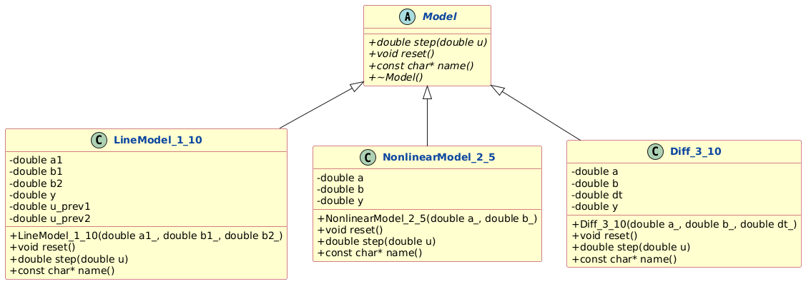
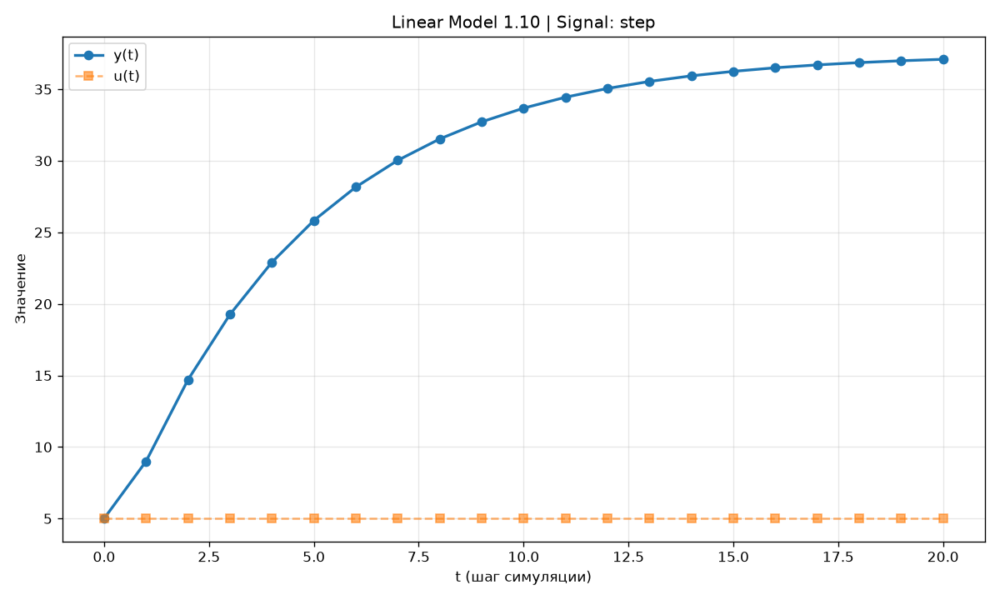
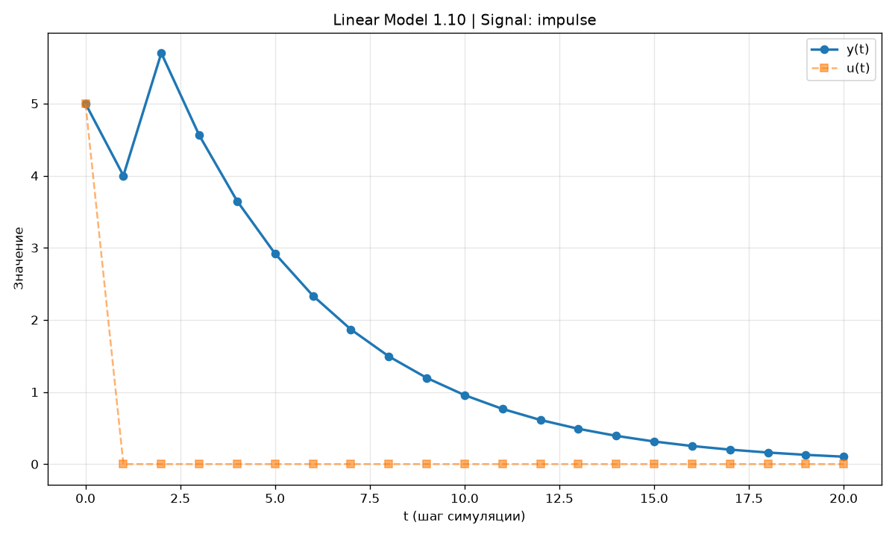
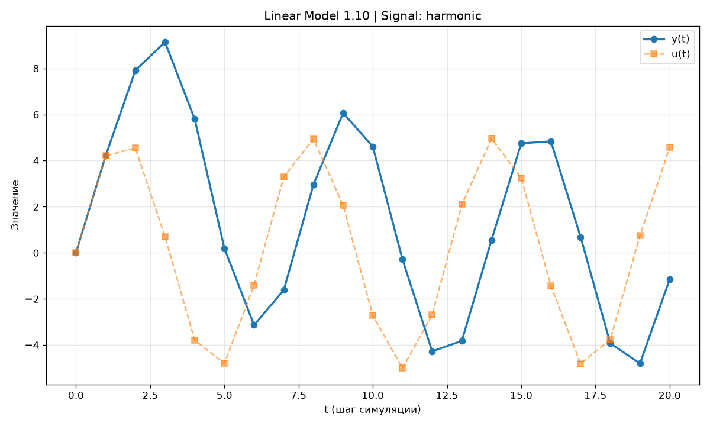
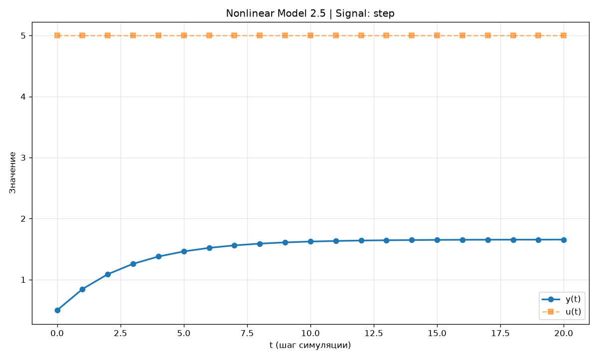
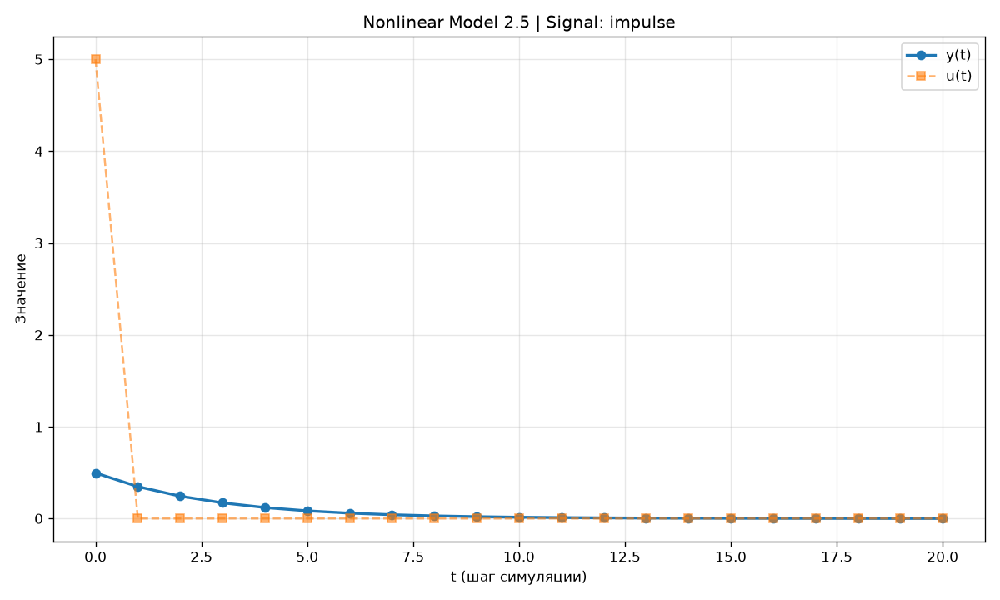
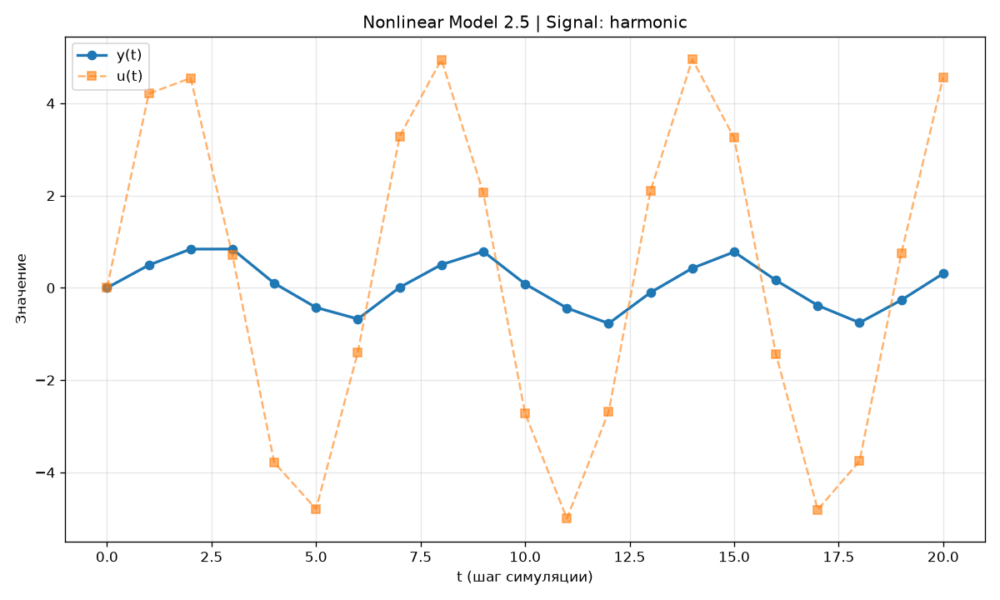
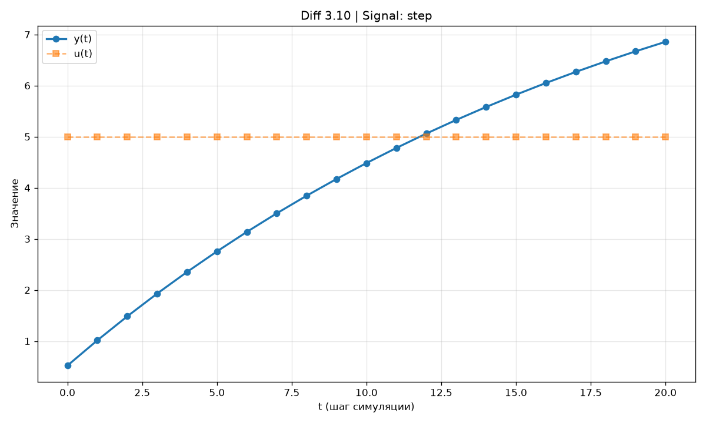
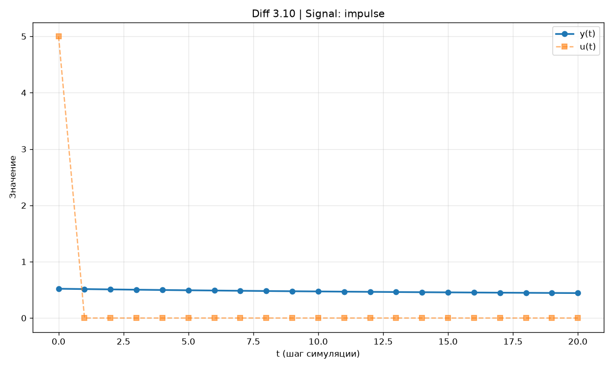
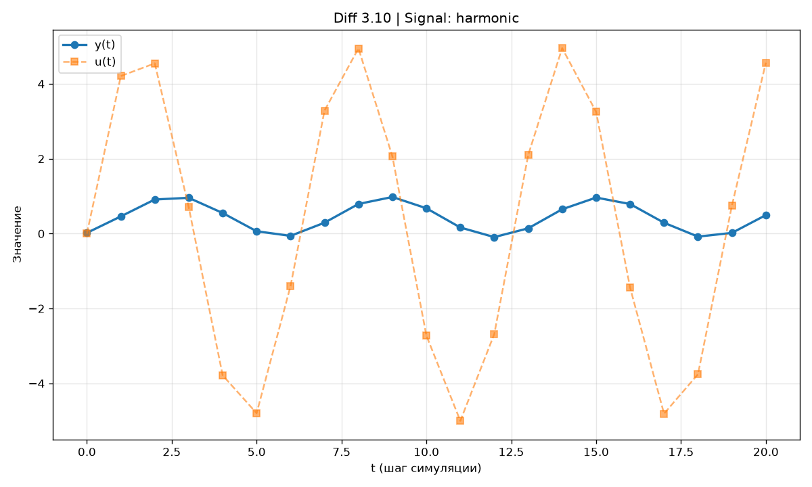

# Министерство образования Республики Беларусь

Учреждение образования

«Брестский государственный технический университет»

Кафедра ИИТ

---

# Лабораторная работа №1

**По дисциплине:** «Общая теория интеллектуальных систем»

**Тема:** «Моделирование температуры объекта»

---

**Выполнила:**
Студентка 2 курса
Группы ИИ-30
Нущик М. С.

**Проверил:**
Дворанинович Д. А.

---

Брест 2026

---

## 1. Цель работы

Освоить приёмы математического моделирования управляемых объектов и объектно-ориентированного программирования на C++. Разработать программу, которая:

- моделирует три объекта различной природы (линейный дискретный, нелинейный дискретный, непрерывный, описываемый дифференциальным уравнением);
- позволяет в процессе работы задавать тип входного воздействия, число шагов симуляции и амплитуду сигнала;
- выводит результаты в консоль и в CSV-файл;
- строит графики переходных процессов с помощью Python + matplotlib.

---

## 2. Постановка задачи

В работе реализуются три модели (вариант 25):

| Блок | Модель | Тип | Название |
|------|--------|-----|----------|
| 1 | 1.10 | линейная дискретная | Distributed Control Window Model |
| 2 | 2.5 | нелинейная дискретная | Signum Friction and Exponential Growth |
| 3 | 3.10 | дифференциальное уравнение | Basic External Constant Offset |

**Требования к реализации:**

- язык C++, принципы ООП; абстрактный базовый класс модели и виртуальные методы;
- три вида входного воздействия: ступенчатое `u(t) = A`, импульсное `u(0) = A, u(t>0) = 0`, гармоническое `u(t) = A·sin(t)`;
- ввод числа шагов `n` и амплитуды `A` во время работы программы;
- табличный вывод результатов в консоль и сохранение в CSV-файл;
- построение графиков результатов (Python + matplotlib);
- сборка проекта через CMake, запуск сборки — bat-файлом.

---

## 3. Структура программы

### 3.1. Иерархия классов

Программа построена вокруг одной иерархии наследования. Абстрактный класс `Model` задаёт единый интерфейс любой математической модели:

```cpp
class Model {
public:
    virtual ~Model() = default;
    virtual double step(double u) = 0;
    virtual void reset() = 0;
    virtual const char* name() = 0;
};
```

Каждая из трёх моделей наследует `Model` и реализует чисто виртуальные методы, храня собственное состояние:

| Класс | Модель | Состояние |
|-------|--------|-----------|
| `LineModel_1_10` | 1.10 | `a1, b1, b2`, `y`, `u_prev1`, `u_prev2` |
| `NonlinearModel_2_5` | 2.5 | `a, b`, `y` |
| `Diff_3_10` | 3.10 | `a, b, dt`, `y` |

**Полиморфизм:** в `main()` программа работает с моделью через ссылку `Model&`. Конкретный объект создаётся после выбора пользователя, и весь дальнейший цикл симуляции един для всех моделей — вызов `model.step(u)` попадает в нужную реализацию благодаря виртуальным методам.



*Рис. 1. Иерархия классов программы*

### 3.2. Состав проекта

| Файл | Назначение |
|------|-----------|
| `src/Model.h` | абстрактный базовый класс Model |
| `src/Model 1.10.h` | модель 1.10 |
| `src/Model 2.5.h` | модель 2.5 |
| `src/Model 3.10.h` | модель 3.10 |
| `src/main.cpp` | меню, ввод, цикл симуляции, вывод |
| `CMakeLists.txt` | правило сборки |
| `plot.py` | построение графиков (Python + matplotlib) |
| `build.bat` | автоматическая сборка (CMake) |
| `doc/readme.md` | отчёт по лабораторной работе |

---

## 4. Математическое описание

### 4.1. Модель 1.10 — Distributed Control Window Model

$$y_{\tau+1} = a_1 \cdot y_\tau + b_1 \cdot u_\tau + b_2 \cdot u_{\tau-2}$$

Выход на следующем шаге зависит от предыдущего значения выхода, от текущего входа, а также от входа, поданного **два шага назад**. Коэффициенты `a1, b1, b2` задают динамику объекта.

**Реализация в коде:**

```cpp
double LineModel_1_10::step(double u) {
    double y_new = a1 * y + b1 * u + b2 * u_prev2;
    u_prev2 = u_prev1;
    u_prev1 = u;
    y = y_new;
    return y;
}
```

История входов хранится в переменных `u_prev1` и `u_prev2`, которые сдвигаются на каждом шаге.

### 4.2. Модель 2.5 — Signum Friction and Exponential Growth

$$y_{\tau+1} = a \cdot y_\tau + b \cdot \text{sign}(u_\tau) \cdot (1 - e^{-|u_\tau|})$$

Модель учитывает знак входного сигнала (`sign(u)`) и экспоненциальное насыщение (`1 - e^{-|u|}`). Это нелинейная модель — воздействие зависит от модуля и знака входа.

**Реализация:**

```cpp
double NonlinearModel_2_5::step(double u) {
    y = a * y + b * sign(u) * (1.0 - std::exp(-std::fabs(u)));
    return y;
}
```

### 4.3. Модель 3.10 — Basic External Constant Offset

$$\frac{dy}{dt} = -a \cdot y + b + u$$

Непрерывное дифференциальное уравнение. Решается **явной схемой Эйлера** с шагом `dt`:

$$y_{\tau+1} = y_\tau + \Delta t \cdot (-a \cdot y_\tau + b + u_\tau)$$

**Реализация:**

```cpp
double Diff_3_10::step(double u) {
    y = y + dt * (-a * y + b + u);
    return y;
}
```

Шаг `dt` влияет на точность численного решения: чем меньше `dt`, тем точнее результат.

---

## 5. Организация ввода-вывода и сборка

### 5.1. Вывод результатов

Одновременно с симуляцией данные выводятся:

- **в консоль** — таблица из трёх колонок фиксированной ширины (`std::setw`), четыре знака после запятой (`std::setprecision(4)`);
- **в файл `results.csv`** — разделитель `,`, заголовок `t,u(t),y(t)`.

Пример содержимого `results.csv`:
```
Model,Linear Model 1.10 (Distributed Control Window),Signal,step
t,u(t),y(t)
0,5.0000,5.0000
1,5.0000,9.0000
2,5.0000,14.7000
...
```

### 5.2. Визуализация

Скрипт `plot.py` читает `results.csv`, разбивает данные на блоки по каждой модели и сигналу, строит графики `y(t)` и `u(t)` на одних осях и сохраняет их в папку `doc/graphs/`.

### 5.3. Сборка

Скрипт `build.bat` выполняет:

1. Настройку проекта через CMake;
2. Сборку исполняемого файла `task_01.exe`;
3. Паузу, чтобы пользователь увидел результат.

---

## 6. Результаты моделирования

### 6.1. Модель 1.10

**Ступенчатый сигнал (A = 5, n = 20):**



*Рис. 2. Переходный процесс модели 1.10 при ступенчатом входе*

**Импульсный сигнал:**



*Рис. 3. Переходный процесс модели 1.10 при импульсном входе*

**Гармонический сигнал:**



*Рис. 4. Переходный процесс модели 1.10 при гармоническом входе*

### 6.2. Модель 2.5

**Ступенчатый сигнал:**



*Рис. 5. Переходный процесс модели 2.5 при ступенчатом входе*

**Импульсный сигнал:**



*Рис. 6. Переходный процесс модели 2.5 при импульсном входе*

**Гармонический сигнал:**



*Рис. 7. Переходный процесс модели 2.5 при гармоническом входе*

### 6.3. Модель 3.10

**Ступенчатый сигнал:**



*Рис. 8. Переходный процесс модели 3.10 при ступенчатом входе*

**Импульсный сигнал:**



*Рис. 9. Переходный процесс модели 3.10 при импульсном входе*

**Гармонический сигнал:**



*Рис. 10. Переходный процесс модели 3.10 при гармоническом входе*

---

## 7. Выводы

Разработана программа, моделирующая поведение трёх управляемых объектов:

- **Модель 1.10** — линейная дискретная система с окном управления. Использует историю входов (`u_prev1`, `u_prev2`).
- **Модель 2.5** — нелинейная система со знаковой функцией и экспоненциальным насыщением.
- **Модель 3.10** — непрерывное дифференциальное уравнение, решаемое явной схемой Эйлера.

Архитектура построена на абстрактном базовом классе с виртуальными методами `step()`, `reset()` и `name()`: единый цикл симуляции работает с любой моделью через ссылку базового класса, а добавление новой модели не требует изменения основного кода. Реализованы табличный вывод в консоль и CSV-файл, автоматическое построение графиков и сборка средствами CMake.

**Цель работы достигнута.**

---

## 8. Приложения

### 8.1. Файлы проекта

Каталог в репозитории: `trunk/ii03016/task_01/`

| Файл | Ссылка |
|------|--------|
| Model.h | [src/Model.h](src/Model.h) |
| Model 1.10.h | [src/Model 1.10.h](src/Model%201.10.h) |
| Model 2.5.h | [src/Model 2.5.h](src/Model%202.5.h) |
| Model 3.10.h | [src/Model 3.10.h](src/Model%203.10.h) |
| main.cpp | [src/main.cpp](src/main.cpp) |
| CMakeLists.txt | [CMakeLists.txt](CMakeLists.txt) |
| build.bat | [build.bat](build.bat) |
| plot.py | [plot.py](plot.py) |

### 8.2. Ссылка на репозиторий

[Мой репозиторий на GitHub](https://github.com/milananchiks/OTIS-2026)