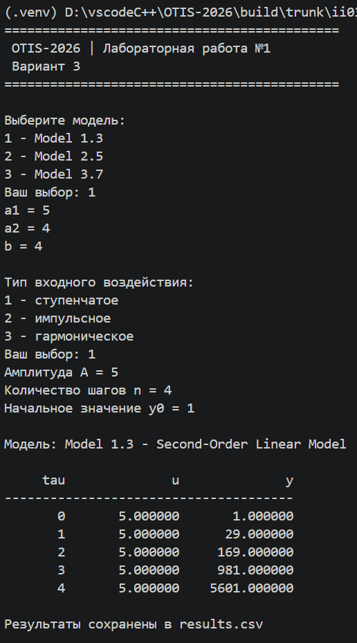
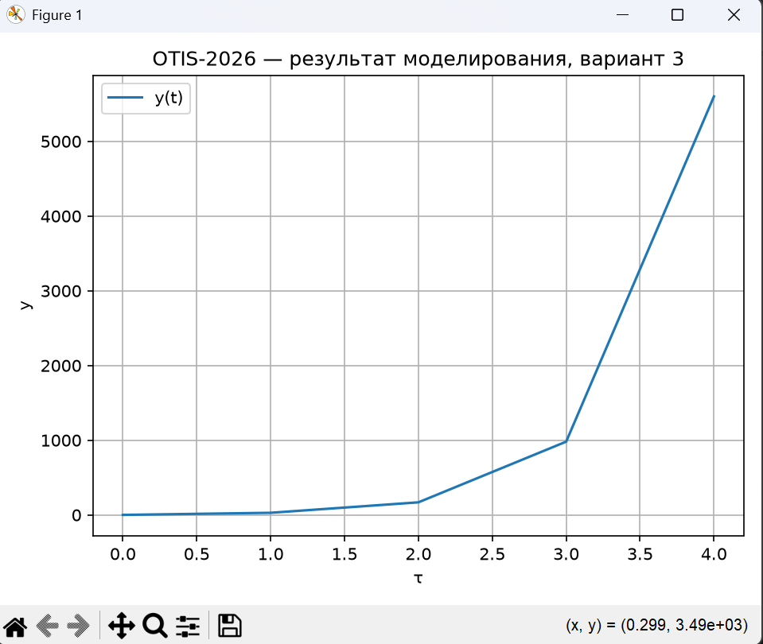
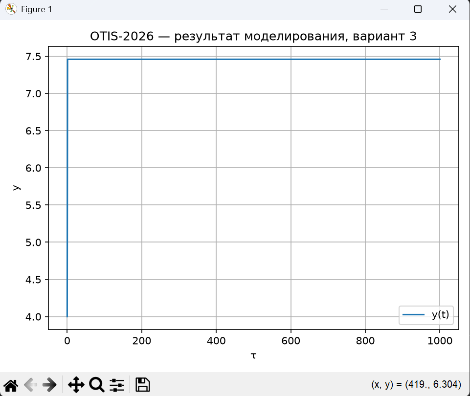
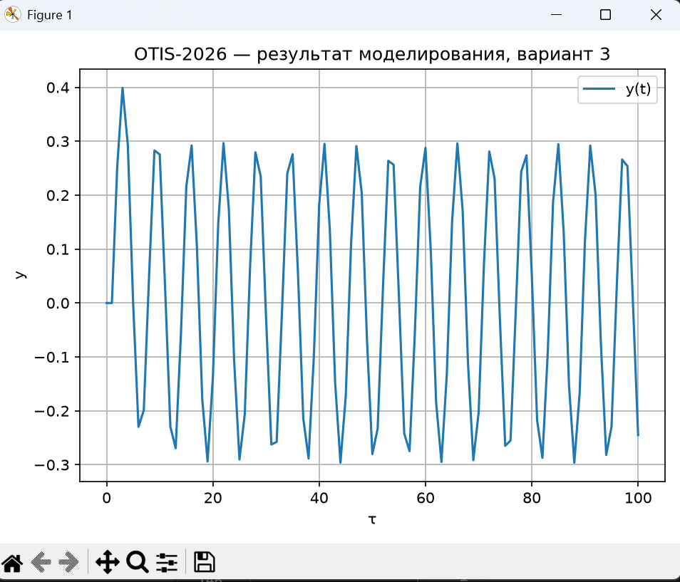
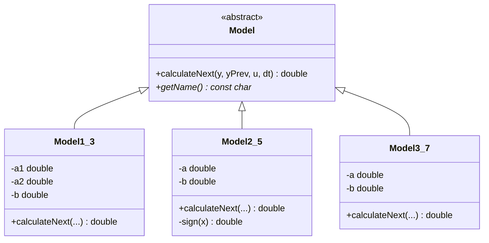

<p align="center"> Министерство образования Республики Беларусь</p>
<p align="center">Учреждение образования</p>
<p align="center">“Брестский Государственный технический университет”</p>
<p align="center">Кафедра ИИТ</p>
<br><br><br><br><br><br><br>
<p align="center">Лабораторная работа №1</p>
<p align="center">По дисциплине “Общая теория интеллектуальных систем”</p>
<p align="center">Тема: “Моделирования температуры объекта”</p>
<br><br><br><br><br>
<p align="right">Выполнил:</p>
<p align="right">Студент 2 курса</p>
<p align="right">Группы ИИ-30</p>
<p align="right">Поляк В. В.</p>
<p align="right">Проверил:</p>
<p align="right">Дворанинович Д. А.</p>
<br><br><br><br><br>
<p align="center">Брест 2026</p>


## Вариант

- Линейная модель: **Model 1.3**
- Нелинейная модель: **Model 2.5**
- Дифференциальное уравнение: **Model 3.7**

## Реализованные модели

### Model 1.3

`y(t+1) = a1*y(t) + a2*y(t-1) + b*u(t)`

### Model 2.5

`y(t+1) = a*y(t) + b*sign(u(t))*(1-exp(-|u(t)|))`

### Model 3.7

`dy/dt = -exp(a)*y + b*u`

Для Model 3.7 используется метод Эйлера:

`y(t+1) = y(t) + dt*(-exp(a)*y(t) + b*u(t))`

## Входные воздействия

1. Ступенчатое: `u(t) = A`
2. Импульсное: `u(0) = A`, `u(t > 0) = 0`
3. Гармоническое: `u(t) = A*sin(t)`

## ООП

Создан абстрактный базовый класс `Model` с виртуальным методом `calculateNext()`.

От него наследуются:

- `Model1_3`
- `Model2_5`
- `Model3_7`

## Результат

Программа:

- позволяет выбрать модель;
- принимает коэффициенты;
- позволяет выбрать входное воздействие;
- позволяет задать количество шагов `n`;
- выводит результаты в табличном виде;
- сохраняет результаты в `results.csv`;
- позволяет построить график через Python/Matplotlib.

## Пример работы программы:

### Сборка

На Windows build.bat:

```bat
@echo off
setlocal

if not exist "%~dp0CMakeLists.txt" (
    echo ERROR CMakeLists not found in this folder
    pause
    exit /b 1
)

cd /d "%~dp0"

echo STARTING BUILD PROCESS

echo STAGE 1 Configuration
cmake -S . -B build
if errorlevel 1 goto error

echo STAGE 2 Compilation
cmake --build build --config Release
if errorlevel 1 goto error

echo SUCCESS Build completed successfully
echo Executable files are in build Release folder
pause
goto end

:error
echo ERROR Build failed
pause
exit /b 1

:end
endlocal

```

После сборки запускать исполняемый файл из каталога `build`.

### Демонстрация исполняемого файла otis_task_01.exe:



При запуске исполняемого файла мы получаем результат файл.csv, после чего автоматически запускается plot.py для визуализации ответа:

## Демострация ступенчатого воздействия

## Демострация импульсного воздействия

## Демострация гармонического воздействия



## UML


