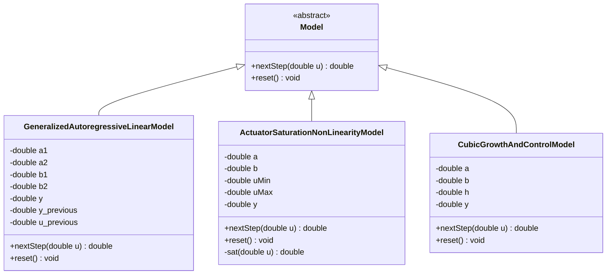

<p align="center"> Министерство образования Республики Беларусь</p>
<p align="center">Учреждение образования</p>
<p align="center">“Брестский Государственный технический университет”</p>
<p align="center">Кафедра ИИТ</p>
<br><br><br><br><br><br><br>
<p align="center">Лабораторная работа №1</p>
<p align="center">По дисциплине “Общая теория интеллектуальных систем”</p>
<p align="center">Тема: “Моделирования температуры объекта”</p>
<br><br><br><br><br>
<p align="right">Выполнил:</p>
<p align="right">Студент 2 курса</p>
<p align="right">Группы ИИ-30</p>
<p align="right">Семенюк А. С.</p>
<p align="right">Проверил:</p>
<p align="right">Дворанинович Д. А.</p>
<br><br><br><br><br>
<p align="center">Брест 2026</p>


## 1. Цель работы

Освоить приёмы математического моделирования управляемых объектов и объектно-ориентированного программирования на C++. Необходимо разработать программу, которая:

- моделирует три объекта различной природы (линейный дискретный, нелинейный дискретный, непрерывный, описываемый дифференциальным уравнением);
- позволяет в процессе работы задавать параметры модели, тип входного воздействия и число шагов симуляции;
- выводит результаты в консоль и в файл, а также строит график переходного процесса;
- выполняет анализ устойчивости линейной дискретной модели и предупреждает пользователя, если заданные коэффициенты приводят к расходящемуся процессу.

## 2. Постановка задачи

В работе реализуются три модели (вариант N — подставить свой):

| Блок | Модель | Тип | Название |
|:--:|:--:|:--:|---|
| 1 | 1.8 | линейная дискретная | Generalized Autoregressive Linear Model |
| 2 | 2.2 | нелинейная дискретная | Actuator Saturation Non-linearity |
| 3 | 3.6 | дифференциальное уравнение | Cubic Growth and Control |

Требования к реализации:

1. язык C++, принципы ООП; абстрактный базовый класс модели и виртуальные методы;
2. три вида входного воздействия: ступенчатое $u_t = const$, единичный импульс $u_0 = A,\ u_{t>0} = 0$, гармоническое $u_t = A\sin t$;
3. все параметры (коэффициенты модели, амплитуда, число шагов $n$) вводятся во время выполнения; некорректный ввод обрабатывается без аварийного завершения;
4. табличный вывод результатов в консоль и сохранение в CSV-файл;
5. построение графика результатов (Python + matplotlib);
6. сборка проекта через CMake, запуск сборки — bat-файлом;
7. дополнительное задание: для линейной модели блока 1 найти корни характеристического уравнения на Z-плоскости и до начала симуляции выводить предупреждение, если коэффициенты делают процесс неустойчивым.

## 3. Структура программы

### 3.1. Иерархия классов

Программа построена вокруг одной иерархии наследования. Абстрактный класс `Model` задаёт единый интерфейс любой математической модели:

```cpp
class Model{
    public:
        virtual ~Model() {}                    
        virtual double nextStep(double u) = 0; 
        virtual void reset() = 0;              
};
```

Каждая из трёх моделей наследует `Model` и реализует оба чисто виртуальных метода, храня собственное состояние (предыдущие значения выхода, шаг интегрирования и т.д.):

| Класс | Модель | Состояние |
|---|---|---|
| `GeneralizedAutoregressiveLinearModel` | 1.8 | $y_t$, $y_{t-1}$, предыдущий вход $u_{t-1}$ |
| `ActuatorSaturationNonLinearityModel` | 2.2 | $y_t$ + приватный метод-ограничитель `sat()` |
| `CubicGrowthAndControlModel` | 3.6 | $y$ + шаг интегрирования $h$ |

Генерация входного сигнала вынесена в отдельную функцию (выбор типа — через `switch`):

```cpp
double inputSignal(int t, int type, double ampl);
```

Проверка устойчивости модели 1.8 реализована функцией `isStable(a1, a2)`, которая вычисляет корни характеристического уравнения и сообщает их модули (подробнее — раздел 4.1).

**Полиморфизм:** в `main()` программа работает с моделью только через указатель `Model*`. Конкретный объект создаётся после выбора пользователя (`switch`), и весь дальнейший цикл симуляции един для всех моделей — вызов `model->nextStep(u)` попадает в нужную реализацию благодаря виртуальным методам. Ресурс освобождается оператором `delete`, для чего в базовом классе и объявлен виртуальный деструктор.



*Рис. 1. Иерархия классов программы*

### 3.2. Защита от некорректного ввода

Поскольку все параметры вводятся с клавиатуры, добавлены две функции-«фильтра»:

```cpp
double checkInputDouble(const std::string& text);
int    checkInputInt(const std::string& text, int minVal, int maxVal);
```

Каждая организует цикл: читаем из `std::cin`; если операция удалась **и** число лежит в допустимом диапазоне — возвращаем значение. Иначе поток восстанавливается парой вызовов `cin.clear()` (снятие флага ошибки) и `cin.ignore(10000, '\n')` (выброс мусора из буфера), после чего ввод повторяется. Дополнительно проверяются логические условия: $u_{min} < u_{max}$ для модели 2.2 и $h > 0$ для модели 3.6.


*Рис. 2. Обработка некорректного ввода: программа не завершается, а запрашивает значение заново*

### 3.3. Состав проекта

| Файл | Назначение |
|---|---|
| `src/Model.h` | абстрактный базовый класс `Model` |
| `src/GeneralizedAutoregressiveLinearModel.h` | модель 1.8 |
| `src/ActuatorSaturationNonLinearityModel.h` | модель 2.2 (с приватным методом `sat()`) |
| `src/CubicGrowthAndControlModel.h` | модель 3.6 (разностная схема Эйлера) |
| `src/main.cpp` | меню, ввод и проверка параметров, цикл симуляции, вывод |
| `src/CMakeLists.txt` | правило сборки исполняемого файла |
| `plot.py` | построение графика по CSV-файлу (Python + matplotlib) |
| `build.bat` | автоматическая сборка и запуск (CMake) |
| `doc/readme.md` | отчёт по лабораторной работе |


## 4. Математическое описание

### 4.1. Модель 1.8 — обобщённая линейная авторегрессионная модель

$$y_{t+1} = a_1\,y_t + a_2\,y_{t-1} + b_1\,u_t + b_2\,u_{t-1}$$

Выход на следующем шаге зависит от двух последних значений самого выхода (авторегрессия) и двух последних значений входа. Коэффициенты $a$ определяют собственную динамику объекта, коэффициенты $b$ — способ передачи воздействия.

**Анализ устойчивости.** Устойчивость определяется только коэффициентами $a_1, a_2$, поэтому к однородной части уравнения ($u_t = 0$) применяем подстановку $y_t = z^t$:

$$z^{t+1} = a_1 z^t + a_2 z^{t-1} \quad\Longrightarrow\quad z^2 - a_1 z - a_2 = 0$$

$$z_{1,2} = \frac{a_1 \pm \sqrt{a_1^2 + 4a_2}}{2}$$

**Критерий устойчивости:** дискретная система устойчива тогда и только тогда, когда все корни характеристического уравнения лежат строго **внутри единичного круга** на Z-плоскости:

$$|z_1| < 1 \quad \text{и} \quad |z_2| < 1$$

Эквивалентные условия можно записать сразу через коэффициенты (критерий Юрия для полинома второго порядка):

$$1 - a_1 - a_2 > 0, \qquad 1 + a_1 - a_2 > 0, \qquad |a_2| < 1$$

| Расположение корней | Поведение |
|---|---|
| внутри круга, $|z_i| < 1$ | сходящийся (затухающий) процесс |
| на окружности, $|z_i| = 1$ | граница устойчивости — процесс не затухает |
| вне круга, хотя бы один $|z_i| > 1$ | процесс расходится с ростом $\sim |z|^t$ |
| корни комплексные | колебательный процесс (затухающий или расходящийся) |

В программе эту проверку до начала симуляции выполняет функция `isStable(a1, a2)`: она вычисляет дискриминант, печатает сами корни (действительные или комплексную пару) и их модули, а при выходе хотя бы одного корня за единичный круг выводит предупреждение `WARNING: system is UNSTABLE`.

### 4.2. Модель 2.2 — насыщение исполнительного органа

$$y_{t+1} = a\,y_t + b\,\mathrm{sat}(u_t), \qquad
\mathrm{sat}(u) = \begin{cases} u_{max}, & u > u_{max} \\ u, & u_{min} \le u \le u_{max} \\ u_{min}, & u < u_{min} \end{cases}$$

**Физический смысл.** Реальный исполнительный орган не может отработать произвольно большой сигнал управления: у двигателя есть предельный ток, у клапана — полный ход, у нагревателя — максимум мощности. Пока сигнал «просится» в допустимый диапазон $[u_{min}, u_{max}]$, система ведёт себя как линейная; при выходе за границу ограничитель «обрезает» сигнал, и дальнейший рост амплитуды ни к чему не приводит.

Метод-ограничитель спрятан в приватной секции класса, снаружи виден только интерфейс модели:

```cpp
double sat(double u){
    if (u > uMax) return uMax;
    else if (u < uMin) return uMin;
    else return u;
}
```

**Замечание об устойчивости.** Характеристическое уравнение строится для линейных систем, поэтому Z-критерий к этой модели формально неприменим. Отметим лишь, что ограничитель делает вход второго слагаемого ограниченным, поэтому при $|a| < 1$ выход гарантированно остаётся ограниченным.

### 4.3. Модель 3.6 — кубический рост с управлением

$$\frac{dy}{dt} = a\,y^3 + b\,u$$

В отличие от двух предыдущих — это **непрерывное** уравнение, и шаг дискретизации по времени здесь не единичный. Численное решение выполняется явной схемой Эйлера с шагом $h = \Delta t$:

$$y_{t+1} = y_t + h\,(a\,y_t^3 + b\,u_t)$$

При $a < 0$ слагаемое $a y^3$ работает как нелинейное «сопротивление»: чем больше $|y|$, тем сильнее кубический член возвращает систему к равновесию. Для постоянного входа $u$ равновесное значение находится из условия $\dot y = 0$:

$$a\,\bar y^3 + b\,u = 0 \quad\Longrightarrow\quad \bar y = \sqrt[3]{-b\,u / a}$$

Шаг $h$ влияет на точность и устойчивость численной схемы (слишком большой шаг приводит к расходимости даже при затухающем точном решении), поэтому значение $h \le 0$ программа не принимает.

## 5. Организация ввода-вывода и сборка

### 5.1. Вывод результатов

Одновременно с симуляцией данные выводятся:

- **в консоль** — таблица из трёх колонок фиксированной ширины (`std::setw`), четыре знака после запятой (`std::setprecision(4)`);
- **в файл `result.csv`** — разделитель `;`, заголовок `t;u;y`, вещественные числа с точкой:

```
t;u;y
0;1.0000;1.0000
1;1.0000;2.0000
2;1.0000;2.8000
```

Файл удобно импортировать в Excel/LibreOffice (мастером «Текст с разделителем»), а также он служит входом для построения графика.

### 5.2. Визуализация

Скрипт `plot.py` читает `result.csv` (парсер допускает числа и с точкой, и с запятой), строит на одних осях вход $u_t$ и выход $y_t$ и сохраняет график в `graph.png`. Запуск производится автоматически в конце bat-файла (если CSV не создан — шаг пропускается с сообщением).

### 5.3. Сборка

Скрипт `build.bat` выполняет четыре шага:

1. проверяет наличие CMake в PATH;
2. создаёт папку `build\` (out-of-source сборка) и генерирует проект командой `cmake`;
3. компилирует исполняемый файл `task1_ii003022.exe`;
4. запускает его, а после завершения симуляции — скрипт построения графика.


*Рис. 3. Автоматическая сборка проекта bat-файлом*

## 6. Результаты моделирования

Все приведённые ниже значения — фактический вывод программы; для контроля каждый случай пересчитан аналитически.

### 6.1. Модель 1.8 — устойчивый процесс

**Параметры:** $a_1 = 0.5$, $a_2 = 0.3$, $b_1 = 1$, $b_2 = 0.5$; ступенчатое воздействие $u = 1$; $n = 15$.

Перед симуляцией программа выводит результат проверки устойчивости:

```
Stability check: z^2 - (0.5)*z - (0.3) = 0
  Roots: z1 = 0.8521, z2 = -0.3521
  Moduli: |z1| = 0.8521, |z2| = 0.3521
  All roots are inside the unit circle -> system is STABLE.
```

| $t$ | $u_t$ | $y_t$ |
|:--:|:--:|:--:|
| 0 | 1.0000 | 1.0000 |
| 1 | 1.0000 | 2.0000 |
| 2 | 1.0000 | 2.8000 |
| … | … | … |
| 12 | 1.0000 | 6.5526 |
| 13 | 1.0000 | 6.6927 |
| 14 | 1.0000 | 6.8121 |

**Анализ.** Оба корня лежат внутри единичного круга — процесс сходится. Установившееся значение легко получить, приравняв $y_{t+1} = y_t = y_{t-1} = \bar y$ и $u_t = u_{t-1} = 1$:

$$\bar y = \frac{(b_1 + b_2)}{1 - a_1 - a_2}\,A = \frac{1.5}{0.2} = 7.5$$

— согласуется с результатами симуляции (к шагу 14 выход достиг 6.81 и продолжает приближаться к 7.5).

 

*Рис. 4. Консольный вывод для модели 1.8 (устойчивый набор коэффициентов)*


*Рис. 5. Переходный процесс модели 1.8 при ступенчатом входе*

### 6.2. Модель 1.8 — неустойчивый процесс (доп. задание)

**Параметры:** $a_1 = 1.2$, $a_2 = 0.3$, $b_1 = 1$, $b_2 = 0.5$; импульсное воздействие $u_0 = 1$; $n = 10$.

```
Stability check: z^2 - (1.2)*z - (0.3) = 0
  Roots: z1 = 1.4124, z2 = -0.2124
  Moduli: |z1| = 1.4124, |z2| = 0.2124
  WARNING: system is UNSTABLE - y(t) will diverge!
```

| $t$ | $u_t$ | $y_t$ |
|:--:|:--:|:--:|
| 0 | 1.0000 | 1.0000 |
| 1 | 0.0000 | 1.7000 |
| 5 | 0.0000 | 6.6157 |
| 9 | 0.0000 | 26.3274 |

**Анализ.** Корень $z_1 = 1.4124$ находится вне единичного круга, о чём программа и сообщает **до** начала вычислений. Выход растёт примерно в $|z_1|$ раз за шаг: $6.62 \cdot 1.4124^4 \approx 26.3$ — совпадает со значением на шаге 9. Важно, что вход давно равен нулю (импульс был только на первом шаге) — расходимость обеспечена исключительно собственной динамикой системы, что и называют неустойчивостью.


*Рис. 6. Предупреждение о неустойчивости*


*Рис. 7. Расходящийся переходный процесс модели 1.8*

### 6.3. Модель 2.2 — работа ограничителя

**Параметры:** $a = 0.5$, $b = 1$, $u_{min} = -2$, $u_{max} = 2$; ступенчатое воздействие амплитудой $A = 5$; $n = 15$.

| $t$ | $u_t$ (сырой) | $y_t$ |
|:--:|:--:|:--:|
| 0 | 5.0000 | 2.0000 |
| 1 | 5.0000 | 3.0000 |
| 2 | 5.0000 | 3.5000 |
| … | … | … |
| 10 | 5.0000 | 3.9980 |
| 14 | 5.0000 | 3.9999 |

**Анализ.** Хотя амплитуда входа равна 5, ограничитель каждый шаг срезает её до 2 — объект получает воздействие только в пределах возможностей «привода». Предельное значение считается как у линейной модели с входом $u_{max}$:

$$\bar y = \frac{b\,u_{max}}{1 - a} = \frac{2}{0.5} = 4$$

Без насыщения установилось бы значение $\bar y = 10$ — ограничитель снизил установившийся выход в 2.5 раза. На графике это видно особенно наглядно: линия сырого входа находится на уровне 5, а выход прижат к 4.

 

*Рис. 8. Консольный вывод для модели 2.2*

 

*Рис. 9. Действие насыщения исполнительного органа*

### 6.4. Модель 3.6 — численное решение схемой Эйлера

**Параметры:** $a = -0.5$, $b = 1$, $h = 0.05$; ступенчатое воздействие $A = 2$; $n = 40$.

| $t$ | $u_t$ | $y_t$ |
|:--:|:--:|:--:|
| 0 | 2.0000 | 0.1000 |
| 1 | 2.0000 | 0.2000 |
| 10 | 2.0000 | 1.0311 |
| 20 | 2.0000 | 1.4849 |
| 39 | 2.0000 | 1.5853 |

**Анализ.** При $a < 0$ кубический член тормозит рост, и система сходится к равновесию. По формуле из раздела 4.3:

$$\bar y = \sqrt[3]{-b\,u/a} = \sqrt[3]{-2/(-0.5)} = \sqrt[3]{4} \approx 1.5874$$

Численное значение на шаге 39 — 1.5853, что отличается от аналитического менее чем на 0.2 %. Это подтверждает корректность схемы Эйлера при достаточно малом шаге $h$.

 

*Рис. 10. Консольный вывод для модели 3.6*

 

*Рис. 11. Решение уравнения 3.6 явной схемой Эйлера*

## 7. Выводы

Разработана программа, моделирующая поведение трёх управляемых объектов:

1. **Модель 1.8** — линейная дискретная авторегрессионная система второго порядка. Для неё аналитически получено характеристическое уравнение $z^2 - a_1 z - a_2 = 0$ и критерий устойчивости $|z_i| < 1$; программа вычисляет корни и предупреждает о неустойчивости до начала симуляции. Экспериментально подтверждены оба случая: при корнях внутри единичного круга выход сходится к теоретическому установившемуся значению 7.5, при выходе корня за круг процесс расходится даже при нулевом входе.
2. **Модель 2.2** — объект с насыщением привода. Показано, что ограничитель срезает избыточный сигнал управления, причём предельное значение выхода (4 при входе 5) в точности совпадает с расчётным.
3. **Модель 3.6** — непрерывный объект с кубической нелинейностью; решение получено схемой Эйлера, численная точка равновесия 1.5853 согласуется с аналитической $\sqrt[3]{4} \approx 1.5874$.

Архитектура построена на абстрактном базовом классе с виртуальными методами `nextStep()` и `reset()`: единый цикл симуляции работает с любой моделью через указатель базового класса, а добавление новой модели не требует изменения основного кода. Реализованы защищённый ввод параметров во время выполнения, табличный вывод в консоль и CSV-файл, автоматическое построение графиков и сборка средствами CMake.

Цель работы достигнута.

## 8. Приложения

### 8.1. Файлы проекта

Каталог в репозитории: `trunk/ii003022/task_01/` 

| Файл | Ссылка |
|---|---|
| `Model.h` | `src/Model.h` |
| `GeneralizedAutoregressiveLinearModel.h` | `src/GeneralizedAutoregressiveLinearModel.h` |
| `ActuatorSaturationNonLinearityModel.h` | `src/ActuatorSaturationNonLinearityModel.h` |
| `CubicGrowthAndControlModel.h` | `src/CubicGrowthAndControlModel.h` |
| `main.cpp` | `src/main.cpp` |
| `CMakeLists.txt` | `src/CMakeLists.txt` |
| `build.bat` | `build.bat` |
| `plot.py` | `plot.py` |