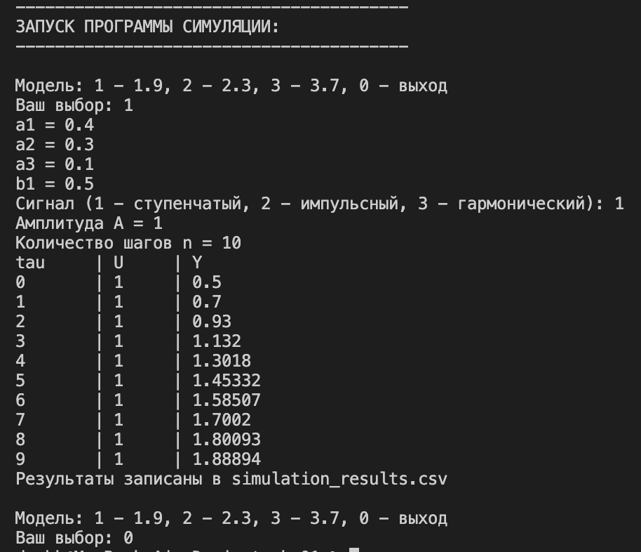
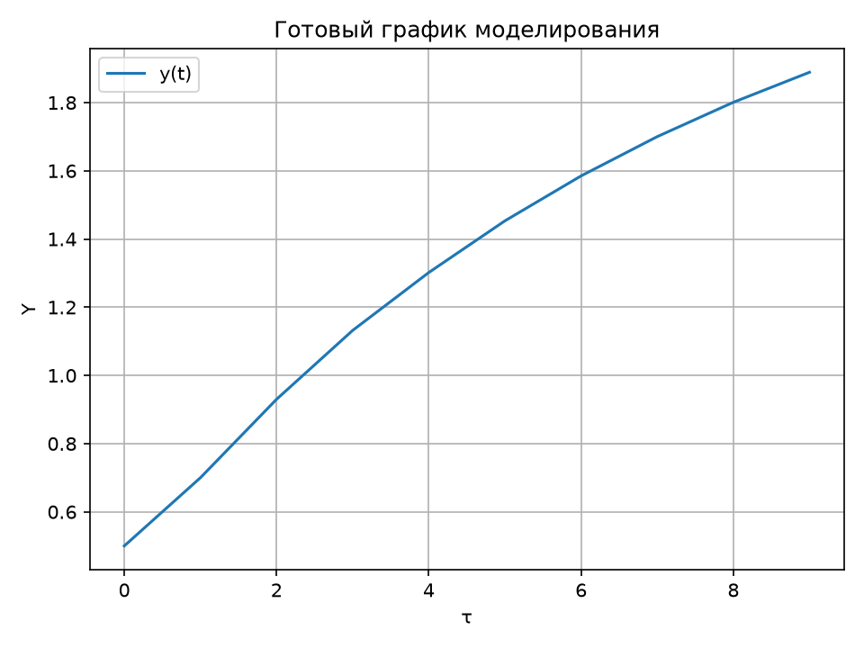
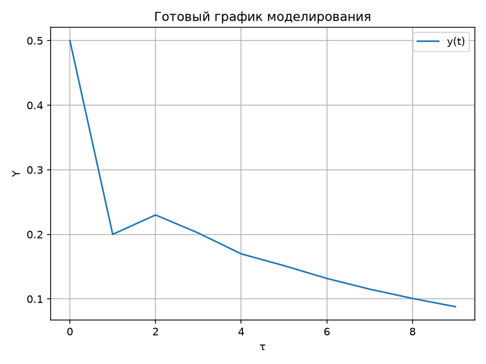
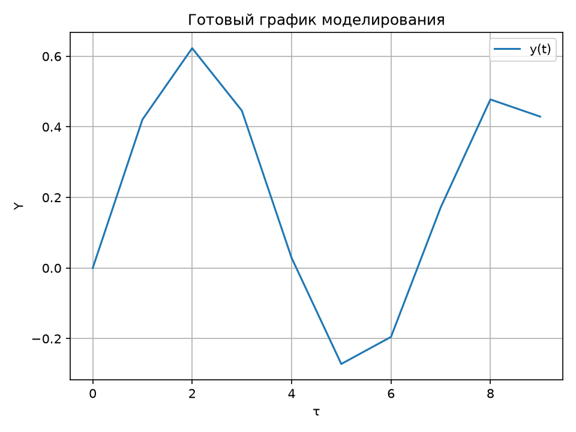
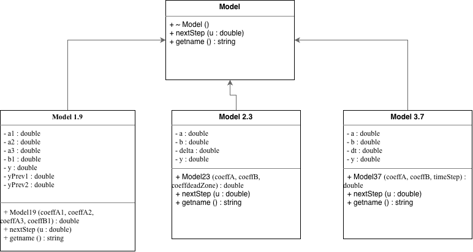

<p align="center"> Министерство образования Республики Беларусь</p>
<p align="center">Учреждение образования</p>
<p align="center">“Брестский Государственный технический университет”</p>
<p align="center">Кафедра ИИТ</p>
<br><br><br><br><br><br><br>
<p align="center">Лабораторная работа №1</p>
<p align="center">По дисциплине “Общая теория интеллектуальных систем”</p>
<p align="center">Тема: “Моделирования температуры объекта”</p>
<br><br><br><br><br>
<p align="right">Выполнил:</p>
<p align="right">Студент 2 курса</p>
<p align="right">Группы ИИ-30</p>
<p align="right">Титова Д.И.</p>
<p align="right">Проверил:</p>
<p align="right">Дворанинович Д. А.</p>
<br><br><br><br><br>
<p align="center">Брест 2026</p>


## Вариант 19.
Линейная модель: Model 1.9
Нелинейная модель: Model 2.3
Дифференциальное уравнение: **Model 3.7**

В данной лабораторной работе необходимо создать программу для моделирования управляемого объекта.

**В программе реализованы три модели:**

**Model 1.9**
`y(t+1) = a1*y(t) + a2*y(t-1) + a3*y(t-2) + b1u(t)`
**Model 2.3**
`y(t+1) = a*y(t) + b*deadzone(u(t))`
**Model 3.7**
`dy/dt = -exp(a)*y + b*u`

Для Model 3.7 используется метод Эйлера:

`y(t+1) = y(t) + dt*(-exp(a)*y(t) + b*u(t))`

**Для каждой модели можно выбрать один из трёх входных сигналов:**
- Ступенчатый
- Импульсный
- Гармонический
  
Пользователь самостоятельно вводит параметры выбранной модели, амплитуду сигнала и количество шагов моделирования.

Создан абстрактный базовый класс Model. В нём задаётся общее для всех моделей: выходное значение y; функция nextStep(); функция getName().

От него наследуются:
- Model19
- Model23
- Model37

При запуске программы пользователю предлагается выбрать одну из реализованных моделей. После выбора модели пользователь самостоятельно вводит значения её параметров. Далее выбирается тип входного сигнала, задаётся его амплитуда и количество шагов моделирования.

После ввода всех необходимых данных программа создаёт объект выбранной модели и выполняет последовательный расчёт выходной величины. Для каждого шага на экран выводятся значения τ, U и Y.

Результаты также сохраняются в файл `simulation_results.csv`.

## Пример работы программы:

**Сборка**

Так как я работаю на macOS, для сборки проекта у меня создан Bash-скрипт вместо bat-файла.

```sh
# Пересоздаем чистую папку для сборки

rm -rf build

mkdir build

cd build

  

# Запускаем CMake и компиляцию

cmake ../src

cmake --build .

  

# Запускаем нашу программу

echo "----------------------------------------"

echo "ЗАПУСК ПРОГРАММЫ СИМУЛЯЦИИ:"

echo "----------------------------------------"

./task_01

```

После сборки запускать исполняемый файл из каталога `build`.

**Итоговое решение полной программы:**



При запуске исполняемого файла мы получаем результат simulation_results.csv.

**График ступенчатого воздействия**



**График импульсного воздействия**



**График гармонического воздействия**




**UML**


